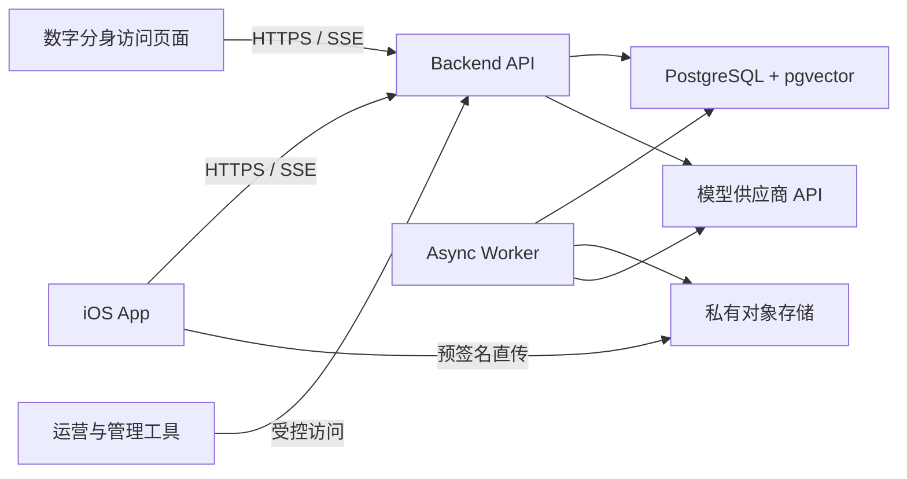
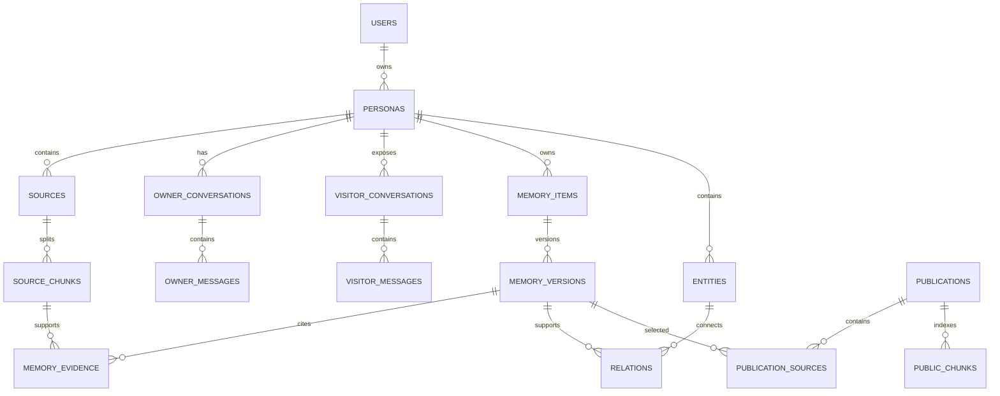
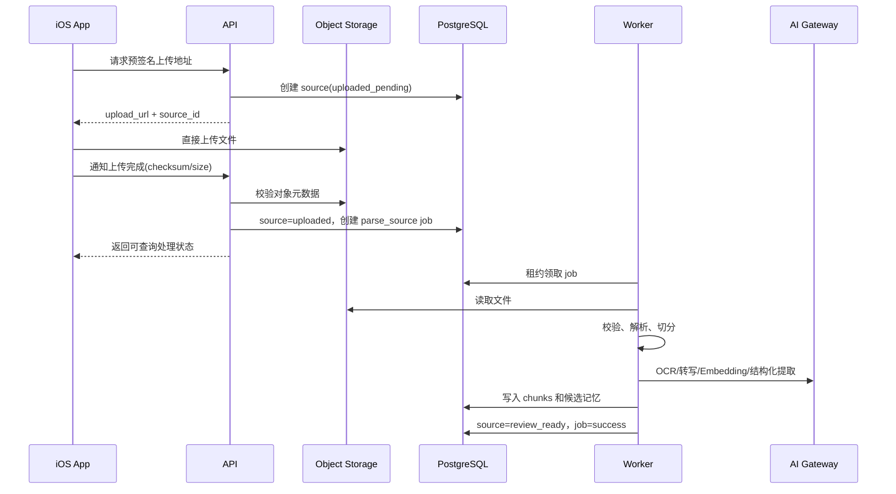
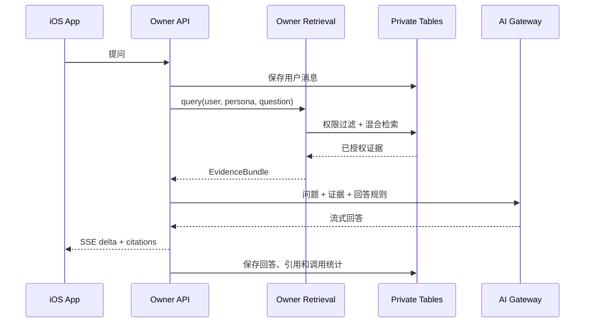
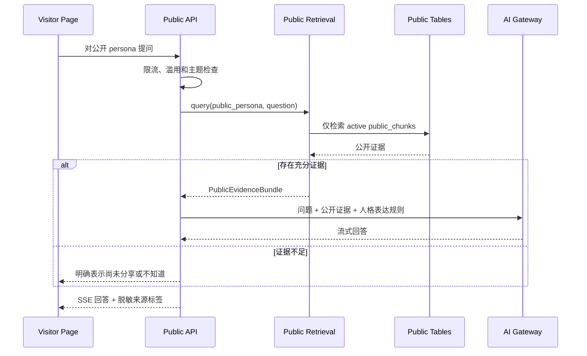

# 寻梦环游个人记忆库与数字分身平台后端概要设计

版本：V1.0（评审稿）\
日期：2026-07-10\
适用阶段：百级种子用户 / 后端 MVP\
关联文档：[产品需求文档 PRD V1.0](../../../01-产品文档/平台需求/寻梦环游_个人记忆库与数字分身平台_PRD_V1.0.md)\
现有客户端：iOS 原生 App

## 1. 文档目的

本文档给出寻梦环游个人记忆库与数字分身平台的后端概要设计，包括系统边界、总体架构、模块划分、数据模型、核心流程、接口约定、权限隔离、AI 检索方案、部署方式和演进策略。

本文档面向后端、iOS、算法、测试、运维和安全人员，用于：

- 统一第一版后端技术路线。
- 明确 iOS App 与后端的接口边界。
- 明确私人知识域与公开人格知识域的隔离方式。
- 为数据库详细设计、API 详细设计和研发拆分提供输入。
- 保证百级用户阶段轻量上线，同时保留后续扩展空间。

## 2. 设计输入与约束

### 2.1 已知条件

- 已有 iOS 原生 App，承担用户资料上传、对话、记忆审核和结果展示。
- 后端从零或接近从零建设。
- 首批规模为 100-500 名注册用户，同时在线用户低于 200。
- 内容包括文字、文档、图片、音频、对话、记忆、情绪、知识、经验和人物关系。
- Owner 可以持续更新私人知识库。
- Visitor 可以通过独立入口与公开数字分身对话。
- 数据高度敏感，需要严格的来源追溯、发布审核和访问审计。

### 2.2 架构约束

- MVP 不使用微服务。
- MVP 不使用独立图数据库和独立向量数据库。
- MVP 不依赖 Redis、Kafka、RabbitMQ 或 RocketMQ。
- 不将大文件通过 API 服务器中转。
- 不把模型供应商的会话或向量存储作为系统主数据源。
- 权限、安全、计费和审计必须由确定性代码执行。
- 所有 AI 派生内容必须能够追溯到原始来源和处理版本。

### 2.3 待确认但不阻塞的条件

- 现有 iOS 登录方案及 Token 格式。
- 首发部署地域和模型供应商。
- OCR、转写和对象存储供应商。
- iOS 当前已实现的上传、流式对话和审核页面协议。

这些差异通过适配器和配置处理，不改变总体架构。

## 3. 设计原则

1. 采用模块化单体，先保证边界清楚，再决定是否拆服务。
2. PostgreSQL 是业务数据、检索数据和任务状态的权威数据源。
3. 对象存储保存不可直接查询的大文件，数据库只保存元数据和解析结果。
4. 原始资料不可被 AI 结果覆盖，派生内容可重建。
5. 私人域和公开域采用独立表、独立索引、独立检索代码路径。
6. 公开发布采用快照，不对私人表做实时可见性过滤。
7. AI 供应商可替换，Prompt、Schema 和模型版本可追踪。
8. 长耗时工作全部异步化，对话接口不等待文件解析任务。
9. 数据删除、发布撤回和权限变更优先保证一致性。
10. 不宣称端到端加密：云端 AI 处理期间，服务端必须能够读取必要明文。

## 4. 总体架构

### 4.1 系统上下文



### 4.2 逻辑分层

```text
接口层
  ├─ Owner API
  ├─ Public Persona API
  └─ Operations API

应用层
  ├─ 身份与数字人格
  ├─ 原始资料与上传
  ├─ 对话
  ├─ 记忆与关系
  ├─ 发布
  ├─ 私人检索问答
  ├─ 公开数字分身问答
  └─ 数据权利与审计

基础能力层
  ├─ PostgreSQL / pgvector
  ├─ 对象存储
  ├─ PostgreSQL jobs
  ├─ AI Gateway
  ├─ 日志与监控
  └─ 密钥与配置
```

### 4.3 部署单元

MVP 使用同一代码仓库和同一 Docker 镜像，运行两个进程：

| 进程 | 职责 | 是否对外暴露 |
| --- | --- | --- |
| `api` | REST、SSE、鉴权、资源权限、上传签名、检索问答 | 是 |
| `worker` | 文件解析、OCR、转写、切分、Embedding、记忆提取、导出和删除任务 | 否 |

基础部署只需要：

```text
1 个 API 实例
1 个 Worker 实例
1 个托管 PostgreSQL
1 个私有对象存储 Bucket
1 组外部模型 API
```

API 与 Worker 可独立扩容，但不拆成独立业务服务。

## 5. 技术选型

### 5.1 推荐基线

| 领域 | 推荐选型 | 说明 |
| --- | --- | --- |
| 后端语言 | Python | 便于文档解析、AI 和数据处理 |
| Web 框架 | FastAPI | 异步 API、类型校验和 OpenAPI 支持良好 |
| 数据访问 | SQLAlchemy 2.x | 事务、连接池和模型管理 |
| 数据迁移 | Alembic | 数据库版本管理 |
| 主数据库 | PostgreSQL | 业务数据、全文检索、权限和任务 |
| 语义检索 | pgvector | 避免额外向量数据库 |
| 对象存储 | S3 兼容存储 | 支持 OSS、COS、S3 或 Supabase Storage |
| 流式协议 | SSE | 适合模型文本增量输出，iOS 实现简单 |
| 异步任务 | PostgreSQL `jobs` 表 | 使用租约和 `SKIP LOCKED` 抢占任务 |
| 部署 | Docker | 同一镜像运行 API 与 Worker |
| API 描述 | OpenAPI 3 | 自动生成 iOS 对接参考 |

如果后端团队已经完全采用 TypeScript，可将 FastAPI/SQLAlchemy 替换为 NestJS/Drizzle 或 NestJS/Prisma，其余设计保持不变。

### 5.2 明确不引入的组件

MVP 暂不引入：

- LangChain、LlamaIndex 等重型编排框架作为系统主骨架。
- Redis 缓存和 Redis 队列。
- Elasticsearch/OpenSearch。
- Neo4j 或其他图数据库。
- Pinecone、Milvus、Weaviate 等独立向量数据库。
- Kubernetes、服务网格和微服务治理。

模型调用采用小型、可测试的业务流水线，避免自由 Agent 直接读写数据库。

## 6. 后端模块划分

### 6.1 `auth` 身份模块

职责：

- 适配现有 iOS 身份凭证。
- 验证 Sign in with Apple、手机号或现有登录 Token。
- 生成内部用户上下文。
- 管理访问凭证、刷新、注销和封禁状态。

边界：

- 不信任客户端传入的 `user_id`。
- 每个请求从认证凭证中解析当前用户。
- 令牌正文不进入日志。

### 6.2 `personas` 数字人格模块

职责：

- 创建和维护数字人格。
- 保存私人配置和公开配置。
- 管理公开入口状态、公开标识和禁止主题。

MVP 规则：一个有效用户对应一个有效数字人格，但数据库不设置不可扩展的全局限制。

### 6.3 `sources` 原始资料模块

职责：

- 生成预签名上传地址。
- 校验文件元数据和上传完成状态。
- 管理原始文件、文本、解析状态和来源。
- 提供来源片段查询和删除影响分析。

对象存储推荐路径：

```text
private/{owner_user_id}/{source_id}/{object_id}/{safe_filename}
exports/{owner_user_id}/{export_job_id}/{filename}
```

路径不使用用户原始文件名作为唯一标识。

### 6.4 `conversations` 对话模块

职责：

- 管理 Owner 与 Visitor 两类会话。
- 先保存用户消息，再调用模型。
- 以 SSE 返回增量内容和引用。
- 在适当时机触发对话记忆提取任务。

Owner 和 Visitor 使用不同的应用服务和数据库访问角色，不通过一个 `mode` 参数动态切换权限。

### 6.5 `memory` 记忆模块

职责：

- 管理候选记忆、正式记忆和版本。
- 管理来源证据、敏感度、状态和冲突。
- 管理实体、别名、关系和时间范围。
- 处理确认、拒绝、修正、替代和删除。

### 6.6 `publishing` 发布模块

职责：

- 从已确认私人记忆生成待发布草稿。
- 执行敏感信息检查和用户二次确认。
- 生成不可变发布快照。
- 建立和删除独立公开索引。
- 管理发布、撤回和暂停状态。

发布模块是私人域进入公开域的唯一写入入口。

### 6.7 `owner_retrieval` 私人检索模块

职责：

- 仅查询当前 Owner 已确认的私人记忆和授权来源。
- 组合全文、向量、时间、类型和实体关系检索。
- 返回带来源和权限信息的证据包。

### 6.8 `public_retrieval` 公开检索模块

职责：

- 仅查询 `public_*` 表和有效发布快照。
- 不依赖私人表上的 `visibility` 条件。
- 对访问者问题执行禁止主题、限流和滥用检查。

此模块使用仅有公开表读取权限的数据库角色，即使应用代码出现缺陷，也不能读取私人表。

### 6.9 `ai_gateway` 模型网关

职责：

- 封装文本生成、结构化提取、Embedding、OCR 和音频转写。
- 统一超时、重试、限流、供应商切换和调用审计。
- 保存模型标识、Prompt 版本、Schema 版本、Token 和延迟。

内部接口示例：

```python
class LLMGateway:
    async def generate(self, request: GenerateRequest) -> GenerateResult: ...
    async def extract(self, request: ExtractRequest) -> ExtractResult: ...
    async def embed(self, texts: list[str]) -> EmbeddingResult: ...
    async def transcribe(self, object_ref: str) -> TranscriptResult: ...
    async def ocr(self, object_ref: str) -> OCRResult: ...
```

### 6.10 `jobs` 任务模块

职责：

- 创建异步任务。
- Worker 通过租约安全抢占任务。
- 支持超时、幂等、重试、取消和失败查看。
- 控制模型供应商并发与用户额度。

### 6.11 `governance` 数据治理模块

职责：

- 导出和删除。
- 权限和发布审计。
- 高权限访问记录。
- 数据保留策略。
- 高风险表达和滥用事件记录。

## 7. 代码结构建议

```text
backend/
├── app/
│   ├── main.py
│   ├── api/
│   │   ├── owner/
│   │   ├── public/
│   │   └── operations/
│   ├── modules/
│   │   ├── auth/
│   │   ├── personas/
│   │   ├── sources/
│   │   ├── conversations/
│   │   ├── memory/
│   │   ├── publishing/
│   │   ├── owner_retrieval/
│   │   ├── public_retrieval/
│   │   ├── ai_gateway/
│   │   ├── jobs/
│   │   └── governance/
│   ├── db/
│   ├── security/
│   ├── observability/
│   └── settings.py
├── worker/
│   ├── main.py
│   └── handlers/
├── migrations/
├── tests/
│   ├── unit/
│   ├── integration/
│   ├── security/
│   ├── retrieval_eval/
│   └── load/
├── Dockerfile
└── pyproject.toml
```

模块之间通过应用服务接口调用，不允许 Router 直接拼接跨模块 SQL。

## 8. 数据架构

### 8.1 数据分类

| 类别 | 权威存储 | 是否可重建 |
| --- | --- | --- |
| 用户、人格、权限 | PostgreSQL | 否 |
| 原始文件 | 对象存储 | 否 |
| 原始对话和提取文本 | PostgreSQL / 对象存储 | 否 |
| 候选和正式记忆 | PostgreSQL | 可从来源辅助重建，但用户修改不可丢失 |
| Embedding 和全文索引 | PostgreSQL | 是 |
| 公开发布快照 | PostgreSQL | 可从发布记录重建 |
| 公开 Embedding | PostgreSQL | 是 |
| 任务状态和调用日志 | PostgreSQL | 否 |

### 8.2 核心实体关系



### 8.3 表设计概要

#### 8.3.1 `users`

```text
id UUID PK
external_subject VARCHAR UNIQUE
auth_provider VARCHAR
display_name VARCHAR
status VARCHAR
created_at TIMESTAMPTZ
updated_at TIMESTAMPTZ
deleted_at TIMESTAMPTZ NULL
```

不保存不必要的第三方登录信息。手机号、邮箱等单独加密或交由认证服务管理。

#### 8.3.2 `personas`

```text
id UUID PK
owner_user_id UUID FK
display_name VARCHAR
private_profile JSONB
public_profile JSONB
public_slug VARCHAR UNIQUE NULL
public_status VARCHAR
created_at TIMESTAMPTZ
updated_at TIMESTAMPTZ
```

索引：`owner_user_id`、`public_slug`、`public_status`。

#### 8.3.3 `sources`

```text
id UUID PK
owner_user_id UUID
persona_id UUID
source_type VARCHAR
title VARCHAR
object_key VARCHAR NULL
mime_type VARCHAR
size_bytes BIGINT
checksum VARCHAR
raw_text TEXT NULL
metadata JSONB
sensitivity VARCHAR
status VARCHAR
parser_version VARCHAR NULL
created_at TIMESTAMPTZ
updated_at TIMESTAMPTZ
deleted_at TIMESTAMPTZ NULL
```

`object_key` 保存对象存储内部键，不保存长期公网 URL。

#### 8.3.4 `source_chunks`

```text
id UUID PK
owner_user_id UUID
persona_id UUID
source_id UUID
sequence_no INTEGER
content TEXT
content_tsv TSVECTOR
embedding VECTOR
embedding_model VARCHAR
token_count INTEGER
metadata JSONB
created_at TIMESTAMPTZ
```

索引：

- `(owner_user_id, persona_id, source_id)` B-tree。
- `content_tsv` GIN。
- `embedding` 向量索引在数据量和延迟达到触发条件后启用。

Embedding 必须记录模型和维度。切换模型时采用新版本并行重建，不直接把不同模型向量混用。

#### 8.3.5 `owner_conversations` / `owner_messages`

```text
owner_conversations
  id UUID PK
  owner_user_id UUID
  persona_id UUID
  status VARCHAR
  created_at TIMESTAMPTZ
  updated_at TIMESTAMPTZ

owner_messages
  id UUID PK
  owner_user_id UUID
  conversation_id UUID
  sender_type VARCHAR
  content TEXT
  status VARCHAR
  citations JSONB
  model_call_id UUID NULL
  created_at TIMESTAMPTZ
```

Owner 会话表只允许本人和受控后台服务访问，并参与对话记忆提取。

#### 8.3.6 `visitor_conversations` / `visitor_messages`

```text
visitor_sessions
  id UUID PK
  persona_id UUID
  anonymous_subject_hash VARCHAR
  status VARCHAR
  expires_at TIMESTAMPTZ
  created_at TIMESTAMPTZ

visitor_conversations
  id UUID PK
  persona_id UUID
  visitor_session_id UUID
  status VARCHAR
  created_at TIMESTAMPTZ
  updated_at TIMESTAMPTZ

visitor_messages
  id UUID PK
  conversation_id UUID
  sender_type VARCHAR
  content TEXT
  status VARCHAR
  public_citations JSONB
  model_call_id UUID NULL
  created_at TIMESTAMPTZ
```

Visitor 表只保存公开会话，不含 Owner 私人会话外键，也不进入 Owner 的记忆提取任务。公开数据库角色不具备任何 `owner_*` 会话表权限。

#### 8.3.7 `memory_items`

```text
id UUID PK
owner_user_id UUID
persona_id UUID
memory_type VARCHAR
current_version_id UUID NULL
status VARCHAR
sensitivity VARCHAR
occurred_at TIMESTAMPTZ NULL
recorded_at TIMESTAMPTZ
perspective VARCHAR
created_by VARCHAR
created_at TIMESTAMPTZ
updated_at TIMESTAMPTZ
deleted_at TIMESTAMPTZ NULL
```

`status`：`candidate`、`confirmed`、`rejected`、`superseded`、`deleted`。

`perspective` 用于区分本人陈述、第三方转述、客观资料和 AI 推断。

#### 8.3.8 `memory_versions`

```text
id UUID PK
memory_item_id UUID
version_no INTEGER
title VARCHAR
content TEXT
structured_data JSONB
confidence NUMERIC
content_tsv TSVECTOR
embedding VECTOR NULL
embedding_model VARCHAR NULL
reviewed_by UUID NULL
reviewed_at TIMESTAMPTZ NULL
model_info JSONB NULL
created_at TIMESTAMPTZ
```

用户确认后的版本不可被 AI 原地修改。新信息创建新版本，并更新 `current_version_id`。

当前有效版本使用 `content_tsv` 和 `embedding` 参与私人检索；候选、拒绝和被替代版本通过状态过滤排除。向量模型升级采用并行重建策略。

#### 8.3.9 `memory_evidence`

```text
id UUID PK
memory_version_id UUID
source_id UUID NULL
source_chunk_id UUID NULL
message_id UUID NULL
evidence_type VARCHAR
quote_start INTEGER NULL
quote_end INTEGER NULL
created_at TIMESTAMPTZ
```

同一条证据至少关联来源片段或原始消息之一。

#### 8.3.10 `entities`

```text
id UUID PK
owner_user_id UUID
persona_id UUID
entity_type VARCHAR
canonical_name VARCHAR
attributes JSONB
sensitivity VARCHAR
created_at TIMESTAMPTZ
updated_at TIMESTAMPTZ
```

`entity_aliases` 表保存别名和称谓，用于合并“爸爸”“父亲”“老高”等指向同一人物的情况。

#### 8.3.11 `relations`

```text
id UUID PK
owner_user_id UUID
persona_id UUID
subject_entity_id UUID
predicate VARCHAR
object_entity_id UUID
perspective VARCHAR
valid_from TIMESTAMPTZ NULL
valid_to TIMESTAMPTZ NULL
strength NUMERIC NULL
sensitivity VARCHAR
evidence_memory_version_id UUID NULL
status VARCHAR
created_at TIMESTAMPTZ
updated_at TIMESTAMPTZ
```

关系不是无时间属性的永久边，关系变更创建新记录或结束旧记录的有效期。

#### 8.3.12 `publications`

```text
id UUID PK
owner_user_id UUID
persona_id UUID
publication_version INTEGER
public_title VARCHAR
public_content TEXT
public_metadata JSONB
status VARCHAR
published_at TIMESTAMPTZ NULL
withdrawn_at TIMESTAMPTZ NULL
created_at TIMESTAMPTZ
```

`public_content` 是用户最终确认的公开快照，不在回答时实时读取私人版本。

一份发布内容可以基于多条私人记忆，因此使用关联表保存来源：

```text
publication_sources
  id UUID PK
  publication_id UUID
  source_memory_version_id UUID
  created_at TIMESTAMPTZ
```

发布来源关联只供 Owner 和发布模块追溯，公开检索角色无权读取。

#### 8.3.13 `public_chunks`

```text
id UUID PK
persona_id UUID
publication_id UUID
sequence_no INTEGER
content TEXT
content_tsv TSVECTOR
embedding VECTOR
embedding_model VARCHAR
public_source_label VARCHAR
status VARCHAR
created_at TIMESTAMPTZ
```

该表不包含 `owner_user_id` 或其他私人关联字段，也不保存原始文件路径、私人标题或内部备注。

#### 8.3.14 `jobs`

```text
id UUID PK
owner_user_id UUID NULL
job_type VARCHAR
payload JSONB
status VARCHAR
priority INTEGER
dedupe_key VARCHAR NULL
attempt_count INTEGER
max_attempts INTEGER
available_at TIMESTAMPTZ
leased_by VARCHAR NULL
lease_expires_at TIMESTAMPTZ NULL
last_error_code VARCHAR NULL
last_error_message TEXT NULL
created_at TIMESTAMPTZ
updated_at TIMESTAMPTZ
finished_at TIMESTAMPTZ NULL
```

#### 8.3.15 `ai_call_logs`

```text
id UUID PK
owner_user_id UUID NULL
persona_id UUID NULL
purpose VARCHAR
provider VARCHAR
model VARCHAR
prompt_version VARCHAR
schema_version VARCHAR NULL
input_tokens INTEGER NULL
output_tokens INTEGER NULL
latency_ms INTEGER
status VARCHAR
error_code VARCHAR NULL
created_at TIMESTAMPTZ
```

默认不保存完整 Prompt 和正文，只保存必要的关联 ID、哈希和统计信息。

#### 8.3.16 `audit_logs`

记录发布、撤回、导出、删除、权限变更、管理员访问和安全事件。审计日志采用追加写入，普通业务角色无更新和删除权限。

### 8.4 多用户隔离

私人高频表冗余保存 `owner_user_id`，用于简化权限和索引。所有私人查询必须同时满足：

```text
owner_user_id = 当前认证用户
persona_id 属于当前认证用户
资源状态允许当前操作
```

数据库启用 Row Level Security 作为第二道防线。FastAPI 每个事务开始时设置当前用户上下文，例如：

```sql
SET LOCAL app.current_user_id = '<authenticated-user-id>';
```

RLS 策略从数据库会话变量读取当前用户，阻断遗漏 Owner 条件的查询。

公开对话连接使用单独数据库角色 `public_chat_role`，只授予以下对象权限：

```text
personas 的公开字段视图
publications 的有效发布视图
public_chunks
visitor_sessions
visitor_conversations 和 visitor_messages
```

该角色无权读取 `sources`、`source_chunks`、`memory_items`、`memory_versions`、`entities` 和 `relations`。

## 9. 核心业务流程

### 9.1 文件上传与入库



关键规则：

- 创建预签名地址和确认上传均支持幂等键。
- Worker 重新执行不会重复创建相同 Chunk 和候选记忆。
- 文件解析在受限 Worker 内执行，设置 CPU、内存和执行时间上限。
- 上传完成后以服务端读取的对象大小和内容签名为准。

### 9.2 Owner 对话与异步记忆提取

```text
iOS 发送消息
→ API 验证 Owner 和 conversation
→ 保存用户消息
→ 私人检索生成证据包
→ AI 生成回答并通过 SSE 返回
→ 保存完整回答和引用
→ 满足提取条件时创建 extract_conversation job
→ Worker 生成候选记忆
→ iOS 查询或收到通知后展示待确认内容
```

为控制成本，不对每个短消息立即进行一次完整记忆提取。触发条件可配置，例如：

- 一轮有实质内容的对话完成。
- 会话空闲达到设定时间。
- 用户显式点击“记住这件事”。
- 累计未处理消息达到阈值。

### 9.3 候选记忆确认

```text
用户提交确认/修改/拒绝
→ API 锁定候选记忆当前版本
→ 校验版本号避免并发覆盖
→ 创建用户确认版本
→ 更新 current_version_id 和状态
→ 创建索引更新任务
→ 写入审计事件
```

采用乐观锁或版本号，防止多个设备同时修改导致静默覆盖。

### 9.4 Owner 私人问答



### 9.5 发布内容

```text
用户选择已确认记忆
→ 生成公开草稿
→ 敏感信息检查
→ iOS 展示最终公开文本和风险提示
→ 用户确认发布
→ 事务写入 publication 快照
→ 创建 build_public_index job
→ Worker 生成 public_chunks
→ public_status 生效
```

公开生效条件为：发布记录有效且公开索引构建成功。索引构建失败时不得出现“已发布但无法正确回答”的半完成状态。

### 9.6 Visitor 数字分身问答



Visitor 输入不得触发 Owner 记忆提取、实体合并或关系写入。

### 9.7 撤回发布

撤回要求优先于索引异步清理：

```text
用户撤回
→ 同一事务将 publication 标记为 withdrawn
→ Public Retrieval 立即按状态排除
→ 异步删除 public_chunks 和相关缓存
→ 写入审计日志
```

即使异步删除尚未完成，公开查询也不能返回已撤回内容。

### 9.8 账号删除

```text
用户二次确认删除
→ 立即冻结登录和公开人格
→ 撤回全部 publication
→ 创建 account_erasure job
→ 删除对象存储内容
→ 删除或匿名化业务数据
→ 清理向量和公开索引
→ 保留法律允许的最小脱敏审计记录
→ 生成完成结果
```

删除任务应幂等，失败后可从最近成功步骤继续。

## 10. 检索与回答设计

### 10.1 检索数据范围

Owner 检索默认包含：

- `confirmed` 状态的当前记忆版本。
- 与当前记忆关联的来源片段。
- 当前有效实体和关系。
- 用户显式允许参与问答的资料。

Owner 检索默认不包含：

- 已拒绝候选。
- 已被替代的旧版本。
- 已删除内容。
- 仅用于审计的历史数据。

Public 检索只包含：

- `published` 且未撤回的 `publications`。
- 对应 `active` 的 `public_chunks`。
- Persona 公开配置和允许主题。

### 10.2 混合检索流程

```text
1. 解析问题中的人物、时间、主题和意图
2. 执行确定性权限与状态过滤
3. PostgreSQL 全文检索 Top N
4. pgvector 语义检索 Top N
5. 必要时扩展一跳实体关系
6. 使用 RRF 或等价方法合并排序
7. 去重并控制同一来源占比
8. 组装带来源的 EvidenceBundle
9. 模型仅依据 EvidenceBundle 回答个人事实
```

MVP 不强制引入单独 Reranker。真实评估表明召回或排序不足时，再增加轻量重排模型。

### 10.3 Chunk 策略

- 文档按照标题、段落和语义边界切分。
- 中文初始建议每段 300-800 字，少量重叠，最终通过检索评估调整。
- 对话按完整轮次或主题片段切分，不按固定字符粗暴截断。
- 每个 Chunk 保留来源、时间、说话者、页码或消息范围。
- 单条已确认记忆本身作为独立检索单元。

### 10.4 EvidenceBundle

应用层统一使用证据包向模型提供上下文：

```json
{
  "question": "用户问题",
  "scope": "owner_private | public_persona",
  "evidence": [
    {
      "id": "evidence-id",
      "content": "证据正文",
      "source_label": "2024 年项目复盘",
      "occurred_at": "2024-05-01T00:00:00Z",
      "memory_type": "experience",
      "confidence": 0.91
    }
  ],
  "answer_policy": {
    "require_grounding": true,
    "allow_general_knowledge": false,
    "unknown_when_insufficient": true
  }
}
```

Public EvidenceBundle 不包含私人 ID、对象存储路径和内部敏感标签。

### 10.5 回答生成

回答模型必须输出：

- 正文。
- 使用的证据 ID。
- 是否证据不足。
- 可选的不确定性说明。
- 安全或禁止主题结果。

服务端验证引用 ID 必须来自本次 EvidenceBundle，模型不得自行构造来源。

## 11. AI 提取设计

### 11.1 提取流水线

```text
内容规范化
→ 判断是否具有长期记忆价值
→ 提取候选记忆
→ 提取实体和关系候选
→ 敏感度分类
→ 与已有记忆做近似去重
→ 写入 candidate
→ 等待用户审核
```

### 11.2 结构化输出概要

```json
{
  "memories": [
    {
      "memory_type": "event",
      "title": "第一次独立向客户汇报",
      "content": "用户第一次独立完成客户汇报。",
      "occurred_at": "2026-07-10",
      "perspective": "self_reported",
      "confidence": 0.92,
      "sensitivity": "private",
      "evidence_refs": ["message-1", "message-2"],
      "entities": [],
      "relations": []
    }
  ]
}
```

服务端使用 JSON Schema 或类型模型进行验证。不合法输出不进入业务表，记录为可重试任务失败。

### 11.3 Prompt 和模型版本

每次 AI 调用记录：

```text
purpose
provider
model
prompt_version
schema_version
input_hash
token_usage
latency
status
```

Prompt 文件随代码版本管理。修改提取 Prompt 时使用离线测试集比较采纳率、重复率、敏感度误判和来源准确率。

### 11.4 模型用途分级

| 用途 | 推荐策略 |
| --- | --- |
| 分类、敏感度、标题 | 低成本模型 |
| 记忆结构化提取 | 支持稳定结构化输出的模型 |
| Embedding | 固定版本的向量模型 |
| Owner 回答 | 质量与成本平衡的通用模型 |
| Public Persona 回答 | 严格证据约束的通用模型 |
| OCR/转写 | 专用服务或专用模型 |

不在 MVP 做用户级模型微调。人格差异通过公开配置、表达示例和检索内容实现。

## 12. 异步任务设计

### 12.1 任务类型

```text
parse_source
ocr_source
transcribe_source
chunk_source
embed_source_chunks
extract_memories
reindex_memory
build_public_index
remove_public_index
export_account
erase_account
```

### 12.2 任务领取

Worker 在事务内使用 `FOR UPDATE SKIP LOCKED` 获取可执行任务，写入租约信息后提交。任务完成前定期续租，Worker 异常退出后由其他 Worker 在租约过期后重试。

### 12.3 幂等策略

- 每个任务具有稳定 `dedupe_key`。
- 写入 Chunk 使用 `(source_id, parser_version, sequence_no)` 唯一约束。
- Embedding 使用 `(chunk_id, embedding_model)` 唯一约束。
- 发布索引使用 `(publication_id, publication_version, sequence_no)` 唯一约束。
- 删除任务采用“目标状态已达成即成功”的语义。

### 12.4 重试策略

- 网络超时、限流和临时供应商错误：指数退避并有限重试。
- Schema 校验失败、文件损坏和不支持格式：直接失败，等待人工或用户处理。
- 每次重试记录错误代码和供应商请求 ID，不记录敏感正文。
- 达到最大重试次数后进入 `failed` 状态，运营可重新排队。

### 12.5 升级专业队列的触发条件

满足下列情况之一并持续出现时，再评估 Redis 或托管消息队列：

- 任务等待时间 P95 持续超过 5 分钟。
- `pending` 任务长期堆积且单纯增加 Worker 无法解决。
- 需要复杂的事件广播、优先级隔离或跨服务事务。
- 数据库任务轮询明显影响在线查询性能。

## 13. API 概要设计

### 13.1 通用约定

- 基础路径：`/v1`。
- 数据格式：JSON，文件使用预签名直传。
- 认证：`Authorization: Bearer <token>`。
- 创建和重试接口支持 `Idempotency-Key`。
- 时间使用 ISO 8601 UTC，客户端负责本地化展示。
- 分页优先使用游标，不使用高 Offset。
- 所有错误返回稳定错误码、是否可重试和 `trace_id`。

错误示例：

```json
{
  "error": {
    "code": "SOURCE_PROCESSING_FAILED",
    "message": "资料处理失败，请稍后重试",
    "retryable": true,
    "trace_id": "trace-id"
  }
}
```

### 13.2 Owner API

```text
GET    /v1/me
GET    /v1/persona
PATCH  /v1/persona

POST   /v1/uploads/presign
POST   /v1/sources/{source_id}/complete
GET    /v1/sources
GET    /v1/sources/{source_id}
DELETE /v1/sources/{source_id}

POST   /v1/conversations
GET    /v1/conversations/{conversation_id}/messages
POST   /v1/conversations/{conversation_id}/messages:stream

GET    /v1/memory-candidates
POST   /v1/memory-candidates/{id}/confirm
POST   /v1/memory-candidates/{id}/reject
GET    /v1/memories
GET    /v1/memories/{id}
PATCH  /v1/memories/{id}
DELETE /v1/memories/{id}

GET    /v1/entities
PATCH  /v1/entities/{id}
POST   /v1/entities/merge
GET    /v1/relations

POST   /v1/publications/drafts
POST   /v1/publications/{id}/publish
POST   /v1/publications/{id}/withdraw
GET    /v1/publications

POST   /v1/exports
GET    /v1/exports/{job_id}
DELETE /v1/account
```

### 13.3 Public Persona API

```text
GET  /v1/public/personas/{slug}
POST /v1/public/personas/{slug}/conversations
POST /v1/public/conversations/{id}/messages:stream
POST /v1/public/messages/{id}/feedback
```

Public API 不接收可改变资源范围的 `owner_user_id` 或私人 `persona_id`。服务端通过不可枚举的公开标识解析有效公开人格。

### 13.4 Operations API

```text
GET  /v1/operations/jobs
POST /v1/operations/jobs/{id}/retry
GET  /v1/operations/ai-usage
GET  /v1/operations/security-events
POST /v1/operations/public-personas/{id}/suspend
```

运营接口使用独立身份、网络和权限策略，不与普通用户接口共用管理员万能 Token。

### 13.5 SSE 事件

```text
message.accepted
response.started
response.delta
response.citation
response.completed
response.failed
```

事件包含 `message_id` 和顺序号，iOS 在网络重连后可以查询最终消息，避免依赖 SSE 重放完整历史。

## 14. 安全设计

### 14.1 身份和授权

- API 层验证登录凭证、账号状态和资源归属。
- 数据库 RLS 作为第二道隔离。
- Public API 使用受限数据库角色。
- 服务账号按 API、Worker、迁移和运维分开。
- 高权限操作使用短时授权并写入审计日志。

### 14.2 对象存储

- Bucket 默认私有。
- 上传和下载均使用短期预签名地址。
- 签名地址绑定对象键、大小、类型和有效期。
- 对象键不可根据用户 ID 之外的信息推测私人内容。
- 服务端校验 MIME、文件签名、大小、校验和和解析超时。
- 原始附件不随记忆发布而自动公开。

### 14.3 数据加密

- 客户端、API、数据库和模型供应商之间使用 TLS。
- 数据库、对象存储和备份启用静态加密。
- 供应商密钥存放在密钥管理服务或受控 Secret 中。
- 高敏身份字段可采用应用层加密，但需要评估其对搜索和去重的影响。

由于云端模型处理需要读取必要内容，产品不得把普通云端模式宣传为端到端加密。后续可为“不参与 AI 的纯保管内容”设计独立加密模式。

### 14.4 Prompt 注入防护

Prompt 注入不能只靠模型拒绝。后端采取：

- Owner 与 Public 使用不同检索模块和数据库角色。
- 模型只接收后端检索出的 EvidenceBundle。
- Visitor 输入不作为系统指令、工具参数或数据库条件直接执行。
- 引用 ID 由服务端校验。
- Public 模型无任何私人查询工具。
- 发布正文中的指令性文本按普通数据处理，不提升为 Prompt。

### 14.5 日志和可观测数据

- 访问日志不记录完整对话正文和文件内容。
- 错误平台只接收脱敏上下文和 `trace_id`。
- AI 调用日志默认保存统计信息和业务关联 ID。
- 调试期开启正文采样必须经过审批、限制比例、设置过期时间并可追踪访问。

### 14.6 数据删除

删除覆盖：

- PostgreSQL 业务记录。
- 全文和向量索引。
- 对象存储文件及导出包。
- 公开发布和公开索引。
- 应用缓存。
- 后续备份自然过期策略。

备份中的删除遵循预先声明的保留周期，恢复备份后必须重放删除清单，避免已删除数据重新出现。

### 14.7 第三方模型数据

- 后端按供应商能力关闭非必要的服务端会话存储。
- 不使用供应商托管向量库作为私人知识库主存储。
- 仅发送当前任务需要的最小上下文。
- 保存供应商、区域、用途和数据处理配置。
- 国内和海外部署使用相同的 `AI Gateway` 接口，不在业务代码中写死供应商。

## 15. 高风险内容处理

高风险检测位于模型调用前后两处：

```text
输入检测
→ 判断自伤、伤人、诈骗、违法或严重现实风险
→ 必要时切换到安全响应模板
→ 输出检测
→ 防止人格模拟继续强化风险
```

安全响应不写成医学诊断，也不从单次语言推断疾病。触发记录应最小化保存，并限制运营人员访问。

如果首发产品包含哀伤辅导或已故数字人格，必须增加独立的危机分级、频率限制、现实感提示和专家转介详细设计，不直接复用普通 Public Persona 流程上线。

## 16. 性能与容量

### 16.1 MVP 容量假设

```text
注册用户：100-500
同时在线：50-200
每用户原始资料：百 MB 到数 GB，主要位于对象存储
每用户可检索文本：数千到数万 Chunk
同时模型任务：5-20
```

### 16.2 优化顺序

1. 为所有 Owner、Persona、状态和时间过滤字段建立 B-tree 索引。
2. 为全文字段建立 GIN 索引。
3. 控制数据库连接池并区分 API 与 Worker 配额。
4. 限制单次问答候选数和模型上下文。
5. 对修改内容做增量 Embedding。
6. 数据量和延迟达到阈值后再启用或调整 HNSW/IVFFlat。
7. 热点公开问题可以在数据库或边缘层缓存，但缓存键必须包含发布版本。

### 16.3 限流

无需 Redis 时，可采用数据库计数、应用进程令牌桶和网关限流组合：

- Owner 按用户、接口和模型用途限流。
- Visitor 按 IP、设备、公开人格和会话限流。
- 上传按用户限制并发数和总空间。
- Worker 按模型供应商限制并发调用。

多 API 实例后，如果进程内限流无法保证全局一致，再增加托管网关限流或 Redis。

## 17. 可观测性

### 17.1 日志

使用结构化 JSON 日志，基础字段包括：

```text
timestamp
level
service
trace_id
request_id
user_hash
persona_hash
route
duration_ms
status_code
error_code
```

### 17.2 指标

必须监控：

- API 请求量、错误率和 P50/P95/P99 延迟。
- SSE 首字延迟和中断率。
- 数据库连接数、慢查询和锁等待。
- Jobs 队列长度、等待时间、执行时间和失败率。
- 各模型供应商调用量、错误率、Token 和成本。
- 文件解析、OCR、转写和 Embedding 成功率。
- 发布撤回到公开失效的延迟。
- 权限拒绝、提示注入和异常抓取事件。

### 17.3 告警

优先告警：

- 发现跨 Owner 数据访问或 RLS 拒绝异常。
- 撤回内容仍被公开检索命中。
- 账号删除任务失败或长时间未完成。
- Public API 错误率或访问量突增。
- 模型成本超出日预算。
- Jobs P95 等待时间超过阈值。

## 18. 备份与容灾

- PostgreSQL 每日备份，条件允许时启用时间点恢复。
- 对象存储启用版本或回收保护，但与用户删除要求协调。
- 备份加密并与生产凭证隔离。
- 至少每季度执行一次恢复演练。
- 恢复后运行一致性检查和删除清单重放。
- 关键配置、数据库迁移和 Prompt 均进入版本控制。

MVP 不建设跨地域双活。需要先保证可恢复、可验证，再根据付费用户和合规要求升级。

## 19. 测试策略

### 19.1 单元测试

- 权限判定。
- 状态机。
- 发布和撤回规则。
- Chunk、去重和排序逻辑。
- AI 结构化输出验证。
- 任务重试和幂等。

### 19.2 集成测试

- iOS Token 到用户上下文。
- 预签名上传和完成确认。
- PostgreSQL RLS。
- Worker 抢占、租约过期和重试。
- 模型供应商超时和限流。
- 对象存储删除和导出。

### 19.3 安全测试

必须建立自动化负向用例：

- 用户 A 请求用户 B 的 Source、Memory、Conversation 和 Export。
- Visitor 尝试提交私人 Persona ID。
- Visitor 提示模型忽略规则并输出私人内容。
- 已撤回 Publication 仍存在 Public Chunk。
- 过期预签名地址和路径篡改。
- 管理员接口使用普通用户 Token。
- 日志和错误响应泄漏 Token、对象键或私人正文。

### 19.4 检索与 AI 评估

建立一套脱敏或合成的固定评估集，包含：

- 可以回答且只有一个明确来源的问题。
- 需要时间过滤的问题。
- 需要人物关系扩展的问题。
- 私人有答案但公开域没有答案的问题。
- 发布后可回答、撤回后必须拒绝的问题。
- 资料不足必须回答不知道的问题。
- 相互冲突的记忆版本问题。

评估指标包括召回率、引用准确率、无依据回答率、私人泄漏率、候选记忆采纳率和重复率。

### 19.5 负载与故障测试

- 200 个并发连接下的 SSE 稳定性。
- 大文件并发上传不经过 API 正文。
- 模型服务超时和故障恢复。
- Worker 处理中退出后任务可被重新领取。
- 数据库短时不可用后的连接恢复。

## 20. 环境与发布

### 20.1 环境

```text
development  本地开发，使用合成数据
staging      与生产拓扑相似，使用测试模型项目
production   真实用户数据，严格权限和审计
```

不同环境使用独立数据库、对象存储 Bucket、模型项目和密钥。

### 20.2 发布流程

```text
代码检查和测试
→ 构建同一 Docker 镜像
→ 执行向后兼容数据库迁移
→ 部署 API
→ 部署 Worker
→ 冒烟测试 Owner 和 Public 两条路径
→ 逐步开启功能开关
```

涉及表删除、列重命名和大规模重建索引时采用扩展-迁移-收缩方式，不在单次发布中破坏旧版本 iOS 兼容性。

### 20.3 功能开关

建议为以下能力配置服务端开关：

- 文件类型和大小。
- OCR、转写和记忆自动提取。
- 公开数字分身。
- 匿名 Visitor。
- 用户级模型和每日额度。
- 高风险内容策略。
- 新 Prompt 或新检索算法灰度比例。

## 21. 地域部署建议

### 21.1 中国大陆首发

```text
API/Worker：国内云容器或小型云主机
PostgreSQL：国内托管 PostgreSQL，启用 pgvector
对象存储：OSS 或 COS
模型：国内可合规调用的模型、OCR 和转写服务
日志：国内区域，默认脱敏
```

### 21.2 海外或全球验证

```text
API/Worker：托管容器平台
PostgreSQL/Auth/Storage：Supabase 或同类托管服务
模型：OpenAI 或其他支持区域的供应商
```

两种部署共享同一业务代码。差异集中在 `AuthAdapter`、`ObjectStorageAdapter` 和 `AIGateway`。

## 22. 架构演进策略

### 22.1 保持当前架构的条件

只要以下指标正常，继续使用模块化单体和 PostgreSQL：

- 在线 API 延迟满足目标。
- Jobs 等待时间可控。
- pgvector 召回和延迟满足产品需求。
- 团队仍由一个小型后端团队维护。

### 22.2 引入 Redis 或专业队列

当全局限流、缓存一致性、任务吞吐或事件分发成为明确瓶颈时引入，不以用户数量作为唯一判断依据。

### 22.3 拆分服务

优先可能拆分的模块：

1. 文件解析和多模态处理 Worker。
2. AI Gateway 和模型调用预算控制。
3. 检索服务。
4. Public Persona 高流量服务。

只有在扩容、故障隔离或团队边界产生真实收益时才拆分。

### 22.4 图数据库

当前关系表可以支持人物页、关系图和一跳/少量多跳查询。只有当复杂路径查询成为核心在线能力，且 PostgreSQL 递归查询和预计算无法满足时，再评估图数据库。

### 22.5 独立向量数据库

pgvector 能满足相当规模的向量检索。只有当向量规模、写入吞吐、跨区域复制或检索延迟出现经过测量的瓶颈时，才迁移到独立向量服务。

## 23. 需求追踪

| PRD 需求域 | 后端模块 | 主要数据表 |
| --- | --- | --- |
| 账号与人格 | `auth`、`personas` | `users`、`personas` |
| 资料上传 | `sources`、`jobs` | `sources`、`source_chunks`、`jobs` |
| 对话建库 | `conversations`、`memory`、`ai_gateway` | `owner_conversations`、`owner_messages`、`memory_*` |
| 记忆审核 | `memory` | `memory_items`、`memory_versions`、`memory_evidence` |
| 人物关系 | `memory` | `entities`、`entity_aliases`、`relations` |
| 本人问答 | `owner_retrieval` | 私人记忆、来源和关系表 |
| 内容发布 | `publishing` | `publications`、`publication_sources`、`public_chunks` |
| 数字分身问答 | `public_retrieval`、`conversations` | `visitor_conversations`、`visitor_messages`、公开表 |
| 导出删除 | `governance`、`jobs` | 全部业务表、审计表 |
| 运营审计 | `governance` | `ai_call_logs`、`audit_logs`、`jobs` |

## 24. 建议研发顺序

### Sprint 1：基础骨架

- FastAPI 项目、配置和数据库迁移。
- AuthAdapter 和用户上下文。
- Users、Personas、Conversations、Messages。
- Owner 文字对话 SSE。
- 基础日志和 AI 调用审计。

### Sprint 2：私人记忆闭环

- Sources 和文本输入。
- Jobs 表和 Worker。
- 结构化记忆提取。
- 候选记忆审核与版本。
- 私人全文与向量检索。
- 回答引用。

### Sprint 3：文件与关系

- 预签名直传。
- PDF、DOCX、图片 OCR 和音频转写。
- Chunk、Embedding 和增量索引。
- Entities、Aliases 和 Relations。
- 任务失败、重试和运营查看。

### Sprint 4：公开数字分身

- Publication 草稿、发布和撤回。
- Public Tables 和 `public_chat_role`。
- Public Persona API 和 Visitor SSE。
- 限流、禁止主题和反馈。
- 权限攻击测试。

### Sprint 5：上线准备

- 导出和账号删除。
- 高风险内容处理。
- 监控、告警、备份和恢复演练。
- 检索评估、负载测试和隐私评审。
- iOS 联调和灰度发布。

## 25. 开发前必须确定的决策

1. 后端最终使用 Python/FastAPI 还是 TypeScript/NestJS；本文默认 FastAPI。
2. iOS 当前登录协议及是否复用现有用户 ID。
3. 数据部署地域和模型供应商。
4. MVP 文件格式与上传限制。
5. Public Persona 页面由现有 iOS App、独立 Web 页面还是两者共同提供。
6. Visitor 是否允许匿名访问，以及匿名访问额度。
7. 高风险内容需要覆盖哪些首发场景和地区资源。
8. 用户删除的备份保留周期及合规口径。

## 26. 概要结论

第一版后端采用：

```text
FastAPI 模块化单体
+ 同代码异步 Worker
+ PostgreSQL / pgvector / jobs
+ 私有对象存储
+ 可替换 AI Gateway
```

架构最重要的安全设计是：

```text
私人知识域
→ 用户主动审核发布
→ 独立 Publication 快照
→ 独立 Public Chunk 索引
→ 受限数据库角色
→ Visitor 数字分身问答
```

这套结构在百级用户阶段足够轻量，未来可以通过增加 Worker、调整 PostgreSQL 索引和拆分热点模块平滑扩展，不需要在 MVP 阶段承担微服务和重型基础设施的成本。
