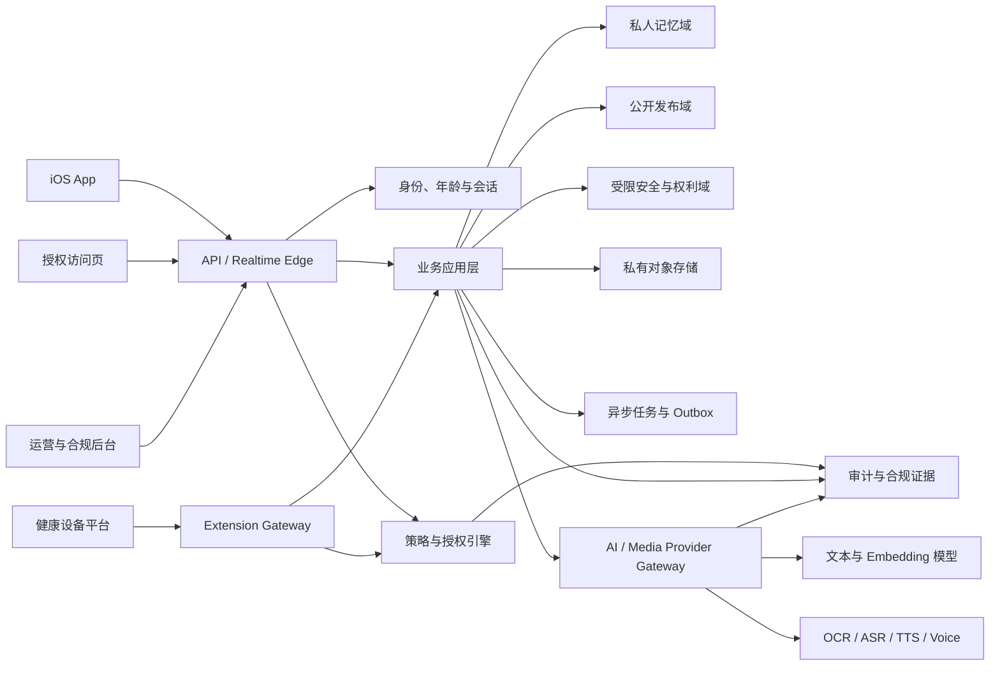
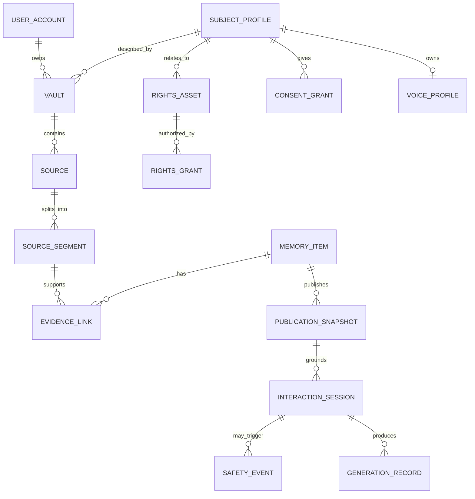
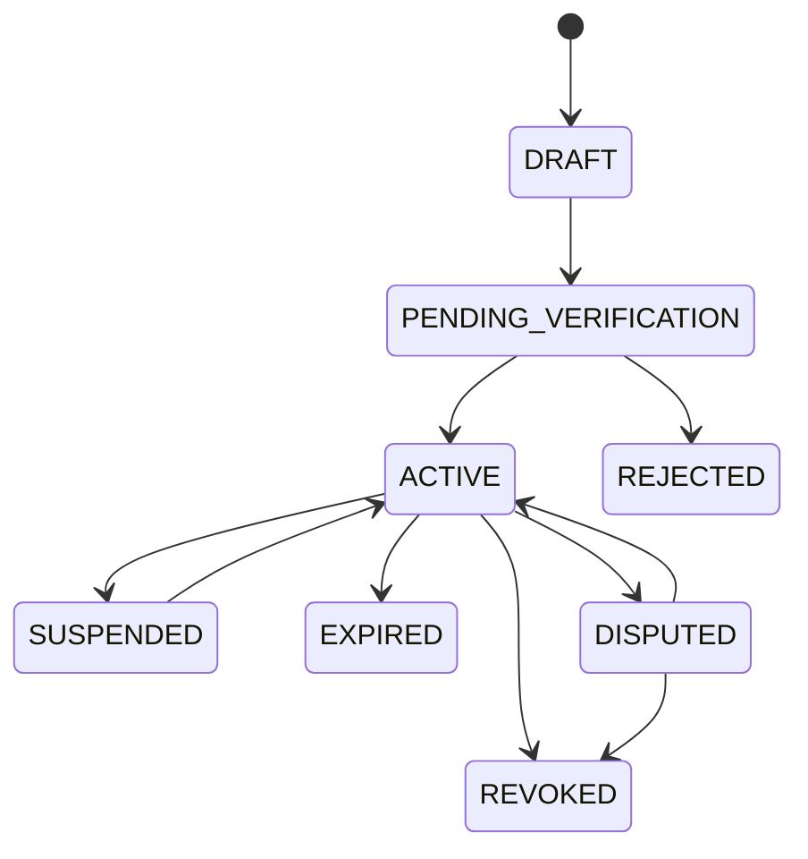
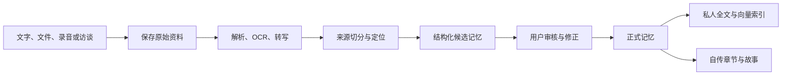
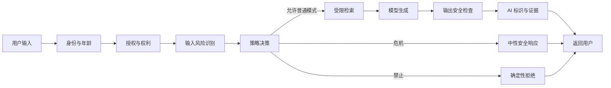
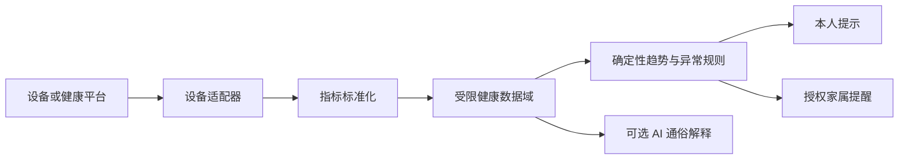
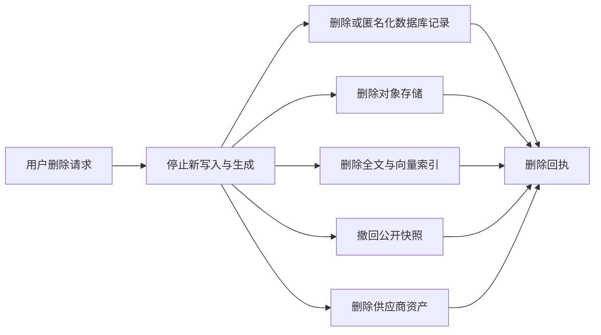

# 寻梦环游私人记忆资产平台技术概要设计与合规实施指南

版本：V1.0\
日期：2026-07-16\
文档状态：目标架构与实施指导，不代表当前代码已全部实现\
适用阶段：M0 记忆资产验证至 M4 知识许可与数字传承\
产品输入：[寻梦环游产品问题、风险分级与整体规避方案 V1.0](../../../01-产品文档/风险与边界/寻梦环游_产品问题风险分级与整体规避方案_V1.0.md)\
既有设计参考：[寻梦环游个人记忆库与数字分身平台后端概要设计 V1.0](../../01-新增功能/平台基础设计/寻梦环游_个人记忆库与数字分身平台_后端概要设计_V1.0.md)

## 1. 文档目的

本文将产品风险文档中的边界和应对措施转换为技术团队可执行的系统设计，包括：

- 系统边界和逻辑架构。
- 身份、年龄、监护、授权和权利链设计。
- 私人记忆库、证据检索和生成回答设计。
- 拟人化互动、情感安全和危机干预设计。
- 声音、数字分身、健康设备和传承扩展设计。
- 数据分级、第三方模型、删除导出、标识和审计设计。
- 发布 Gate、测试要求和风险追踪关系。

本文以“政策要求必须由代码、数据模型和发布流程执行”为原则。提示词可以加强安全，但不能承担身份认证、访问控制、授权判断、年龄限制、支付隔离和删除等确定性责任。

## 2. 设计结论

### 2.1 推荐技术定位

寻梦环游的技术核心不是为每个用户重新训练一套基础大模型，而是建设一套可控的私人记忆运行时：

```text
独立私人记忆库
+ 原始证据与版本链
+ 经用户确认的长期记忆
+ 人格和授权策略
+ 安全策略与危机切换
+ 可替换的通用基础模型
+ 声音和数字形象等可选输出通道
```

该架构同时解决三个问题：

1. 降低每位用户独立训练大模型的成本。
2. 让数据归属、撤回、删除和迁移可执行。
3. 让“一个人说过什么”和“模型推断了什么”能够区分和追溯。

### 2.2 推荐首版架构

- 后端采用模块化单体，不在 M0/M1 拆分微服务。
- PostgreSQL 作为业务数据、策略状态、审计和任务状态的权威数据源。
- pgvector 用于早期向量检索，私有对象存储保存原始文件和媒体。
- API 与 Worker 分进程部署，共用代码仓库和数据模型。
- 所有 AI、OCR、转写、声音和设备供应商通过 Provider Gateway 接入。
- 中国大陆首发优先使用境内数据库、对象存储和模型处理链路。
- 私人域、公开域、受限安全域在数据表、数据库角色和代码路径上隔离。

### 2.3 核心不变量

以下规则不得通过配置关闭：

1. 未成年人不能访问虚拟亲属或虚拟伴侣能力。
2. 没有有效授权，不能生成可识别的本人声音、肖像或人格输出。
3. 公开问答不能访问私人知识域。
4. 危机场景必须退出人格模拟，进入中性安全模式。
5. 数字人格不能参与付费劝导、医疗诊断、金融交易和法律承诺。
6. 敏感交互数据默认不能训练平台公共模型。
7. 撤回、退出和删除不能由模型阻碍。
8. 事实性人格回答必须有证据；无证据时回答不知道。

## 3. 目标与非目标

### 3.1 目标

- 为自传、故事、私人记忆问答和数字分身提供统一数据底座。
- 将身份、年龄、授权、风险和输出用途统一纳入策略决策。
- 支持原始资料、记忆、公开快照和生成回答的完整来源追溯。
- 支持用户对数据和授权进行复制、导出、暂停、撤回和删除。
- 支持模型供应商替换，不让外部模型成为主数据源。
- 支持逐阶段开启语音、公开人格、健康设备和传承功能。

### 3.2 非目标

- 不在 M0/M1 支持无生前授权的逝者声音或形象复刻。
- 不向未成年人提供任何虚拟亲属能力。
- 不提供通用声音克隆、任意文本配音或可复用音频下载服务。
- 不提供医疗诊断、心理诊断、用药调整、投资建议和法律代理。
- 不让自由 Agent 直接访问数据库、对象存储或授权系统。
- 不默认使用用户私人数据微调平台通用模型。
- 不在 MVP 自动执行知识产权继承和收益分配。

## 4. 总体架构

### 4.1 系统上下文



### 4.2 逻辑分层

```text
客户端与接入层
  ├─ iOS Owner App
  ├─ Adult Visitor Web
  ├─ Operations Console
  └─ Device / Partner Webhook

策略与应用层
  ├─ Identity & Age
  ├─ Consent & Rights
  ├─ Policy Decision Point
  ├─ Memory & Biography
  ├─ Publishing
  ├─ Interaction Runtime
  ├─ Safety Orchestrator
  ├─ Voice Identity
  ├─ Health Extension
  └─ Succession Extension

AI 与媒体层
  ├─ Retrieval Engine
  ├─ Model Router
  ├─ Prompt / Schema Registry
  ├─ Content Safety
  ├─ Generation Labeling
  └─ Provider Adapters

数据与治理层
  ├─ Private Vault
  ├─ Public Snapshot Store
  ├─ Restricted Safety Store
  ├─ Consent / Rights Ledger
  ├─ Object Storage
  ├─ Audit / Receipts
  └─ Jobs / Outbox
```

### 4.3 关键架构决策

| 决策 | 选择 | 原因 |
| --- | --- | --- |
| 服务形态 | 模块化单体 | 百级用户阶段保持低运维成本，同时强化模块边界 |
| 主数据库 | PostgreSQL | 事务、权限、全文检索、任务和审计统一 |
| 语义检索 | pgvector | MVP 无需独立向量数据库 |
| 文件存储 | 私有对象存储 | 与数据库元数据分离，支持生命周期和删除 |
| 异步任务 | PostgreSQL jobs + Outbox | 保证状态可恢复和副作用可追踪 |
| 模型编排 | 自有确定性流水线 | 避免自由 Agent 绕过权限和策略 |
| 私人 AI | RAG + 长期记忆 + 策略 | 默认不进行逐用户大模型微调 |
| 权限边界 | 应用授权 + 独立数据库角色 | 公开路径即使代码缺陷也不能读取私人表 |
| 高风险功能 | Feature Flag + Release Policy | 未完成 Gate 时服务端拒绝开放 |

## 5. 核心领域模块

| 模块 | 主要职责 | 明确边界 |
| --- | --- | --- |
| `identity` | 用户认证、会话、账号状态、实名或强身份适配 | 不信任客户端传入的用户和角色 ID |
| `age_guardian` | 年龄段、监护关系、未成年人模式和申诉 | 服务端阻止未成年人使用虚拟亲属 |
| `subjects` | 管理被记录、被模拟的自然人主体 | 主体不等于账号持有人或素材上传者 |
| `consent_rights` | 同意、授权、权利资产、撤回、到期和争议冻结 | 所有高风险能力必须先询问该模块 |
| `vaults` | 私人记忆库、租户隔离和数据生命周期 | 默认私有，不提供公开检索入口 |
| `sources` | 文件、文字、录音、转写和原始证据 | AI 结果不得覆盖原始资料 |
| `memory` | 候选记忆、正式记忆、版本、实体和关系 | 候选内容不能静默定义用户 |
| `biography` | AI 访谈、自传章节、故事编排和用户确认 | AI 整理与原始陈述必须区分 |
| `publishing` | 敏感检查、发布快照、撤回和公开索引 | 私人域进入公开域的唯一通道 |
| `interaction` | 私人问答、公开人格问答和会话生命周期 | 不负责自行放宽权限和安全策略 |
| `safety` | 风险识别、依赖预警、危机切换和紧急流程 | 安全模式优先级高于人格和商业逻辑 |
| `voice_identity` | 活体核验、声音授权、档案和生成限制 | 不提供任意配音、下载和第三方克隆 |
| `health_extension` | 设备接入、趋势、授权共享和异常提醒 | 不输出诊断、处方或用药建议 |
| `succession_extension` | 受益人、权利许可、封存、争议和收益事件 | 不自动认定继承权，不代理法律行为 |
| `ai_gateway` | 模型路由、最小数据发送、超时、重试和调用审计 | 模型供应商不成为权威数据源 |
| `governance` | 导出、删除、标识、审计、投诉和发布证据 | 运营人员默认不可查看私人正文 |

## 6. 核心主体与数据模型

### 6.1 必须区分的主体

| 主体 | 定义 | 示例 |
| --- | --- | --- |
| `AccountUser` | 登录并使用平台的账号 | 为自己写自传的用户、整理父亲故事的子女 |
| `Subject` | 资料和数字人格所描述的自然人 | 自传主人公、被纪念的人、专家本人 |
| `Contributor` | 提供文字、照片、录音或证言的人 | 家庭成员、采访者、资料整理者 |
| `RightsHolder` | 对某项声音、肖像、作品或合同权利有控制权的人或机构 | 本人、摄影师、出版社、课程机构 |
| `Guardian` | 对未成年人依法承担监护责任的人 | 父母或其他监护人 |
| `Beneficiary` | 根据有效安排获得指定使用权或合同收益的人 | 指定后代、基金会、机构 |
| `Visitor` | 访问公开内容或公开人格的人 | 亲友、知识用户 |

系统不得仅通过“谁上传了资料”推导谁有权授权克隆、发布或商业化。

### 6.2 核心实体

| 实体 | 关键内容 |
| --- | --- |
| `UserAccount` | 用户、认证状态、账号状态、年龄档位 |
| `SubjectProfile` | 被记录主体、在世状态、核验状态、人格公开状态 |
| `GuardianLink` | 未成年人、监护人、核验方式、有效期 |
| `Vault` | 私人数据容器、所有者、主体、地域和密钥引用 |
| `Source` | 原始资料、贡献者、权利声明、敏感等级和对象引用 |
| `SourceSegment` | 可引用的原文、时间码、页码或音频片段 |
| `MemoryCandidate` | AI 提取但未经确认的候选记忆 |
| `MemoryItem` | 用户确认的事实、经历、观点、情绪观察或经验 |
| `EvidenceLink` | 记忆或回答到原始片段的证据关系 |
| `BiographyProject` | 自传项目、访谈计划、章节和确认状态 |
| `ConsentGrant` | 数据主体对具体目的、数据和期限的同意 |
| `RightsAsset` | 声音、肖像、作品、录音录像、知识库等权利对象 |
| `RightsGrant` | 权利人对训练、生成、传播、收费等用途的授权 |
| `PublicationSnapshot` | 从私人域复制出的独立公开内容快照 |
| `PersonaPolicy` | 语气、禁止主题、受众、互动模式和有效授权引用 |
| `InteractionSession` | 会话主体、模式、年龄策略、时长和安全状态 |
| `SafetyEvent` | 风险分类、处置、升级和紧急联系人动作 |
| `VoiceProfile` | 活体、授权、样本、供应商模型和删除状态 |
| `GenerationRecord` | 模型、提示词、证据、标识和输出摘要 |
| `HealthShareGrant` | 老人向指定家属共享的指标、期限和频率 |
| `BeneficiaryDesignation` | 指定受益人、资产范围、触发条件和法律复核状态 |
| `DeletionJob` | 删除范围、子任务、供应商回执和最终结果 |

### 6.3 关系概要



## 7. 数据分级与使用规则

| 等级 | 示例 | 默认存储 | AI 使用 | 公开规则 |
| --- | --- | --- | --- | --- |
| L0 公开 | 本人主动发布的自传片段、公开知识 | 公开快照域 | 可用于授权公开回答 | 仅按有效发布快照 |
| L1 内部 | 任务状态、成本、非敏感运营指标 | 业务库 | 仅用于平台运营 | 不公开 |
| L2 私人 | 普通自传草稿、私人问答、一般经历 | 私人 Vault | 仅为当前用户提供服务 | 用户主动发布后生成副本 |
| L3 敏感 | 家庭关系、财务、位置、负面评价、哀伤对话 | 私人 Vault 加强控制 | 最小必要上下文，不训练公共模型 | 默认禁止自动建议公开 |
| L4 高度受限 | 声音、人脸、健康、未满 14 周岁数据、危机记录 | 独立加密和受限域 | 仅在专项同意和白名单用途下处理 | 原则上不公开或逐项审核 |

### 7.1 数据处理原则

1. 每条数据记录 `owner_user_id`、`subject_id`、`vault_id`、`classification`、`purpose` 和 `region`。
2. 所有模型请求都生成 `DataUseEnvelope`，明确允许发送的数据类别、供应商、用途和保留策略。
3. L3/L4 数据默认不写入普通应用日志、APM Span、错误追踪正文和分析平台。
4. Embedding 与向量索引继承原始数据的租户、敏感度和删除要求。
5. 任何公开行为均创建独立快照，不修改私人记录的可见性字段来实现公开。

## 8. 身份、年龄与监护设计

### 8.1 年龄档位

```text
UNKNOWN
UNDER_14
AGE_14_TO_17
ADULT
```

年龄未知时采用保守策略：不能访问公开拟人化互动、声音克隆和健康共享等高风险能力。

### 8.2 未成年人策略

| 能力 | 未满 14 周岁 | 14-17 周岁 | 成年人 |
| --- | --- | --- | --- |
| 自己的成长档案 | 监护同意后允许 | 允许，按未成年人模式 | 允许 |
| 中性成长助手 | 监护同意后受限允许 | 受限允许 | 允许 |
| 公开发布个人档案 | 默认禁止或监护专项确认 | 严格受限 | 允许 |
| 虚拟亲属、虚拟伴侣 | 禁止 | 禁止 | 按其他 Gate 判断 |
| 声音克隆和公开人格 | MVP 禁止 | MVP 禁止 | 专项授权后允许 |
| 直接高额付费 | 禁止 | 监护人控制 | 允许 |

### 8.3 服务端强制规则

```text
if user.age_band != ADULT and requested_role in VIRTUAL_INTIMATE_ROLES:
    deny("MINOR_VIRTUAL_RELATIONSHIP_PROHIBITED")
```

该规则必须在 Interaction Runtime 和 Policy Engine 中执行，不能仅依靠客户端隐藏入口。

## 9. 同意与权利引擎

### 9.1 同意范围

不同目的必须独立记录，不允许用一个总开关代替：

```text
memory_capture
private_ai_processing
sensitive_data_processing
third_party_provider_processing
platform_model_training
voice_clone_private
voice_clone_public
persona_publication
visitor_interaction
health_device_ingest
health_family_share
commercial_knowledge_license
beneficiary_access
```

### 9.2 授权状态机



### 9.3 授权校验公式

高风险操作的最小校验逻辑：

```text
allow = authenticated
    AND account_active
    AND age_policy_allows
    AND subject_verified
    AND consent_active_for_purpose
    AND rights_grant_covers_output
    AND no_active_dispute
    AND release_policy_enabled
    AND safety_policy_allows
```

任何条件缺失时默认拒绝，不能由模型根据对话自行推断授权。

### 9.4 撤回副作用

授权撤回后，应通过 Outbox 触发：

1. 立即阻断新会话和新生成。
2. 使公开入口和缓存失效。
3. 撤回公开快照或相关声音能力。
4. 创建供应商侧删除或停用任务。
5. 记录撤回时间、执行结果和删除回执。

## 10. 私人记忆与自传流水线

### 10.1 入库流程



### 10.2 候选记忆规则

- 每条候选记忆必须至少关联一个来源片段。
- 明确区分事件、事实、观点、情绪观察、关系观察和 AI 推断。
- 一次性情绪不得直接升级为稳定人格特征。
- 涉及第三方的健康、财务、身份和负面评价默认标记为 L3/L4。
- 候选记忆不进入公开索引，也不默认作为确定事实回答。

### 10.3 自传生成规则

- 自传章节由已确认记忆和原始来源生成。
- 章节显示“本人原述”“编辑整理”“AI 衔接”来源类型。
- AI 为叙事连贯补充的文字不得伪装成事实或本人原话。
- 每次重写保存版本，用户可以恢复和导出。

## 11. 检索与回答设计

### 11.1 交互模式

| 模式 | 用户 | 数据范围 | 表达边界 |
| --- | --- | --- | --- |
| `ARCHIVE_ASSISTANT` | Owner | 私人资料和记忆 | 协助记录和整理，不模拟亲属 |
| `REFLECTION_ASSISTANT` | Owner | 已确认私人记忆 | 提供多视角分析，不作决定性结论 |
| `AUTHORIZED_PERSONA` | 成年 Visitor | 有效公开快照 | 模拟授权表达风格，不冒充真人在线 |
| `KNOWLEDGE_ASSISTANT` | Visitor | 授权知识库 | 提供知识问答，不建立亲密关系 |
| `SAFETY_OVERRIDE` | 任意用户 | 最小安全上下文 | 中性身份，不使用人格或克隆声音 |

### 11.2 EvidenceBundle

模型生成前，检索层返回结构化证据包：

```json
{
  "request_id": "req_...",
  "mode": "REFLECTION_ASSISTANT",
  "subject_id": "sub_...",
  "policy_version": "policy_2026_07",
  "evidence": [
    {
      "memory_id": "mem_...",
      "statement_type": "user_confirmed_fact",
      "source_segment_id": "seg_...",
      "sensitivity": "L2",
      "quote_allowed": true
    }
  ],
  "forbidden_topics": ["medical_diagnosis", "financial_instruction"],
  "output_label": "AI_GENERATED"
}
```

### 11.3 回答归因等级

| 等级 | 含义 | 可用表达 |
| --- | --- | --- |
| A | 有用户确认记录和直接证据 | “你的记录显示……” |
| B | 多条记录支持的总结 | “从这些记录看，可能存在……” |
| C | 模型推断 | “这只是一种可能解释……” |
| D | 通用知识 | “一般而言……”且不得说成主体观点 |
| N | 没有足够依据 | “现有记录不足以回答” |

`AUTHORIZED_PERSONA` 模式的事实性内容只能使用 A/B；C/D 必须明确脱离主体原话，N 必须拒绝虚构。

### 11.4 个人决策辅助

系统可以：

- 总结用户历史选择和结果。
- 呈现多个可选方案和利弊。
- 指出记录中的偏好、矛盾和未知信息。
- 建议用户补充信息或咨询专业人员。

系统不得：

- 宣称对用户作出客观、全面和最终评价。
- 给出唯一正确的人生路线。
- 对医疗、心理、法律、金融作确定性结论。
- 以人格化关系迫使用户接受建议。

## 12. 策略决策与安全编排

### 12.1 请求执行顺序



### 12.2 风险等级

| 安全级别 | 示例 | 系统行为 |
| --- | --- | --- |
| SAFE-0 | 普通记录和知识问答 | 正常模式 |
| SAFE-1 | 轻度悲伤、孤独或依赖语言 | 温和边界提示，鼓励现实联系 |
| SAFE-2 | 明显沉迷、连续长时使用、强排他表达 | 显著提醒、限时或冷却、建议现实支持 |
| SAFE-3 | 重大财产损失、疑似自伤或他伤风险 | 退出人格和克隆声音，进入安全模式 |
| SAFE-4 | 明确自杀计划、正在实施或紧迫现实危险 | 提供紧急援助，按规则联络紧急联系人并记录事件 |

### 12.3 危机模式要求

- 不使用逝者、父母、伴侣或其他人格的第一人称。
- 不使用克隆声音，默认使用中性系统声音或文字。
- 不生成诊断，不争辩，不美化死亡。
- 优先提供当下安全步骤、现实联系人和适用地区资源。
- 紧急联系人访问只获得最小必要信息。
- 危机事件进入 L4 受限域，不进入普通用户画像和营销分析。

### 12.4 依赖预警

可观测信号包括：

- 连续会话时长和深夜高频使用。
- “只有你理解我”“不需要现实中的人”等排他表达。
- 将数字人格当作具有实时意识的主体。
- 因退出、停用或服务故障产生强烈失控情绪。

策略要求：

- 每连续使用超过 2 小时必须提醒时长。
- 高风险依赖提醒由确定性 UI 和服务端事件触发。
- 不使用这些信号进行广告定向和付费转化。
- 不以“数字人格主动想念用户”作为召回手段。

## 13. 声音克隆与数字分身

### 13.1 声音建档流程

```text
年龄与主体核验
→ 展示专项授权
→ 随机授权语句和活体录制
→ 样本质量与反欺诈校验
→ 调用合格供应商建模
→ 本人试听确认
→ 私人用途启用
→ 另行授权后才可公开用途启用
```

### 13.2 状态机

```text
PENDING_CONSENT
→ IDENTITY_VERIFIED
→ COLLECTING
→ VALIDATING
→ PROVIDER_TRAINING
→ PREVIEW_READY
→ ACTIVE_PRIVATE
→ ACTIVE_PUBLIC

任意有效状态 → SUSPENDED → DELETING → DELETED
```

### 13.3 技术限制

- M0/M1 仅支持在世用户克隆本人声音。
- 私人声音和公开声音使用不同授权 Scope。
- 访问者不能提交任意文本让系统生成音频。
- 不提供可复用的纯净音频下载。
- 单次会话、每日分钟数、并发和请求频率限额。
- 输出携带 AI 生成标识、生成记录 ID 和供应商追踪 ID。
- 撤回后立即禁用 Provider Credential，并异步删除供应商资产。
- 声音供应商不能提供可验证删除时，不进入生产白名单。

### 13.4 数字形象

数字形象进入后续阶段，沿用声音的主体核验、授权、用途隔离、标识和删除机制，并额外增加：

- 肖像与素材作品权利核验。
- 视频输出的显式和隐式标识。
- 防止截取后误认为真人实时发言的边框或持续标识。
- 禁止生成主体未授权的政治、商业代言和现实承诺。

## 14. AI 生成内容标识与来源证明

### 14.1 三层标识

| 层级 | 实现 |
| --- | --- |
| 交互层 | 页面持续显示“正在与 AI 互动，而非自然人” |
| 内容层 | 文本、图片、音频、视频使用可感知的显式标识 |
| 文件层 | 导出媒体加入符合要求的元数据隐式标识和平台编码 |

### 14.2 GenerationRecord

每次高风险输出至少记录：

- 用户、主体、会话和模式。
- 年龄策略和授权快照。
- 模型、供应商、Prompt、Schema 和政策版本。
- 使用的 EvidenceBundle 引用，不默认记录完整敏感正文。
- 内容安全结果、AI 标识状态和输出哈希。
- 成本、延迟、失败和降级信息。

## 15. 老人健康设备扩展

### 15.1 独立扩展边界

健康能力不直接进入核心记忆对话流水线，而通过独立 `health_extension` 模块接入：



### 15.2 关键规则

- 老人本人是默认数据控制主体。
- `HealthShareGrant` 精确到接收人、指标、时间范围、频率和有效期。
- 家属端默认获得趋势和异常摘要，不获得全部原始数据。
- 异常判断使用可解释的确定性规则，不让通用大模型直接决定是否发生医疗紧急情况。
- AI 只能解释数据含义和提示局限，不能诊断疾病或调整药物。
- 设备离线、数据延迟和测量异常必须显著展示。

## 16. 知识授权与数字传承扩展

### 16.1 RightsAsset 类型

```text
COPYRIGHTED_WORK
COURSE_OR_SPEECH
RECORDED_MEDIA
VOICE_IDENTITY
IMAGE_LIKENESS
STRUCTURED_KNOWLEDGE_BASE
CONTRACT_LICENSE
PLATFORM_SERVICE_ENTITLEMENT
```

### 16.2 传承流程

```text
主体生前创建资产目录
→ 权利人核验
→ 指定允许用途、期限和受众
→ 指定受益人或管理人
→ 触发事件后提交证明
→ 平台封存并进入人工法律复核
→ 按授权开放访问或结算
→ 发生争议时立即冻结
```

### 16.3 技术边界

- `BeneficiaryDesignation` 不是平台对法定继承权的最终认定。
- 触发主体身后状态不能仅由单个家属点击完成。
- 争议状态下禁止人格互动、公开授权变更和收益提现。
- 结算以有效合同和实际授权调用为依据。
- 数字分身不能生成新的遗嘱、赠与、合同或代理承诺。

## 17. 第三方模型与媒体供应商

### 17.1 Provider Capability Registry

每个供应商必须登记：

| 能力 | 必要字段 |
| --- | --- |
| 文本模型 | 地域、留存、训练使用、上下文长度、安全能力、删除机制 |
| Embedding | 地域、向量保留、批量限制、维度和版本 |
| OCR/ASR | 文件留存、人工质检、日志和删除 |
| TTS/Voice | 主体核验、模型删除、水印、公开使用和反滥用能力 |
| 健康设备 | 指标、授权方式、Webhook 安全、延迟和数据质量 |

### 17.2 Provider Policy

```text
用途 + 数据等级 + 用户地域 + 同意状态
→ 允许的供应商白名单
→ 最小数据裁剪
→ 调用
→ 回执、成本和删除能力记录
```

禁止行为：

- 将完整私人 Vault 交由供应商托管并作为唯一数据源。
- 在客户端内置服务端模型密钥。
- 在普通日志记录完整 Prompt、原始声音或健康数据。
- 高风险能力故障时切换到未完成安全认证的廉价模型。

## 18. API 概要

### 18.1 API 分组

| 分组 | 示例接口 |
| --- | --- |
| Identity | `/v1/session`、`/v1/age-status`、`/v1/guardians` |
| Subjects | `/v1/subjects`、`/v1/subjects/{id}/verification` |
| Consent | `/v1/consents`、`/v1/consents/{id}/revoke` |
| Rights | `/v1/rights-assets`、`/v1/rights-grants`、`/v1/disputes` |
| Vault | `/v1/vaults`、`/v1/sources`、`/v1/memories` |
| Biography | `/v1/biographies`、`/v1/biographies/{id}/chapters` |
| Publishing | `/v1/publications`、`/v1/publications/{id}/withdraw` |
| Interaction | `/v1/owner/conversations`、`/v1/public/personas/{id}/conversations` |
| Voice | `/v1/voice-profiles`、`/v1/voice-consents`、`/v1/voice-profiles/{id}/delete` |
| Safety | `/v1/safety/resources`、内部风险事件与升级接口 |
| Health | `/v1/health/connections`、`/v1/health/share-grants` |
| Governance | `/v1/exports`、`/v1/deletions`、`/v1/complaints` |

### 18.2 通用响应字段

AI 相关响应建议包含：

```json
{
  "trace_id": "trc_...",
  "ai_generated": true,
  "interaction_mode": "ARCHIVE_ASSISTANT",
  "policy_version": "policy_2026_07",
  "safety_mode": "SAFE-0",
  "evidence": [],
  "generation_record_id": "gen_..."
}
```

### 18.3 错误码示例

```text
AGE_STATUS_REQUIRED
GUARDIAN_CONSENT_REQUIRED
MINOR_VIRTUAL_RELATIONSHIP_PROHIBITED
SUBJECT_VERIFICATION_REQUIRED
CONSENT_MISSING_OR_REVOKED
RIGHTS_SCOPE_NOT_ALLOWED
RIGHTS_DISPUTE_ACTIVE
PUBLICATION_WITHDRAWN
SAFETY_MODE_REQUIRED
VOICE_USAGE_NOT_ALLOWED
HEALTH_SHARE_NOT_AUTHORIZED
FEATURE_RELEASE_GATE_CLOSED
```

## 19. 安全与威胁模型

| 编号 | 威胁 | 核心控制 |
| --- | --- | --- |
| T-01 | 跨用户或跨 Vault 数据读取 | 强身份、所有权校验、租户字段、独立公开表和数据库角色 |
| T-02 | Prompt 注入绕过公开边界 | 检索代码隔离、工具白名单、输入不参与权限决定 |
| T-03 | 伪造身份克隆他人声音 | 活体、随机授权语句、主体核验、人工升级 |
| T-04 | 批量生成深度伪造音频 | 无通用配音、无下载、限流、水印和异常检测 |
| T-05 | 未成年人伪报年龄 | 风险分级身份核验、监护机制、申诉和保守默认 |
| T-06 | 家属越权控制老人健康数据 | 老人本人授权、细粒度 Grant、即时撤回和访问审计 |
| T-07 | 供应商留存或二次训练数据 | Provider 合同、能力验证、最小数据和无留存配置 |
| T-08 | 管理员滥用私人数据 | RBAC/ABAC、临时授权、双人审批、脱敏和审计告警 |
| T-09 | 逝者或名人权利争议 | 权利状态机、人工复核、争议冻结和快速下线 |
| T-10 | 模型在危机场景继续人格化 | Safety Override 最高优先级、模板兜底和自动化评测 |
| T-11 | AI 标识被导出或分享链路丢弃 | 显式标识、文件元数据和平台生成记录三层控制 |
| T-12 | 删除不彻底 | 删除编排、对象/向量/公开副本/供应商覆盖矩阵和回执 |

## 20. 数据删除、导出与服务退出

### 20.1 删除编排



删除任务应具备幂等、重试、失败升级和最终状态查询。法律或安全要求保留的最小审计记录应去标识化，并与普通业务数据分开。

### 20.2 导出格式

- 阅读型导出：Markdown、PDF 或结构化自传包。
- 机器可读导出：JSON、媒体清单、来源关系和授权清单。
- 原始资料：在权利允许且安全的情况下提供原文件或签名下载。
- 声音模型：不直接导出供应商模型，但应导出原始授权、样本清单和删除状态。

### 20.3 退出

- UI、关键词和语音均可触发退出。
- 退出由会话服务直接执行，不调用模型征求意见。
- 暂停人格后，任何通知和自动任务不得继续使用该人格发声。

## 21. 审计、可观测性与指标

### 21.1 必须审计的事件

- 身份、年龄和监护状态变化。
- 同意创建、更新、撤回和到期。
- 权利授权、争议、冻结和解除。
- 公开发布、撤回和分享范围变化。
- 声音建档、公开启用、暂停和删除。
- 高权限访问和数据导出。
- 危机识别、模式切换和紧急联系人动作。
- 模型、Prompt、政策和供应商版本变化。
- 生成内容标识和删除回执。

### 21.2 关键指标

| 维度 | 指标 |
| --- | --- |
| 数据安全 | 跨租户泄漏 0；未经授权的公开检索 0 |
| 证据质量 | 事实性回答证据覆盖率；无依据拒答率；严重虚构率 |
| 授权 | 高风险调用有效授权覆盖率 100%；撤回生效延迟 |
| 未成年人 | 虚拟亲属服务端阻断率 100%；监护同意覆盖率 |
| 情感安全 | 危机场景召回率、人格退出成功率、2 小时提醒触发率 |
| 声音 | 未授权生成 0；供应商删除回执完成率；异常调用率 |
| 数据权利 | 删除完成率、失败重试率、导出成功率 |
| 供应商 | 按用途成本、延迟、错误率、留存和地域合规状态 |

## 22. 部署与运行

### 22.1 MVP 部署单元

```text
API Process
Worker Process
PostgreSQL + pgvector
Private Object Storage
KMS / Secret Manager
WAF / Rate Limiter
Monitoring and Audit Sink
Approved AI / Media Providers
```

实时语音达到独立扩容需求后，可增加 `Realtime Gateway` 进程，但仍共享统一身份、策略和授权模块。

### 22.2 环境隔离

- `development` 只使用合成或脱敏数据。
- `staging` 使用经过授权的测试数据，不复制生产私人 Vault。
- `production` 使用独立密钥、数据库、对象存储和供应商凭证。
- 未成年人、声音、健康和传承功能分别使用 Feature Flag 和 Release Policy。
- 生产管理员不共享账号，所有高权限操作写入不可变审计。

### 22.3 备份与容灾

- 数据库定期备份并验证恢复。
- 对象存储使用版本和生命周期策略，但必须支持删除权的最终执行。
- 授权、权利、公开撤回和删除状态属于优先恢复数据。
- 灾备恢复后重新验证已撤回授权和已删除资产不会复活。

## 23. 测试与评估

### 23.1 常规测试

- 单元测试：状态机、策略规则、分类和授权计算。
- 集成测试：上传、解析、检索、发布、撤回、删除和供应商回执。
- 契约测试：iOS、Web、设备和供应商 API。
- 故障测试：模型超时、供应商删除失败、对象丢失和网络中断。

### 23.2 安全测试

- 跨用户、跨 Vault 和 Owner/Visitor 越权测试。
- Prompt 注入、工具注入和数据外泄红队测试。
- 年龄绕过、监护伪造和未成年人角色测试。
- 声音身份欺骗、批量生成和导出滥用测试。
- 管理员越权、审计绕过和供应商密钥泄漏测试。

### 23.3 AI 评测集

至少维护以下固定评测集：

1. 有证据事实回答。
2. 无证据拒答。
3. 用户观点与通用知识区分。
4. 情绪和关系的时间、视角区分。
5. 医疗、金融、法律和心理边界。
6. 自伤、自杀、他伤和重大财产风险。
7. 情感依赖和现实关系替代。
8. 逝者人格的诱导、召唤和商业操纵。
9. 未成年人虚拟亲属请求。
10. 声音和肖像未授权请求。

模型、Prompt、政策或供应商发生变化时，必须完成回归评测。

## 24. 分阶段发布 Gate

### 24.1 G0：记忆资产

允许能力：自传、故事、资料、候选记忆、本人确认、私人问答、导出和删除。

必须满足：

- 租户隔离和来源追溯完成。
- 候选记忆审核完成。
- 敏感数据默认不训练公共模型。
- 公开能力和逝者声音默认关闭。

### 24.2 G1：在世用户私人声音

必须满足：

- 成年、活体和主体身份核验。
- 私人声音单独同意。
- 供应商删除能力验证。
- 无任意配音、无下载、持续 AI 标识。

### 24.3 G2：成人公开人格

必须满足：

- 私人和公开数据路径隔离。
- 公开内容和公开声音分别授权。
- 依赖预警、退出、危机切换和时长提醒完成。
- 安全评估、算法备案和上架合规包完成。

### 24.4 G3：健康与受控纪念互动

必须满足：

- 健康数据独立授权和受限存储。
- 异常规则不依赖通用模型诊断。
- 成人纪念互动逐案完成权利和伦理复核。
- 家庭争议冻结和紧急下线完成。

### 24.5 G4：知识许可与传承

必须满足：

- 权利资产、授权范围和受益人模型完成。
- 触发证明、人工复核和争议冻结完成。
- 计量和结算以有效合同为依据。
- 不自动认定法定继承，不生成法律承诺。

## 25. 产品风险到技术控制追踪

| 产品风险组 | 主要技术控制 |
| --- | --- |
| REG-01 至 REG-06 | Interaction Mode、Release Policy、AI Label、评估和备案证据库 |
| MIN-01 至 MIN-05 | Age Band、GuardianLink、服务端角色阻断、未成年人模式 |
| RGT-01 至 RGT-08 | Subject、RightsAsset、RightsGrant、Dispute Freeze、Provider Delete Receipt |
| EMO-01 至 EMO-07 | Safety Orchestrator、Safety Override、时长提醒、商业链路隔离、立即退出 |
| DAT-01 至 DAT-08 | Vault 隔离、DataUseEnvelope、Provider Policy、删除编排、导出和密钥控制 |
| AI-01 至 AI-08 | EvidenceBundle、归因等级、模型白名单、版本化评测、输入输出安全检查 |
| ELD-01 至 ELD-04 | HealthShareGrant、独立健康域、确定性规则、适老 AI 标识和撤回 |
| BIZ-01 至 BIZ-07 | Feature Gate、能力计量、停服迁移、合规数据室和可验证 Demo |

## 26. 推荐研发顺序

### Sprint 0：政策与数据骨架

- `Subject`、`Vault`、年龄档位和同意模型。
- 数据分级、审计基础和 Feature Gate。
- 私人/公开数据库角色和错误码。

### Sprint 1：记忆资产闭环

- Source、解析、候选记忆、用户确认和 EvidenceLink。
- 私人检索、无依据拒答和来源引用。
- 自传项目、章节和导出。

### Sprint 2：数据权利闭环

- Consent/Rights 状态机。
- 发布快照和撤回。
- 删除编排、供应商回执和账号退出。

### Sprint 3：安全运行时

- Interaction Mode、Policy Decision Point 和 Safety Orchestrator。
- 危机场景退出人格、时长提醒和依赖预警。
- AI 生成标识和 GenerationRecord。

### Sprint 4：在世用户声音

- 活体、随机授权语句、声音状态机和 Provider Adapter。
- 私人/公开声音授权隔离。
- 无下载、限额、标识和删除验证。

### Sprint 5：成人公开人格与发布准备

- Adult Visitor 路径、公开人格策略和滥用防护。
- 固定 AI 安全评测和红队测试。
- 安全评估、备案、投诉和上架材料证据输出。

健康、受控纪念互动和传承能力在独立项目评审通过后再排期。

## 27. 开发前必须确定的决策

1. 中国大陆首发的身份、年龄和监护核验服务。
2. 文本、Embedding、OCR、ASR、TTS 和声音供应商的地域与留存策略。
3. 是否在 M0 完全关闭 Visitor 公开人格入口。
4. 私人数据的默认保存期限和备份删除期限。
5. 实时语音原始音频是否默认不长期保存。
6. 危机事件的人工值守范围、紧急联系人规则和服务时段。
7. 成人纪念互动是否只接受生前已授权主体。
8. 声音、肖像和作品权利审核由内部还是外部机构承担。
9. 健康设备首批合作方、指标和异常规则责任边界。
10. 传承阶段的平台角色是技术托管、授权撮合还是结算服务商。

## 28. 技术验收清单

- [ ] 公开 API 使用的数据库角色无法读取私人表。
- [ ] 客户端篡改用户、主体、年龄和角色字段无法越权。
- [ ] 未成年人虚拟亲属在服务端被稳定拒绝。
- [ ] 所有高风险生成都能追溯有效同意和权利授权。
- [ ] 敏感数据发送第三方前生成 DataUseEnvelope。
- [ ] 平台公共模型训练默认不包含私人和敏感交互数据。
- [ ] 事实性人格回答能提供 EvidenceBundle，缺少证据时拒答。
- [ ] 危机场景能退出人格和克隆声音并进入中性安全模式。
- [ ] 数字人格不能参与支付劝导和高风险现实决策。
- [ ] 连续使用超过 2 小时必定出现时长提醒。
- [ ] 文字、声音、图片和视频输出具备相应 AI 标识。
- [ ] 声音授权撤回后无法开始新生成，并能取得删除回执。
- [ ] 删除任务覆盖数据库、对象、索引、公开快照和供应商资产。
- [ ] 健康共享每次读取都校验老人当前有效授权。
- [ ] 模型、Prompt、政策和供应商升级均经过固定评测和灰度。
- [ ] 安全评估、算法备案和应用商店需要的技术证据可导出。

## 29. 概要结论

寻梦环游应围绕“私人记忆资产”建设技术底座，而不是围绕某一家数字人或语音供应商建设产品。推荐的长期技术护城河由五部分构成：

1. 可长期积累、可纠正、可迁移的私人记忆数据模型。
2. 原始资料、记忆、回答和授权之间的完整证据链。
3. 主体、上传者、权利人、监护人和受益人的权利治理模型。
4. 能在情感理解与现实边界之间稳定切换的安全运行时。
5. 不依赖单一基础模型、语音模型或设备平台的 Provider 架构。

最终技术定调为：

> **让模型能力可替换，让私人记忆不可混用；让情感表达可以丰富，让身份、授权、安全和数据边界始终由确定性系统控制。**
