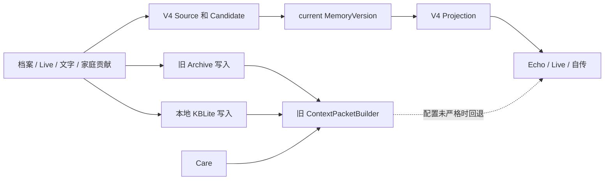
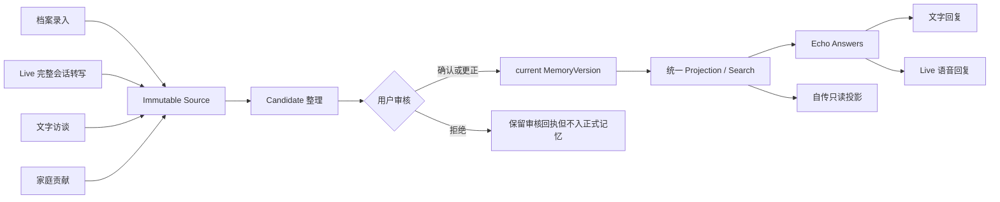

# DreamJourney V4 预发布兼容清理与单链收敛实施方案

> 文档日期：2026-08-28\
> 文档性质：编码实施指导，不是已经完成的变更记录\
> 适用对象：负责 iOS、后端、数据库、部署与验证的 Codex 或研发人员\
> 决策状态：产品已确认采用“V4 唯一权威、删除旧读写链、删除旧路由和兼容运行时”\
> 风险等级：高。包含数据库重建和旧接口退役，但本文不授权直接清库、部署或删除线上数据

---

## 1. 执行摘要

DreamJourney 尚未公开发布，目前只有一个测试账号。现有代码是在旧 Archive、KBLite、Care、旧认证和旧 feature 名称之上逐步叠加 V4 Owner Truth，因此出现了两类并存状态：

1. 正式配置下，部分请求已经优先使用 V4 `MemoryVersion` 和 Projection。
2. 代码中仍保留旧读路径、旧写路径、本地 KBLite、旧 HTTP 路由、兼容别名、shadow/backfill 和旧数据库表。

继续保留这些运行时兼容会带来四个直接问题：

- 同一个问题可能命中不同事实源，造成 Live、文字问答和自传回答不一致。
- 旧开关或配置遗漏时，系统可能静默退回 Archive/KBLite/Care。
- iOS 账号切换、家庭身份和本地缓存仍可能携带旧事实。
- 测试需要同时覆盖两套链路，增加初创团队维护成本。

本方案采用预发布硬切换：

```text
档案录入 / Live / 文字问答 / 家庭贡献
    -> Source
    -> Candidate
    -> 用户审核 DecisionReceipt
    -> current MemoryVersion
    -> Projection / Search
    -> 回响 / Live / 自传
```

最终只有一套事实权威：**用户确认后的当前 `MemoryVersion`**。原始 `Source`、待确认 `Candidate`、会话转写和媒体仍是证据或处理材料，不能直接成为回答事实。

清理可以做干净，但必须按依赖顺序进行。不能根据文件名批量删除所有 `legacy_*` 或 `*_shadow`，因为其中一部分包含仍被 V4 使用的身份校验、安全过滤或未来能力占位。正确做法是先抽取 V4 必需逻辑，再删除旧运行时。

---

## 2. 当前代码基线与保护边界

### 2.1 iOS 基线

- 仓库：`/Users/gaominge/Documents/Codex/Video/DreamJourney_dev`
- 分支：`feature/prd-stitch-ui-adaptation`
- 基线提交：`8f0a9aadf573f59623307f8cce6b5aff39c942d0`
- 提交说明：`fix: unify live and text echo answers`

当前工作树存在未提交内容，编码任务不得覆盖、回滚、stash 或重置这些文件：

- `DreamJourney/Sources/Modules/Echo/EchoViewController.swift`
- `DreamJourney/Sources/Services/DialogEngineManager.swift`
- `DreamJourneyTests/AccountLeaseRuntimeTests.swift`
- `docs/product/寻梦环游_当前代码整体概要设计_2026-08-17.md`

编码前必须重新执行 `git status --short --branch`。如果上述文件仍有改动，应在现状之上做最小修改，并逐段检查 diff。

### 2.2 后端基线

- 仓库：`/Users/gaominge/Documents/Codex/Video/DreamJourneyBackend`
- 分支：`main`
- 基线提交：`0227e3d5b97a7883b86443d701aa22f4cbb36557`
- 提交说明：`docs: record worker deployment hardening`
- 当前工作树：干净

### 2.3 本方案不包含的授权

本文允许编码人员实现和验证清理，但不自动授权以下动作：

- 删除、覆盖或重建部署环境数据库。
- 删除对象存储内容。
- 修改生产域名、证书或密钥。
- 推送代码、合并分支或部署服务器。
- 覆盖安装真机 App。

涉及上述动作时，必须单独向用户说明影响并取得明确授权。

---

## 3. 已确认的产品决策

### 3.1 必须执行

1. V4 合同是唯一权威合同。
2. 正式记忆只有一条权威版本链，不允许 Archive、KBLite 或本地会话成为平行事实源。
3. 删除旧读回退，包括后端 `ContextPacketBuilder.build(...)` 的旧 Archive/KBLite/Care 查询分支，以及 iOS 本地 KBLite 回退。
4. 删除旧写路径，包括旧 Archive 写入、本地 KBLite 事实持久化和旧 KB mutation。
5. 删除旧 HTTP 路由、旧 feature 别名和兼容运行时。
6. 只有一个测试账号，不承诺旧数据迁移；允许在受控部署阶段重建测试账号与 V4 数据基线。
7. 重建前保留一次离线快照，用作事故恢复证据，不作为运行时兼容层。
8. 重建后 iPhone 必须删除旧 App 数据并进行干净安装。

### 3.2 必须保留

1. `Source -> Candidate -> DecisionReceipt -> MemoryVersion` 审核链。
2. current `MemoryVersion` 及其可重建 Projection/Search。
3. Owner、Family、Visitor 的身份和授权边界。
4. 家人管理、账号切换、授权撤销和账号清理能力。
5. V4 当前使用的六类 Worker 注册和激活机制。
6. 当前 V4 消息中心、待确认记忆、正式记忆、内容记录和自传读取功能。
7. Voice、媒体、Publication、Digital Human 等未来能力的 V4 端口或明确关闭状态。
8. 安全过滤、引用、无答案策略、权限二次校验和 AccountLease。

### 3.3 明确不再支持

- 已安装的旧测试包继续无缝工作。
- 旧 `/archive/*`、`/kb/*`、`/care/*` 客户端。
- 旧 `/auth/login` 和 `/auth/restore`。
- 本地 KBLite 作为回答上下文或事实权威。
- 旧 Archive 内容自动回填到 V4。
- feature 名称别名的过渡期。
- 旧数据库中的测试数据原地迁移。

---

## 4. 清理目标与非目标

### 4.1 清理目标

完成后必须满足：

- 任何回响回答、Live 回答、文字回答和自传内容，只读取当前身份有权访问的 current `MemoryVersion` 派生投影。
- 所有记忆录入只写 immutable `Source`，随后进入 Candidate 审核；不能直接写正式记忆。
- 用户确认后生成或推进唯一正式版本链，不创建平行的正式记忆分支。
- iOS 不再读取、写入、同步或清理 KBLite 事实数据库。
- 后端不再注册旧 Archive、KB、Care、兼容迁移和 shadow 比对路由。
- 默认配置就是 V4 严格模式，不再依赖某个环境变量“打开正确链路”。
- 空白新数据库可以只通过一套 V4 baseline 建成可运行环境。
- 旧路由静态不存在，调用返回普通 404，而不是继续返回兼容响应。

### 4.2 非目标

本任务不负责：

- 新增产品功能。
- 开放当前已关闭的 Voice Clone、Digital Human、Publication 或 Visitor。
- 修改正式记忆的产品结构和归纳算法。
- 迁移历史测试数据。
- 优化第三方 Provider 延时。
- 为未发布的旧客户端提供升级提示。
- 重新设计 UI。

---

## 5. 清理前后的事实架构

### 5.1 当前混合状态



当前最大风险不是 V4 没有实现，而是正确链路仍依赖配置，旧链路仍可达。

### 5.2 目标单链状态



### 5.3 唯一权威规则

| 数据对象 | 可以保存什么 | 能否直接用于事实回答 |
|---|---|---|
| Source | 用户原始文字、会话转写、媒体引用、来源元数据 | 否 |
| Candidate | 系统整理出的待确认陈述 | 否 |
| DecisionReceipt | 用户确认、更正或拒绝的不可变审核行为 | 否，作为版本证据 |
| MemoryVersion | 用户确认后的正式事实版本 | 是，唯一权威 |
| Projection/Search | current MemoryVersion 的可重建读取模型 | 是，但不能反向写事实 |
| Conversation runtime | 当前会话上下文与临时状态 | 否 |
| Provider 输出 | ASR、LLM、TTS、数字人结果 | 否 |

---

## 6. “兼容”与“必须保留能力”的定义

编码前必须先按下表分类，禁止用 `legacy` 或 `shadow` 文件名做批量删除条件。

| 类型 | 定义 | 处理方式 |
|---|---|---|
| 运行时旧兼容 | 会读取、写入或响应旧 Archive、KB、Care、旧认证、旧 feature 名 | 删除 |
| 一次性迁移工具 | 只为旧数据 backfill、parity、inventory 服务 | 本项目无迁移承诺，删除 |
| 数据库 migration 机制 | 把空数据库建成目标 schema 的机制 | 保留，但改为新的 V4 baseline |
| V4 安全/身份逻辑 | Owner、Family、Visitor 识别，response identity 校验，授权 epoch | 保留并改中性命名 |
| V4 可重建投影 | MemoryVersion 的查询、自传和搜索投影 | 保留 |
| 未来能力 shadow | Voice、媒体、Publication、Digital Human 的默认关闭实现 | 不因本次兼容清理删除，逐项确认 |
| 运行时观测 | 当前链路的日志、指标、审计 | 保留并改为 V4 命名 |

---

## 7. 处理矩阵

### 7.1 直接删除

| 范围 | 当前对象 | 删除条件 |
|---|---|---|
| 后端旧读写 API | `/archive/*`、`/kb/*`、`/care/*` | iOS 调用点已归零 |
| 后端 KBLite 兼容 API | `kblite-compatibility` 路由与服务 | V4 投影已覆盖当前读取场景 |
| 后端旧迁移 API | legacy inventory、backfill-plan、shadow-parity 等 | 不迁移唯一测试账号 |
| 旧身份 tombstone | `/auth/login`、`/auth/restore` | iOS 和管理工具只使用当前认证 API |
| feature 别名 | `publicationManagementM2`、`publicationGrantManagementM2`、`publicationVisitorM2`、`visitorAccess` | 调用点静态为零 |
| iOS 本地事实存储 | KBLite 数据库、同步、语义搜索、三方合并、PDF 导出 | V4 服务端读取已覆盖所有正式页面 |
| iOS 旧知识 UI | Knowledge 模块旧图谱和同步页面 | 当前导航不可达且无产品保留要求 |
| 旧 Memoir 代码岛 | `Sources/Memoir/*` | 自传已只读 current MemoryVersion 投影 |
| 旧上下文回退 | Archive/KBLite/Care 拼接回答 | `/echo/answers` V4-only 验证通过 |

### 7.2 先替换再删除

| 当前对象 | 仍承载的必要能力 | 替换目标 |
|---|---|---|
| `EchoKnowledgeContextPolicy.swift` 中 `KBPersonaIdentity*` | 身份标准化、Owner/Family 路由、响应身份匹配 | 移入 `PersonaAuthorityIdentity.swift` 等 V4 中性模块 |
| `ContextPacketBuilder` | 部分安全过滤和 V4 materialization builder | 拆成 `OwnerTruthContextPacketBuilder` 与独立安全策略 |
| `FamilyRepository` 的 KBLite 通知 | 家庭切换后上下文失效 | 改为 V4 authority epoch / persona generation |
| `DigitalHumanContextStore` 的 KBLite identity | 当前身份解析 | 使用中性 PersonaAuthorityIdentity |
| `AccountLifecycleRuntimeRegistry` 的 KBLite 清理 | 账号切换隔离 | 只清理当前会话、V4 缓存和 Provider runtime |
| `MemoryArchiveRepository` | 混有旧本地档案和当前页面 fixture | 把当前 V4 UI 依赖移到明确的 ViewModel/MessageStore 后再删除旧仓库 |
| 旧数据库 migration 链 | 当前部署从零建库 | 生成并验证新的 V4 baseline 后再替换 |

### 7.3 必须保留

- `owner_truth` schema 的 Vault、Source、Candidate、DecisionReceipt、Memory、MemoryVersion、Relation 和 Projection。
- Candidate extraction、Projection、Media processing、Media deletion、Message、Publication cleanup Worker 的统一注册。
- `OwnerTruthContextAuthorityService` 的 V4 语义，但去掉兼容开关和旧命名依赖。
- `/echo/answers` 统一回答接口。
- Family relationship、grant、revoke 和 persona switching。
- AccountLease、auth principal、ownership、feature gate 和 authority epoch。
- 待确认记忆、审核记录、正式记忆、内容记录、自传投影和消息中心。

---

## 8. 实施顺序与工作包

必须按 WP0 到 WP8 顺序执行。每个工作包通过验收后才能进入下一个。不要将所有删除放在一个大提交里。

## WP0：保护现场、建立基线与禁改清单

### 任务

1. 记录 iOS 和后端分支、HEAD、工作树。
2. 保存当前 API route inventory、feature inventory、数据库表 inventory。
3. 为目标主链建立最少一组端到端基线测试：
   - Source 创建。
   - Candidate 生成。
   - 接受/更正后激活 MemoryVersion。
   - Projection/Search 可读。
   - `/echo/answers` 能引用正式记忆。
   - Live 和文字最终都消费 `/echo/answers`。
   - 自传读取相同 current MemoryVersion。
4. 建立禁止回归符号清单，但扫描仅针对生产源代码，不扫描 docs、git history 或 fixtures。
5. 在开始删除前提交一份“文件处置清单”，标记 `delete / adapt / retain`。

### 验收

- 基线测试可以在当前代码上运行并留下结果。
- 未修改或覆盖 iOS 当前工作树已有改动。
- 每个待删除路由都有调用点清单。

### 停止条件

- 无法证明 Live、文字和自传当前的 V4 目标读取接口。
- 某个旧组件仍是唯一身份或安全校验实现，且尚未确定替代位置。

## WP1：后端 V4 上下文成为无条件唯一权威

### 任务

1. 新建中性 V4 context builder，例如：
   - `app/services/owner_truth_context_packet.py`
   - `OwnerTruthContextPacketBuilder`
2. 从 `ContextPacketBuilder` 中提取并保留：
   - V4 materialization 到 Context Packet 的构建。
   - citation、token budget、排序和截断规则。
   - persona safety 与 neutral response 规则。
3. `/echo/answers` 直接调用 `OwnerTruthContextAuthorityService` 和新的 V4 builder。
4. 删除“开关关闭时调用 `ContextPacketBuilder.build(payload)`”分支。
5. 删除：
   - `OWNER_TRUTH_CONTEXT_AUTHORITY_ENABLED`
   - `OWNER_TRUTH_CONTEXT_AUTHORITY_CLOSED_PILOT_ENABLED`
   - 对应配置、示例环境变量、别名解析和测试分支。
6. 当 V4 context 不可用时必须 fail closed：返回稳定错误或无事实回答，不能读取旧数据。
7. 将日志和指标中的 shadow/legacy 命名改成 authority/materialization 命名。

### 验收

- `/echo/answers` 没有任何代码路径调用旧 `ContextPacketBuilder.build(...)`。
- 删除两个 authority feature flags 后，默认启动就是 V4-only。
- V4 Projection 缺失时不读取 Archive、KB 或 Care。
- 引用只指向有权访问的 current MemoryVersion/Source evidence。

## WP2：iOS 脱离 KBLite 与旧 Archive 事实链

### 任务 A：先抽身份与授权逻辑

从 `EchoKnowledgeContextPolicy.swift` 抽取并改名：

- `KBPersonaIdentity` -> `PersonaAuthorityIdentity`
- `KBPersonaAuthorizationSnapshot` -> `PersonaAuthorizationSnapshot`
- `KBPersonaIdentityResolver` -> `PersonaAuthorityIdentityResolver`
- `KBPersonaPolicy` 中仍有效的 response identity 校验 -> `PersonaAuthorityPolicy`
- `EchoV4IdentityRoutingPolicy` 保留，但只引用中性类型

类型迁移完成后，删除 `allowsLocalKBLiteFallback(...)`。

### 任务 B：删除启动、账号和家庭耦合

逐一修改：

- `AppCoordinator`：移除 KBLite/KnowledgeSync 启动准备。
- `UserManager`：移除登录、退出和用户切换时的 KBLite 切换。
- `AccountLifecycleRuntimeRegistry`：移除 KBLite 和旧 ConversationMemory 的清理注册，只保留 V4 缓存、会话和 Provider runtime 清理。
- `DigitalHumanContextStore`：改用中性 persona identity。
- `FamilyRepository`：
  - 保留家庭关系、邀请、授权与切换。
  - 删除 KBLite generation 通知。
  - 删除从本地图谱推断 `knowledgeCandidates` 的行为。
  - 切换身份后推进 authority epoch，并重新向服务端获取当前授权状态。

### 任务 C：删除回答回退

- `EchoViewController`：删除本地 KBLite context 构造。
- `DialogEngineManager`：删除 KBLite 和 local archive context 注入。
- Live 与文字只提交问题、会话和身份元数据给统一 `/echo/answers`。
- TTS 只朗读 `/echo/answers` 返回的文本，不自行补充事实。

### 任务 D：删除本地旧模块

确认无生产调用后删除：

- `KBLiteManager.swift`
- `KBLiteModels.swift`
- `KBLiteMultiUser.swift`
- `KBLiteGapDetector.swift`
- `KBLitePDFExporter.swift`
- `KBLiteSemanticCachePolicy.swift`
- `KBLiteSemanticSearch.swift`
- `KBLiteTestHelper.swift`
- `KnowledgeSyncCoordinator.swift`
- `KnowledgeThreeWayMerge.swift`
- `Modules/Knowledge/*`
- `Sources/Memoir/*`

不要删除：

- 当前 `MemoryArchiveViewController`。
- 当前 V4 `AuthoritativeInAppMessageCenter`。
- 当前家人管理 UI。

### 验收

- 生产 Swift 源码中不再出现 `KBLiteManager`、`KnowledgeSyncCoordinator`、`allowsLocalKBLiteFallback`。
- Owner、Family 切换后只通过服务端 authority 路由读取。
- 注销、退出和切换账号后没有旧本地事实可被下一账号读取。
- App 冷启动不依赖本地知识库初始化成功。

## WP3：后端删除旧路由、服务与存储接口

### 任务 A：先删除客户端调用

从 `DreamJourneyBackendClient.swift` 删除或替换：

- `postArchiveItem`、`deleteArchiveItem`。
- KBLite compatibility read。
- context shadow build/compare。
- archive media、image、items。
- KB sync、mutation、governance、changes、snapshot、extract。
- Care latest 等旧数据读取。

### 任务 B：删除后端路由

从 `app/main.py` 和 `app/services/route_ownership.py` 删除：

- `/archive/*`
- `/kb/*`
- `/care/*`
- KBLite compatibility 路由
- legacy migration inventory/backfill/parity 路由
- context shadow build/compare 路由
- `/auth/login`
- `/auth/restore`

保留当前认证接口，例如 `/v2/auth/challenges`、`/v2/auth/password/*`、`/auth/refresh`、`/auth/logout`。本清理不顺带重命名仍在使用的稳定接口。

### 任务 C：删除旧服务

经引用扫描确认后删除以下旧用途文件：

- `app/domain/owner_truth/legacy_backfill.py`
- `app/domain/owner_truth/legacy_migration.py`
- `app/domain/owner_truth/legacy_tail_shadow.py`
- OwnerTruth migration/parity/retirement 类 shadow 文件
- `app/services/owner_truth_kblite_compatibility.py`
- `app/services/owner_truth_legacy_backfill.py`
- `app/services/owner_truth_legacy_migration.py`
- `app/services/owner_truth_legacy_shadow_parity.py`
- `app/services/owner_truth_legacy_tail_shadow.py`
- 已被 WP1 替换的 context shadow build/compare 文件
- `app/async_effects/legacy_identity_inbox_bridge.py`

删除前必须对每个文件执行反向引用扫描。Voice、Media、Publication 和 Digital Human 的 `*_shadow.py` 不在本批次自动删除范围。

### 任务 D：清理 release policy 和 compatibility fence

1. 删除 feature 别名：
   - `publicationManagementM2`
   - `publicationGrantManagementM2`
   - `publicationVisitorM2`
   - `visitorAccess`
2. iOS 和后端只使用稳定名称。
3. 产品未发布且要求干净安装，可以删除旧客户端功能兼容判断。
4. 如保留最低 build fence，只能作为当前发布安全阀，不能改变 API 行为或启用旧事实链。

### 验收

- 旧路由未注册，调用返回 404。
- OpenAPI 中不存在旧路由。
- `route_ownership.py` 不存在旧 route ownership 条目。
- release policy 中不存在旧 feature alias。
- 后端生产代码不再导入 KBLite、Archive、Care 的旧上下文服务。

## WP4：存储层解耦与新的 V4 数据库基线

### 任务 A：从 Store 接口移除旧仓储

逐项清理：

- `app/services/in_memory_store.py`
- `app/services/postgres_store.py`

移除旧 KB、Archive、Care 和 legacy migration repositories。保留 V4 Owner Truth、auth、family、policy、outbox/jobs、message、provider、publication 等当前仓储。

### 任务 B：定义目标 schema

目标 baseline 至少包含：

- 身份、认证、会话和账号生命周期。
- Family relationship 与授权。
- `owner_truth.vaults`
- `owner_truth.sources`
- `owner_truth.source_links`
- `owner_truth.extraction_results`
- `owner_truth.memory_candidates`
- `owner_truth.decision_receipts`
- `owner_truth.memories`
- `owner_truth.memory_versions`
- `owner_truth.memory_relations`
- `owner_truth.correction_links`
- current MemoryVersion 激活约束。
- versioned person-memory、search、thread-summary 等可重建投影。
- outbox、jobs、worker lease 和通知所需表。

目标 baseline 不包含：

- `kb_snapshots`
- `kb_changes`
- `kb_change_feed_state`
- `kb_operation_receipts`
- `archive_items`
- `care_snapshots`
- 旧 public `memories` 权威表
- 仅用于旧迁移 parity 的表和状态

### 任务 C：生成 baseline

建议流程：

1. 不直接修改当前部署数据库。
2. 从现有 migration 链在临时空数据库构建最新结构。
3. 导出仅包含目标 V4 schema 的确定性 baseline SQL/manifest。
4. 新建 baseline migration，例如 `0001_v4_prelaunch_baseline.sql/json`。
5. 在另一个空数据库只运行新 baseline。
6. 比较目标表、索引、约束、触发器、默认值和权限。
7. 运行后端完整测试和主链 smoke。
8. 验证通过后，才删除旧 0001 到当前旧链中不再需要的文件。

不要直接把 105 个 migration 简单拼接成一个文件。需要以最终目标 schema 为准，排除已退役对象。

### 验收

- 新空数据库一次迁移成功。
- 第二次运行 migrator 幂等。
- 目标 schema 和运行代码一致。
- 旧表不存在。
- Source 到 current MemoryVersion 的事务约束、唯一性和引用完整性通过。
- Worker 能从 outbox/jobs 正常 claim、retry 和完成。

## WP5：配置、部署和脚本清理

### 任务

1. 从 `.env.example`、settings 和部署模板删除：
   - 旧 authority flags。
   - KBLite/Archive/Care 运行时开关。
   - legacy migration/shadow parity 开关。
   - 已删除 feature alias。
2. 删除只服务旧路由的健康检查和监控。
3. 保留并核对六类当前 Worker 的部署注册。
4. 启动时进行配置 schema 校验，禁止未知的旧变量悄悄生效。
5. 密钥不写入仓库、文档、测试快照或日志。

### 验收

- 使用最小环境变量集可以启动 API 和 Worker。
- 旧环境变量不影响行为，最好在启动检查中明确报为 unsupported。
- 部署文档只描述 V4-only 环境。

## WP6：测试与负向封口

### 任务 A：后端单元与集成测试

必须覆盖：

1. Source 创建是幂等的。
2. Candidate 只有 pending 状态可审核。
3. 接受/更正推进唯一 current MemoryVersion。
4. 拒绝不改变正式记忆。
5. Projection 只从 current MemoryVersion 重建。
6. `/echo/answers` 只使用授权 V4 context。
7. Owner、Family、Visitor 越权全部 fail closed。
8. 身份切换后旧 context 不可复用。
9. Worker 重试不会重复激活版本。
10. 旧路由全部 404。

### 任务 B：iOS 测试

必须覆盖：

1. 冷启动、登录、刷新、退出和注销。
2. 自己 AI 助手与家庭成员切换。
3. 档案文字录入到待确认记忆。
4. 接受、更正、拒绝到正式记忆/审核记录。
5. 正式记忆和内容记录是不同视图，但来自同一 Source/MemoryVersion 链。
6. 文字问答与 Live 对同一事实返回一致答案。
7. Live 断开只影响运行会话，不会把转写直接写入正式记忆。
8. 自传读取 current MemoryVersion 投影。
9. 账号切换后没有旧本地事实残留。
10. 无网或 V4 context 不可用时显示可理解错误，不回退本地旧知识。

### 任务 C：静态负向扫描

生产源码中以下符号必须归零，或只出现在明确保留的迁移说明文档中：

```text
KBLiteManager
KnowledgeSyncCoordinator
allowsLocalKBLiteFallback
owner_truth_kblite_compatibility
owner_truth_legacy_backfill
OWNER_TRUTH_CONTEXT_AUTHORITY_CLOSED_PILOT_ENABLED
publicationManagementM2
publicationGrantManagementM2
publicationVisitorM2
visitorAccess
```

路由扫描必须证明：

```text
/archive/
/kb/
/care/
/auth/login
/auth/restore
```

不再注册到 OpenAPI。

### 推荐验证命令

后端编译：

```bash
env PYTHONPYCACHEPREFIX=/private/tmp/dreamjourney-backend-pyc python3 -m compileall -q app
```

后端测试：

```bash
.venv/bin/python -m unittest <本工作包相关测试模块>
.venv/bin/python -m unittest discover
```

iOS 无签名编译：

```bash
xcodebuild \
  -workspace DreamJourney.xcworkspace \
  -scheme DreamJourney \
  -configuration Debug \
  -sdk iphonesimulator \
  -destination 'generic/platform=iOS Simulator' \
  -derivedDataPath /private/tmp/DreamJourneyV4CleanupDerivedData \
  CODE_SIGNING_ALLOWED=NO \
  build
```

具体测试命令应以当前 workspace、scheme 和测试 target 为准。编码阶段不默认进行真机安装。

## WP7：受控部署重建与唯一测试账号恢复

此工作包是独立的破坏性部署任务，必须单独获批。

### 推荐流程

1. 宣布维护窗口，禁止新写入。
2. 停止 API 和全部 Worker。
3. 快照：
   - 数据库。
   - 对象存储清单和必要对象。
   - 非密钥配置版本。
   - 当前部署镜像/提交号。
4. 校验快照可读取，并记录 hash、时间、负责人。
5. 新建空数据库或新 schema，不在旧库上原地删表。
6. 运行新的 V4 baseline。
7. 启动 API，再启动 Worker。
8. 重建管理员、白名单和唯一测试账号，不复用旧业务数据。
9. 验证 Source、Candidate、Decision、MemoryVersion、Projection、Echo 主链。
10. 在 iPhone 删除旧 App 或清除全部 App 数据，然后安装新包。
11. 完成真机 smoke 后开放写入。
12. 旧快照隔离保留一个验证窗口。到期删除仍需单独批准。

### 回退

如新环境失败：

- 停止新环境写入。
- 不尝试把新数据合并回旧兼容库。
- 恢复旧镜像和离线快照，仅用于修复窗口。
- 记录失败步骤、schema 版本和请求 correlation ID。

### 停止条件

- 快照无法验证。
- fresh baseline 不可重复构建。
- Worker 不能稳定 claim jobs。
- iOS 仍调用旧路由。
- `/echo/answers` 未证明 V4-only。

## WP8：文档与证据收尾

### 任务

1. 更新当前架构文档，移除“兼容层仍在”的描述。
2. 输出旧对象退役清单，记录删除提交和验证证据。
3. 更新 API 清单、OpenAPI、数据库字典和部署手册。
4. 更新故障排查手册，明确“不允许本地旧事实回退”。
5. 保存 fresh baseline 对比报告和主链 smoke 结果。

---

## 9. 文件级影响清单

以下是实施起点，不代替编码时的反向引用扫描。

### 9.1 iOS：重点修改

| 文件/模块 | 处理 |
|---|---|
| `DreamJourney/Sources/Services/EchoKnowledgeContextPolicy.swift` | 抽取中性身份模型，删除 local KBLite fallback |
| `DreamJourney/Sources/Modules/Echo/EchoViewController.swift` | 删除本地 KBLite context，统一服务端回答 |
| `DreamJourney/Sources/Services/DialogEngineManager.swift` | 删除 KBLite/Archive 事实注入，保留会话与语音编排 |
| `DreamJourney/Sources/Services/DreamJourneyBackendClient.swift` | 删除旧 Archive/KB/Care/compatibility API 方法 |
| `DreamJourney/Sources/App/AppCoordinator.swift` | 移除 KBLite/KnowledgeSync 启动依赖 |
| `DreamJourney/Sources/Services/UserManager.swift` | 移除本地知识库账号切换 |
| `DreamJourney/Sources/Services/DigitalHumanContextStore.swift` | 改用中性 Persona authority identity |
| `DreamJourney/Sources/Services/AccountLifecycleRuntimeRegistry.swift` | 移除旧本地事实 runtime 清理项 |
| `DreamJourney/Sources/Services/FamilyRepository.swift` | 保留家庭管理，删除 KBLite 推断和通知 |
| `DreamJourney/Sources/Modules/Archive/MemoryArchiveViewController.swift` | 保留，确认只消费 V4 ViewModel/API |
| `DreamJourney/Sources/Services/MemoryArchiveRepository.swift` | 拆出仍需 fixture/message 能力后删除旧档案仓储 |

### 9.2 iOS：候选删除

- `DreamJourney/Sources/Services/KBLite*.swift`
- `DreamJourney/Sources/Services/KnowledgeSyncCoordinator.swift`
- `DreamJourney/Sources/Services/KnowledgeThreeWayMerge.swift`
- `DreamJourney/Sources/Modules/Knowledge/*`
- `DreamJourney/Sources/Memoir/*`

项目文件、build phase、测试 target 和资源引用也必须同步清理。

### 9.3 后端：重点修改

| 文件/模块 | 处理 |
|---|---|
| `app/main.py` | `/echo/answers` V4-only，删除旧路由注册 |
| `app/core/config.py` | 删除旧 flags、别名和 compatibility 配置 |
| `app/services/context_packet.py` | 拆出 V4 builder 后删除旧 archive/kb/care build |
| `app/services/owner_truth_context_authority.py` | 保留并改成无条件 V4 authority |
| `app/services/route_ownership.py` | 删除旧 route ownership |
| `app/services/release_policy.py` | 删除 feature aliases 和 sunset 兼容 |
| `app/services/client_compatibility.py` | 删除旧客户端行为兼容；是否保留最低 build 安全阀单独决定 |
| `app/services/in_memory_store.py` | 移除旧 repositories |
| `app/services/postgres_store.py` | 移除旧 repositories |
| `app/db/migrator.py` | 支持新的单一 V4 baseline，保持幂等 |

### 9.4 后端：候选删除

- `app/services/owner_truth_kblite_compatibility.py`
- `app/services/owner_truth_legacy_*.py`
- 仅服务 OwnerTruth 旧迁移的 `app/domain/owner_truth/legacy_*.py`
- 仅服务旧 context compare 的 shadow build/compare 文件
- `app/async_effects/legacy_identity_inbox_bridge.py`
- 旧路由专属 request/response model、tests 和 fixtures

### 9.5 不得按名称误删

- 当前 Worker deployment registry。
- 当前 V4 schema migration 逻辑。
- Voice、Media、Publication、Digital Human 的未来能力 shadow。
- V4 message center。
- V4 MemoryArchive 页面。
- Owner/Family/Visitor 授权和安全策略。

---

## 10. 目标 API 合同

### 10.1 记忆写入

所有入口最终只调用 V4 Source capture：

```text
POST /v2/vaults/{vault_id}/sources
POST /v2/vaults/{vault_id}/family-contribution-grants/{grant_id}/sources
```

接口返回只表示 Source 已接收和 Candidate extraction 已请求，不能表示已成为正式记忆。

### 10.2 审核与激活

```text
GET  /v2/vaults/{vault_id}/candidates
POST /v2/vaults/{vault_id}/candidates/{candidate_id}/decisions
```

Decision 服务负责接受、更正、拒绝和 current MemoryVersion 激活，不允许客户端直接指定正式版本内容。

### 10.3 回答

```text
POST /echo/answers
```

Live 与文字问答使用同一接口、同一身份、同一 query plan、同一 Projection。差别只在输入输出媒介：

- 文字：键盘文本 -> answer text。
- Live：ASR final transcript -> answer text -> TTS。

ASR partial 不应发起事实问答；TTS 不得修改 answer text 的事实。

### 10.4 自传

自传必须读取 current MemoryVersion 的只读叙事投影。它不能读取本地 Memoir 事实库，也不能成为新的事实权威。

### 10.5 旧合同

旧合同删除后：

- 不注册路由。
- 不保留客户端方法。
- 不保留 feature alias。
- 不提供数据回填。
- 不通过 410 或升级提示模拟兼容层，统一为不存在的 404。

---

## 11. 关键数据约束

### 11.1 单一正式版本链

同一 Vault/Persona 在任一时刻只能有一个 current MemoryVersion。新确认行为应：

1. 锁定当前版本头。
2. 校验 DecisionReceipt 未被消费。
3. 创建新版本或更新既定版本链。
4. 原子切换 current 指针。
5. 写 outbox 请求重建 Projection。
6. 提交事务。

禁止：

- 客户端维护 current 指针。
- Projection 反向覆盖 MemoryVersion。
- 同一 DecisionReceipt 重复激活。
- Owner 与 Family 因本地 persona id 生成平行正式版本。

### 11.2 Projection 可丢弃、可重建

Projection 只保存：

- 来源版本 ID。
- 维度化读取内容。
- 搜索索引或摘要。
- rebuild 状态和 hash。

删除 Projection 后应能仅凭 current MemoryVersion 重建。无法重建说明 Projection 已承担事实权威，必须修复。

### 11.3 Source 不可变

Source 原文和原始会话转写不可被整理结果覆盖。更正通过 Candidate/Decision/MemoryVersion 表达，保证证据链可审计。

---

## 12. 验收矩阵

| 编号 | 场景 | 预期 | 证据 |
|---|---|---|---|
| AC-01 | 档案录入文字 | 生成 Source，随后出现 Candidate | API receipt、DB、UI |
| AC-02 | Live 会话结束 | 完整 final transcript 生成 Source，不直接入正式记忆 | session/source IDs |
| AC-03 | 文字访谈结束 | 与 Live 相同整理链 | trace 对比 |
| AC-04 | 接受 Candidate | 生成唯一新 current MemoryVersion | DB 约束、receipt |
| AC-05 | 更正 Candidate | 正式版本使用用户更正事实 | version diff |
| AC-06 | 拒绝 Candidate | 正式版本不变，审核记录可见 | receipt、current head |
| AC-07 | 文字问学校 | 从 current MemoryVersion 回答并带 citation | response trace |
| AC-08 | Live 问同一问题 | 与文字事实一致，语音正常 | transcript、answer、audio |
| AC-09 | 自传展示 | 与 current MemoryVersion 一致 | projection version ID |
| AC-10 | 切换家人 | 只读取该家人被授权上下文 | persona/authority trace |
| AC-11 | 撤销家庭授权 | 新请求立即拒绝，旧会话不可继续读 | epoch change |
| AC-12 | V4 projection 暂不可用 | fail closed，不读 KBLite/Archive | logs、negative test |
| AC-13 | 调用 `/archive/*` | 404 | HTTP test |
| AC-14 | 调用 `/kb/*` | 404 | HTTP test |
| AC-15 | 调用 `/care/*` | 404 | HTTP test |
| AC-16 | 空数据库启动 | 新 baseline 一次完成 | migration log |
| AC-17 | 重跑 migrator | 无副作用 | second-run log |
| AC-18 | 干净安装 iPhone | 登录、档案、回响、我的可用 | true-device checklist |
| AC-19 | 退出再登录另一账号 | 无旧本地事实泄漏 | privacy test |
| AC-20 | OpenAPI 扫描 | 无旧路由和旧 alias | generated spec diff |

---

## 13. 提交拆分建议

为了便于审查和回退，建议至少拆成以下提交：

1. `test: lock v4-only authority acceptance baseline`
2. `refactor: extract v4 persona authority identity`
3. `refactor: make echo context v4-only`
4. `refactor: detach ios runtime from kblite`
5. `refactor: remove legacy ios knowledge and archive clients`
6. `refactor: remove legacy backend routes and services`
7. `refactor: remove legacy stores and feature aliases`
8. `db: replace prelaunch migration chain with v4 baseline`
9. `ops: remove legacy configuration and deployment paths`
10. `docs: record v4-only cutover evidence`

不要在第一个提交中同时删数据库、iOS 和后端。每个提交都应能编译，或者明确属于紧邻的原子提交组。

---

## 14. 风险与控制

| 风险 | 可能表现 | 控制 |
|---|---|---|
| 误删身份隔离 | Family 读到 Owner 私有内容 | 先抽中性身份模块，保留负向授权测试 |
| 误删安全过滤 | Persona 回答不当或暴露未确认内容 | 从 ContextPacketBuilder 独立提取安全策略 |
| iOS 仍调用旧接口 | 真机 404、页面空白 | 先删除客户端调用，再删除后端路由 |
| baseline 漏表/索引 | Worker 或事务运行失败 | 双空库构建、schema diff、完整测试 |
| 未提交 iOS 改动被覆盖 | 丢失其他任务工作 | 禁止 reset/stash/revert，逐文件 diff |
| Provider 能力被误当旧 shadow 删除 | Voice/媒体无法后续启用 | 只删除与旧事实链直接相关的 shadow |
| 本地缓存残留 | 干净链仍读取旧手机数据 | 真机删除 App 后重装 |
| 清库不可恢复 | 测试数据和配置丢失 | 新库切换、离线快照、单独审批 |
| 删除 feature alias 导致隐藏调用失败 | 某脚本或 UI gate 失效 | 静态扫描、运行日志和全链 smoke |

---

## 15. 完成定义

只有全部满足，才能宣布“兼容已删除”：

- [ ] `/echo/answers` 无旧 context fallback。
- [ ] iOS 无 KBLite/Archive/Care 事实读取和写入。
- [ ] 后端无旧 Archive/KB/Care/compatibility 路由。
- [ ] feature aliases 已删除。
- [ ] 旧 auth tombstones 已删除。
- [ ] Store 接口无旧 repositories。
- [ ] 空数据库可由 V4 baseline 构建。
- [ ] Source 到 MemoryVersion 主链通过。
- [ ] 文字、Live、自传使用同一 current MemoryVersion。
- [ ] Owner、Family、Visitor 权限负向测试通过。
- [ ] clean install 真机 smoke 通过。
- [ ] OpenAPI、数据库字典、部署和架构文档已更新。
- [ ] 删除清单、测试结果、baseline diff 和部署证据已归档。

如果只完成“环境变量打开 V4”或“旧入口隐藏”，不得标记为完成。

---

## 16. 交给 Codex 的执行提示词

下面内容可直接作为新编码任务的首条消息。建议每次只执行一个工作包。

```text
请按照《2026-08-28-DreamJourney-V4-预发布兼容清理与单链收敛实施方案.md》执行 WP0 和 WP1。

硬约束：
1. 当前产品未发布，V4 是唯一权威，不新增旧兼容。
2. 不得 reset、stash、revert 或覆盖 iOS 工作树中已有未提交修改。
3. 先读取当前 git status、HEAD 和相关代码，再实施最小改动。
4. 只处理本工作包，不顺带清理其他 future shadow 或重构 UI。
5. current MemoryVersion 是唯一事实权威；Source/Candidate/Projection/Provider 均不能成为平行权威。
6. 任何 V4 context 失败都必须 fail closed，禁止 Archive/KBLite/Care 回退。
7. 修改后运行方案规定的静态扫描、后端测试和 iOS 无签名编译。
8. 输出：改动文件、合同变化、测试结果、未完成项、风险和下一工作包前置条件。
9. 未经明确要求，不 push、不部署、不清库、不做真机安装。

本次验收重点：
- /echo/answers 不再有 ContextPacketBuilder.build 的旧回退。
- V4 context 不依赖 feature flag 才正确运行。
- 必需的 persona identity 和安全策略已经从 KBLite/legacy 命名模块中解耦。
```

后续任务将 `WP0 和 WP1` 替换为对应工作包，并附上前一工作包的测试证据。

---

## 17. 实施记录模板

| 字段 | 内容 |
|---|---|
| 工作包 | WPx |
| 开始基线 | iOS SHA / Backend SHA |
| 工作树保护 | 已确认 / 异常说明 |
| 修改文件 | 列表 |
| 删除文件 | 列表 |
| API 变化 | 列表 |
| Schema 变化 | 列表 |
| 测试命令 | 列表 |
| 测试结果 | 通过/失败及日志路径 |
| 静态扫描 | 禁止符号结果 |
| 风险 | 列表 |
| 回退点 | commit / snapshot |
| 是否允许进入下一 WP | 是/否及原因 |

---

## 18. 最终结论

对于当前“未发布、单测试账号”的阶段，保留旧运行时兼容没有产品收益，反而会持续制造双事实源和测试负担。建议执行本方案的 V4-only 硬切换。

真正需要谨慎的不是旧测试数据，而是旧模块中夹带的身份、安全和构建依赖。只要遵循“先建立验收、再抽必要能力、再删调用、再删实现、最后重建 schema”的顺序，就可以把兼容删除干净，同时保留 V4 的可扩展性与审计能力。
