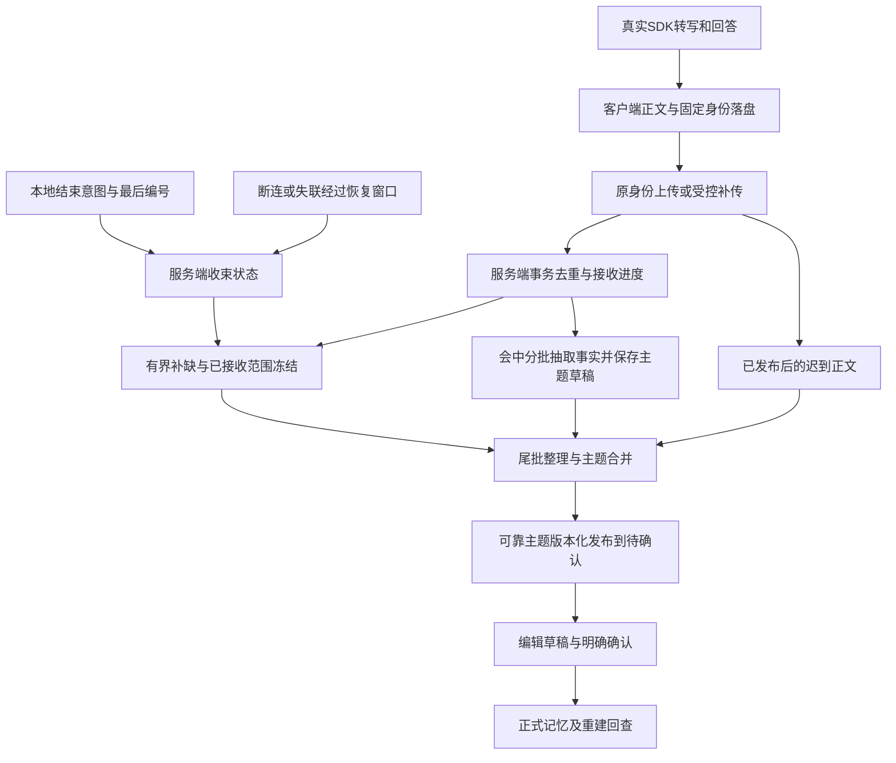

# Live 记忆韧性保存、主题归纳与会后发布：完整设计方案

日期：2026-09-29｜版本：1.0｜设计编号：DJ-LIVE-RESILIENT-MEMORY-20260929
后续实施者：当前助手（Astra/Codex）｜文档用途：设计决策记录与后续回溯，不是Sol交接指令。
当前交付：设计文档，未实施、未测试、未部署。

## 1. 目标与执行边界

把“整场最后一次交接失败，所有待确认记忆均不可见”改为：逐条可靠保存正文、会中持久化主题草稿、会后归纳发布可靠部分；存在可恢复缺口时受控补传，无法恢复的少量细节不阻塞无关主题。

用户已确认：

1. 待确认记录需要归纳，同一事件/主题不要一句话一条；多维分类不等于多张卡片。
2. 长场允许少部分事实未被归纳，但不能捏造、记反或忽略明确纠正。
3. 会中只形成后台草稿，会后集中展示；不不断向待确认列表推送半成品。
4. 只有“待确认”业务状态，不新增“正在审核”；编辑是页面行为，可保存草稿并在退出后恢复。
5. 同一件事补充时合并未确认记录；已确认正式记忆只能通过关联补充/更正再次确认。
6. 实际积压时主动提醒并平稳停止 Live，后台继续处理。
7. 本轮验收改为短场 A → 20 分钟 → 短场 B → 40 分钟，删除本轮 65 分钟压力要求。历史记录不改写。
8. 本地与真机分开；手机未连接不是本地停工理由；真机由用户后续主动发起。

用户已指定后续由当前助手实施，而非交给Sol。本文记录预期行为、拟议实现和验证边界，当前任务先完成文档保存。后续实施沿用会话授权推进本地代码、迁移、验证和发布准备；文档本身不代表已实施，也不新增生产部署、真实模型付费调用、手机操作、历史任务补传/重处理或commit/push授权。

范围：现有 Live→正文→整理→候选→确认→正式记忆链。禁止重写已通过的音频、账号、权限及正常保存链；必要变化以兼容增量实现。不要顺带优化测试工具或修理静音；用户已明确静音不是本轮硬条件，实际播放器仍须保留。

### 1.1 决策成熟度

- **已确认**：主题归纳、允许少量遗漏、会中草稿/会后展示、单一待确认状态与编辑恢复、20/40分钟替代65分钟、后续由当前助手实施。
- **方案方向**：原身份幂等补传、持久结束意图、服务器异常收束、主题版本化、部分发布、积压保护。
- **建议参数**：第6节时间、次数及第10节阈值是拟议初始值，用户尚未逐项确认；实施前结合现有协议和本地对照校准，不把建议冒充现场结论。
- **待验证**：本次第32轮正文是否仍完整保存在手机、停止意图未落盘的具体原因、诊断队列是否实际造成阻塞、复合主题与现有V5数据合同的兼容方式。

## 2. 事实与未决原因

证据入口：[9/29本场分析](../../../../outputs/2026-09-29-live-playback-device-retest/run-01/README.md)、[逐轮映射](/Users/gaominge/Documents/liftora/outputs/2026-09-29-live-playback-device-retest/run-01/long-turn-to-memory-audit.json)、[服务器只读快照](/Users/gaominge/Documents/liftora/outputs/2026-09-29-live-playback-device-retest/run-01/long-candidate-audit.json)。

| 事实 | 设计含义 | 不可外推 |
|---|---|---|
| 最新两短场分别3/4条候选→正式→冷启动通过 | 保留可用短场及确认链 | 不是所有短场/长场已修好 |
| 长场32次完整往返，服务器31轮/62正文 | 语音完成与保存完成必须分别观察 | 不能仅按总数定位缺失身份 |
| 前24轮预整理为16个内部atom，后7轮未分配 | 内部草稿不是用户候选；尾部需要独立触发 | 24条引用覆盖不等于语义全覆盖 |
| 6次模型请求responseAccepted且stop；无最终Source/发布 | 当前证据优先指向保存/结束/发布交接 | 不能宣布所有模型容量问题排除 |
| 第33次期间0.523595秒送帧间隔触发测试停止 | 测试停止原因和产品不收尾分开诊断 | 不得靠放宽门槛宣称保存修复 |
| 本机Live关闭，close intent/end未完成 | 停麦不能等于后台保存结束 | 主线程/诊断I/O首因尚未证明 |

历史参考：[9/22复盘](../../../../outputs/2026-09-22-live-full-retrospective/2026-09-22-DreamJourney-Live全链路历史复盘与根因证据报告.md)。历史 final降级、身份域混比、恢复SQL、admission字段、模型合同失败是不同问题。历史seq5首因和本轮具体调度/收尾首因保持未决。

## 3. 与旧规范的优先关系

本文只覆盖下列明确调整，其余旧权限、B7、证据身份、幂等审核及正式记忆保护继续有效。

| 旧限制 | 本次替代规则 |
|---|---|
| 所有事实完整后才能全场发布 | 每个主题自身可信、来源明确即可进入冻结的部分发布清单；遗漏与冲突独立标记 |
| 同场未知正文写只能持续GET，冷启零正文POST | **仅新协议正文append/reconcile**在端到端幂等验证后可受控原身份补传；正式审核/激活等其他未知写不自动重放 |
| 仅成功end后才处理尾批 | 正常end意图、断连恢复期限、心跳失联可共同驱动服务器尾批调度 |
| 单一最终Source/manifest一次发布 | 已发布Source不可变；后补形成新修订/新Source版本和增量发布，不改旧证据 |
| 所有候选内容都不可更新或直接重建一条 | 为未确认主题增加版本化提案更新；已确认/有编辑草稿走独立保护路径 |
| short→20→short→65 | short-A→20→short-B→40，本地logical与物理时间分开 |

这是明确合同调整，不能只修改测试期望。必须同时更新协议版本、数据库约束、客户端状态、默认Worker和对应验收。旧版历史任务不自动套用新的补传政策；新旧协议并存、可识别。已经拒绝的候选不因同内容重复出现而复活。

## 4. 整体流程与职责

客户端负责：正文持久化、事件身份、结束意图、发送状态、补传调度、显示及编辑草稿。服务器负责：事务去重、明确缺口、连接/心跳活动、恢复期限、任务持久化、主题合并、部分发布与正式确认。模型只做受约束的提取/归纳/关系建议，不能决定消息是否收到、伪造身份或直接写正式记忆。

停止语音、停止接收新消息、正文上传完成、整理完成、发布完成是不同事件；不可用一个Bool代替。

## 5. 正文身份与幂等补缺

### 5.1 稳定身份

复用现有account/vault/productSession/captureGeneration、messageId、clientSequence、commandId、内容hash、捕获时间及role。首次准备时冻结；不得补传时生成新messageId或改写正文、role、时间。assistant内容不能被登记成owner。

一个用户轮可包含多条消息/片段，不能用“32×2”替代逐条身份清单。补充转写用明确版本/修订，不能冒用旧消息编号覆盖已确认正文。

### 5.2 复用去重，不另造一套不相容存储

当前入口：Backend `app/services/owner_truth_conversation.py` 的 PG `append_interview_message` / `_deduplicated_result`；消息/回执事务、command/session锁；迁移0109客户端序号唯一约束。预整理`register_segment`也已有message与单元身份。

实施前以真实默认HTTP+隔离PG证明：

- 同一消息/原command重复或并发到达，只一条正文、一次有效轮数变化、一个回执。
- 丢ACK后重发返回原提交身份及当前单调进度；新鲜权限可更新，正文身份不得变化。
- 同号异文、同号异role、错账号/错场/错误代次拒绝；不得用文本去重吞掉合法重复发言。
- 去重命中后路由仍可能走预整理登记/审计：这些副作用也必须幂等，不重复模型调用和候选。
- 消息与回执/预整理任务在事务或有唯一约束的持久outbox中一致；回滚不留半条消息或重复任务。

旧expectedVersion更新、policy变化、401后authority恢复应分别验证，不可通过删除权限检查实现“任意重发”。如普通append无法兼容关闭后补传，应增加明确的新协议补传入口，而不是解除所有已结束会话写保护。

### 5.3 接收进度合同

服务器返回：同场身份、协议/进度版本、最高连续已接收序号、实际接收区间、声明的结束位置（可能未知）、明确缺口区间、当前收束/发布修订。missing只指本次快照确定缺少的条目；客户端可直接原身份补传，由服务端原子判重，无须每条先GET。

最高连续序号与最高已见序号必须分开。收到1–62和64不等于收到64条；不能用MAX(sequence)表示完整。返回有界区间/分页，不随40分钟数据无限增长。

### 5.4 客户端补传与重启

先落盘再发；收到匹配回执后再标确认。当前进程、重建Store或重启App均从同一持久队列恢复，不依赖旧Controller对象存活。账号切换立即暂停旧账号队列，恢复后需重新验证权限。

受控重发只适用于已冻结身份、已验证服务器去重的新协议正文。未知审核、激活、纠正提交等写入仍按现有专属合同核实，不能套用正文策略。补传超限保留记录，后台/下次前台可开启有预算的新恢复周期，不得每次页面刷新偷偷重置预算。

手机离线时服务器不能从空气里恢复未上传正文；iOS后台限制意味着自动恢复是机会性能力，不承诺App被杀仍持续上传。

## 6. 结束意图、异常恢复与尾批调度

### 6.1 正常停止

在可用的持久存储中尽早保存close intent，包含场次、停止请求时间、已接受事件边界、已登记消息上界、可能仍在封存的成员及其状态。不得等音频拆卸/诊断导出/全部上传完成才第一次记录停止意图。

随后关闭新采集入口，处理截止边界内允许的迟到final/回调；有界完成封存。最终结束编号一经声明不能静默改变；尚未定稿的边界必须明确provisional，经单调revision变成final。

服务端可在正文不齐时接受“结束意图”，持久登记并安排核对，不得要求所有正文已到才能知道用户已停止。此记录不冒充旧end/ACK成功回执。旧end若要求连续完整，保留该含义；新增部分会后快照采用新的显式状态与Source合同。

### 6.2 异常结束判定

server activity lease由真实会话活动或独立心跳续期，不能用“最后一句话”替代连接存活。连接信息来自可信的已认证连接/后端代理；没有原生连接可观测性时由客户端心跳补足。

临时断网进入恢复窗口，不立即发布。旧连接迟到心跳不能为已经关闭/已发布的旧generation续命；新场不能重置旧场的期限。后台扫描器依据持久deadline工作，重启不把等待时间归零。

无结束通知时标记`endPositionKnown=false`，只能冻结已收到的区间，不能虚构“全文完整”。恢复窗口内原场恢复则继续会中草稿；进入发布冻结后的恢复必须形成新修订，不再修改原清单。

### 6.3 建议初始参数（设计默认，尚未实测校准）

| 参数 | 初始值 | 含义 |
|---|---:|---|
| 客户端心跳 | 20秒 | 只发送轻量活动信息，不因用户沉默停会话 |
| 明确断连恢复等待 | 60秒 | 从服务端观察到断连开始 |
| 无断连信号的活动失联 | 90秒 | 从最后有效心跳/活动算起；到期即进入收束，不再额外叠加60秒 |
| 正常主动停止恢复等待 | 0秒 | 直接进入补缺；不等重连 |
| 单次收束补缺总窗口 | 最多60秒 | 所有消息共享，不是每条60秒 |
| 单条自动补传 | 每恢复周期最多3次 | 按退避、有抖动；无并发重复发送；429遵守Retry-After和总期限 |
| 会中草稿最长未触发等待 | 60秒 | 有完整、已保存、未整理内容时触发；不等停止 |
| 常规分批 | 最多8个用户轮并受token/字节上限约束 | 不是8条候选上限；足批/时限/停止任一触发 |

实现应集中配置、持久记录策略版本与实际deadline。不得为测试过绿无限增加期限。以上不是供应商规格，也不是“候选在60秒内必定生成”的承诺。模型处理采用独立的现有有界请求/任务预算；在矩阵中记录其具体值、起算点、重试消耗，不允许整个40分钟会话被旧60分钟任务起算方式提前终止而不自知。

### 6.4 补缺期限到达

冻结“已收到范围+未知结束位置/已知缺口+修订号”，建立尾批任务，保留待补队列。少量正文缺失不能让已完整保存的主题永远不可见。

若缺失范围可能包含当前主题的纠正，不能自称已解决该主题冲突；优先发布不受影响主题，对受影响部分给出未完整状态。不要求推断未知正文的语义。

### 6.5 尾批与发布任务必须持久化

结束意图、恢复期限到达、普通append、Worker完成均可“唤醒检查”，但任务唯一键按run/generation/snapshotRevision/workType/inputHash去重。使用既有Worker与PG租约机制，禁止HTTP请求里同步做长模型调用。

任务：接收新正文→规划可处理单元；收束→冻结快照/尾批；单元完成→主题汇总；主题有效→发布检查。默认API lifespan及独立Worker都必须真正装配，不仅测试手动调用helper。

扫描器必须找回已经满足条件但未排队的任务；并发、超时、进程崩溃不能造成一次触发丢失。任务重试和模型请求预算持久化，不因重新排队变成新无限预算。

## 7. 草稿、主题归纳与证据

### 7.1 三层数据分开

- 原始正文：不可变消息/修订，逐条落地。
- 事实atom：内部证据、来源索引/范围、确定性、矛盾/纠正关系；不直接每atom建卡片。
- 主题草稿/候选：一个事件或主题的标题、连贯摘要、多维属性、关联事实集合与版本，面向用户。

主题可有experience/emotion/knowledge等多个维度，需兼容现有V5 facets/审核绑定。若当前候选schema只容纳单一kind，应明确增加容器/复合提案协议和读取适配，不得把多件事塞入一个旧字段绕过校验。

### 7.2 合并标准

同一主体、同一事件/持续事项、相容时间范围且叙事连续，可以归纳；重复提及、补充地点或感受、对同一事实纠正沿用主题身份。相同关键词/相同维度/相似向量不能单独决定合并。

不同日期的两次旅行、不同人物的相似经历、互相独立的工作与亲子事件应可分开。含混关系不强行合并；不能为了减少卡片捏造因果、情绪、动机。

候选展示标题+简洁连贯摘要，必要时可展开来源/细节。摘要长度按主题复杂度适配，不设“全场最多一条”；先用验收样本确定可读性，不能只靠条数证明质量。

示例：同次杭州亲子游的出发、游船、孩子偏好和用户明确说出的感受，归为一条，关联亲子/旅行等维度；工作调动另起一条。用户没有说出的感受不得补写。

### 7.3 跨批、跨场身份

使用稳定topicId/eventId及修订号；模型提出关系，服务端按来源、主体、事件及版本校验。只读检索同账号相关主题/正式记忆，候选集合有界，不把全部历史全文塞给模型。

原始事实证据身份与模型措辞分离；合法释义不能变成factOmitted。多段相同文本需保留不同messageId/sequence，不能只靠textHash消掉合法发生次数。

不复活已拒绝主题；新实质事实需要明确关联和新的变更理由。删除/拒绝/账号隔离优先于模型合并建议。

## 8. 部分成功和发布规则

### 8.1 宽容的是遗漏，严格的是正确性

可以：遗漏少量次要细节、暂时缺少无法恢复正文、个别单元失败；记录具体范围/原因，发布其他可靠主题。

不可以：无证据内容、错人错场、错误引用、旧事实覆盖新纠正、将助手建议当用户经历、把部分结果标成全场完整。未解决冲突隔离到受影响事实/主题，不无差别阻断全场。

支持校验从“所有atom必须全场通过”拆成：每个发布主题的正向证据严格有效；未覆盖事实进入遗漏清单；主题内关系冲突独立阻塞。不得简单吞掉factOmitted异常然后返回success。

### 8.2 Source与发布清单

部分会后快照使用不可变Source或Source版本，注明observed ranges、known missing、endPositionKnown、cutoff、captureGeneration、content hash、completeness；不得伪造连续full Source或复用与内容不符的hash。

发布清单按snapshotRevision记录topic IDs/versions、有效证据、未处理/遗漏/冲突范围、任务结果和实际覆盖口径。候选写入、manifest结果、幂等回执/后续事件同事务或可靠outbox；重复完成只返回既有结果。

页面在一轮汇总发布后集中显示少量主题，不每个atom完成就弹卡。部分发布可显示“已整理部分内容，仍有少量内容未完成”，不误导为全部完成。没有任何可靠内容时明确待处理/失败；纯问题合法无候选则为noChange，两者不得混用。

### 8.3 迟到补传

已冻结/发布的快照不修改。验证同账号、原场、原消息身份后接收补传，形成递增修订并只整理增量及受影响主题；不把旧场重新设成活跃Live。跨版本旧协议或过期恢复权限不得凭旧场ID任意补写。

迟到正文的接收、去重和修订规划应事务一致；原始close水位不回退。超出声明水位的消息不是普通缺口补传，需有捕获边界/修订证据，否则拒绝并记录。

## 9. 待确认编辑与正式记忆

业务不新增“正在审核”。内部可有工作流和版本状态，但不得将编辑状态变成新的用户审核步骤。

| 情况 | 写入规则 |
|---|---|
| 后台草稿 | 生成新草稿revision，合并同一主题 |
| 已待确认且无人编辑 | 稳定candidate/topic ID，新proposal版本；标记有补充 |
| 有未提交编辑草稿 | 保留基准版本和用户编辑；新模型版本待合并，不覆盖本地或服务端编辑草稿 |
| 正式记忆 | 产生关联补充/更正提案，经用户确认后变更正式版本 |
| 已拒绝 | 相同信息不自动复活 |

编辑草稿按账号/candidate/baseProposalVersion/本地editRevision持久化；输入自动保存，退出或进程结束后恢复。落盘失败不能假装保存成功；账号切换不得显示另一账号草稿。多设备不是必须新增功能，但服务器应检测版本冲突。

确认使用用户实际看到的proposal版本/hash和已有V5绑定，服务端事务比较后执行。后台更新与确认并发时，只有一个版本成功；若变化则展示新内容，不静默确认。用户自编辑可作为用户补充来源记录，但不能冒充旧原文证据。

不得直接UPDATE现有不可变候选payload规避约束；实现版本化提案或兼容附表，并适配确认/纠正/读取/回执。维度、候选数量与底层正式记忆操作数量并不必然1:1，验收须按语义和版本映射核对，不能只比总数。

## 10. 积压提示与自动收束

监控至少包含：客户端未确认正文数与最老年龄、服务端未整理范围与最老年龄、持久化容量/失败、Worker进展、预算余量。模型一时慢或用户沉默不等于必须关闭。

初始可配置策略建议：未确认正文最老超过30秒或未整理最老超过120秒进入观察/提示；持续60秒无进展且积压未降再决定收束。持久化不可用、接近既有硬容量或预算明确无法继续时可立即进入保护收束。数值是设计起点，须本地故障验证后记录校准，不把它们说成真实设备测量值。

一次场次只提示一次同级原因，不反复打断。尽量等当前用户话语边界；设置有界宽限，故障持续时不能无限等一句话结束。先保存停止意图，不让提示播放成功成为停止前提；音频通道失效则文字提示并按同一流程收束。

推荐文案：“我们聊了不少，我这边整理有些跟不上了。我们先休息一下，我把已经收到的内容整理好，再继续聊。”

积压提示属系统事件，不能进入用户事实或生成记忆；不能在并非时长原因时谎称到达供应商时长上限。自动停止后后台继续，不自动重新开麦。

压力验收区分：健康负载应持续完成20/40分钟；故障注入触发提前收束是独立场景通过，不能拿它冒充完成物理时长。

## 11. 有界执行、性能与最小诊断

复用现有请求/模型/重试预算，不无上限扩容；按实际token/字节分页，初次抽取、support、主题汇总、跨批/跨场关系每个请求都核对输入输出预算。模型容量按实际endpoint/model配置，不依据供应商宣传窗口直接放开应用限制。

本轮现场诊断环存在逐事件全文件重写和同步snapshot风险；这是待验证线索。设计要求：保存与停止路径不能被诊断导出同步卡住；最小记录包括消息/场次hash、dispatch状态、close意图/边界、补传次数、缺口、任务/发布版本及首错阶段。不得先做全面日志重构；用最小对照确认后仅修真实阻塞点。

诊断必须有界、无正文/密钥、不阻塞主线程关键路径；进度时间记录入队和完成含义，不能把写日志时间当SDK到达时间。现有语音播放完整性与实际player证明不放宽。

## 12. 最小实施分解与现有接入点

工作区：iOS `/Users/gaominge/Documents/Codex/Video/DreamJourney_dev`；Backend `/Users/gaominge/Documents/Codex/Video/DreamJourneyBackend`；工具 `/Users/gaominge/Documents/liftora/tools/live_device_lab`。开工重新核对分支、dirty内容和指纹；不重置用户改动。

| 工作包 | 目标与现有入口 | 交付断言 |
|---|---|---|
| P0 | 现状映射、运行/本地版本、同版短场基准；复核本次尾部断点 | 事实/假设分离，缺口精确到身份，不借新设计认定历史首因 |
| P1 | iOS Outbox/Coordinator（OwnerTruthContracts、EchoViewController）、BackendClient；正文补传 | 原身份持久队列、端到端去重、重启/账号隔离 |
| P2 | main.py append/end、conversation repository；结束意图/接收区间/后补修订 | 非完整正文也可登记结束意图；不伪造旧end成功 |
| P3 | live_long_memory repository、默认preorganizer/候选Worker、PG迁移/lifespan | 定时小批/尾批、恢复扫描、持久任务和预算 |
| P4 | extractor/support/relations/manifest、Source与candidate版本 | 主题归纳、部分发布、迟到增量、严守证据 |
| P5 | 候选读取/编辑/确认/V5绑定 | 单一待确认状态、草稿恢复、不覆盖编辑、不误确认 |
| P6 | Manager/Controller压力感知与提示 | 有界收束、语音停止后台继续、提示不生成事实 |
| P7 | 默认链集成与四场验收、报告/发布回滚准备 | 见验收矩阵，不以测试数量代替业务证据 |

数据模型最少需要表达：协议能力/版本；closeIntent及activity lease；已接收区间与缺口；snapshotRevision/Source完整性；主题稳定ID/提案版本；用户编辑基准；发布manifest/遗漏原因；持久任务和重试预算。尽量扩展现有表，不为每个概念盲目新建表。先交映射表与迁移说明再按包实现，正常保存链保持兼容。

## 13. 发布兼容与回滚准备

新协议由服务器能力协商，老客户端不会突然被允许写已结束场；API/Worker/schema/客户端必须列出兼容矩阵。新增列/表先兼容读，再启用新行为；禁止旧Worker误领新格式任务。关闭功能开关后停止新任务规划，保留已有正文、草稿、版本和恢复坐标，不丢弃未完成任务。

候选版本化/复合主题涉及既有确认触发器，迁移必须隔离PG验证；禁止仅内存实现通过。演练发布准备和回滚应在隔离环境，本轮不操作生产或历史任务。

需要输出功能开关默认值、迁移编号、镜像/源/构建指纹、健康检查、Worker版本核对、可回退边界和数据兼容风险。未授权不得实际发布。

## 14. 验收与交付标准

完整条目见[验收矩阵](验收矩阵.md)。最终同版必跑：`short-A → logical20 → short-B → logical40`。物理场次后续授权后使用`short-A → physical20 → short-B → physical40`。每场长场前短场新鲜且独立，绑定源码/配置/迁移/模型适配/工具/安装包，任何实际依赖变化使旧凭据失效。

健康20分钟至少110次用户输入，40分钟至少220次；实时SDK响应若导致用时超过最低时长不算失败，但必须预先声明总预算，不能加速音频伪造时长。逻辑样本可采用相同轮数，明确不是物理时间。每档都加入足够独立事实、重复、补充、纠正、跨主题和尾段事实，不能用重复4句话宣称百事实覆盖。详见矩阵真值集。

本地完成状态：所有适用本地必测断言通过→`LOCAL_PASS`；外部未运行明确`REAL_PROVIDER_NOT_RUN / DEVICE_SHORT_NOT_RUN / DEVICE_20M_NOT_RUN / DEVICE_40M_NOT_RUN / DEPLOY_NOT_RUN / HISTORICAL_REPROCESS_NOT_RUN`。如果真实调用过，按实际结果，不机械填NOT_RUN。不可用外部未运行阻断本地可完成工作；真实代码/装配缺口仍在则`LOCAL_INCOMPLETE`并列断言。

基线失败须同环境旧快照对照、逐项归因；不得凭以前报告归为基线。跳过项如属必须链，要有独立入口同版证据，否则不通过。历史首因未决不强行结案，也不让不可恢复历史证据成为无限本地停工理由。

一次性交付：具体变更、同断言修前红/修后绿、逐项证据、同场事实→Source→候选→正式关系、最终指纹与命令、四场门禁记录、参数实际值、未决项、发布回滚方案。不以“再跑了很多测试”替代逐项完成。
