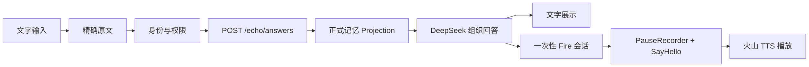
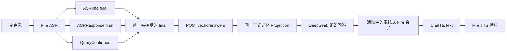

# 寻梦环游 Live 回响检索与语音播放 Bug 修改指导

> 文档日期：2026-08-27（Asia/Shanghai）\
> 文档用途：交由独立 Codex 开发任务实施、验证和提交\
> iOS 基线：`feature/prd-stitch-ui-adaptation` / `8f0a9aad fix: unify live and text echo answers`\
> 后端基线：`main` / `9923333 fix: enable V4 memory context in production`\
> 问题范围：Live 回响无法稳定引用正式记忆；Live 回答文字已生成但没有声音\
> 本文性质：Bug 修复实施约束，不是需求探索文档

## 1. 目标与结论

本次修复必须让文字问答和 Live 问答满足以下统一链路：

`用户本轮完整表达 → 唯一 Canonical Query → 冻结身份 → /echo/answers → 当前正式记忆 Projection → 回答 → 火山语音播放`

当前代码只统一了中间的 `/echo/answers`，尚未统一：

1. 请求前的用户语句定稿；
2. 回答后的语音播放状态机。

因此，本次不修改正式记忆结构、不修改 DeepSeek 回答提示词，也不新增回答接口。修复重点是 Live 输入定稿和音频交付闭环。

## 2. 用户可见问题

### BUG-LIVE-001：Live 无法回答正式记忆中已存在的学校信息

复现现象：

1. 正式记忆中存在用户毕业学校；
2. 文字问答询问“我是哪个大学毕业的”，能够回答；
3. Live 询问同一问题，回答不知道或未找到；
4. 两端理论上已经调用同一个 `/echo/answers`。

### BUG-LIVE-002：Live 回答没有声音

复现现象：

1. Live 能完成 ASR；
2. 后端可能已经返回回答，界面也可能进入“正在回响”；
3. 没有听到回答音频；
4. 当前链路没有可靠区分“指令提交成功”和“真正开始播放”。

## 3. 不可破坏的产品原则

1. 已确认的正式记忆是事实权威；Live 和文字问答不能读取两套事实源。
2. 回答可以温和、口语化，但不得改写事实。
3. 火山 Fire 继续承担实时 ASR/TTS；不得引入 Apple 系统 TTS 作为产品主链路。
4. DreamJourney `/echo/answers` 是唯一回答权威；不得恢复供应商 LLM 独立回答。
5. 用户输入和 Live 全量转写不得写入生产明文日志。
6. 本次不得修改 Candidate、MemoryVersion、Projection 或用户审核流程。

## 4. 当前架构

### 4.1 文字问答



### 4.2 Live 问答



## 5. 已确认的代码级原因

### 5.1 Live 缺少唯一、权威的语句定稿器

`DialogEngineManager` 当前会从以下三类事件向上发送 `isFinal=true`：

1. `SEEventASRInfo`；
2. `SEEventASRResponse`；
3. `SEEventChatTextQueryConfirmed`。

`EchoViewController.onASRResult` 收到第一个 final 后立即调用 `finishUserVoice` 和 `/echo/answers`。状态机进入下一阶段后，同一语句随后到达的、更权威的 `ChatTextQueryConfirmed` 可能被拒绝。

这会导致：

- 文字问答发送用户输入的精确原文；
- Live 可能发送提前结束、识别错误或标点切分不完整的文本；
- 后端接口和正式记忆相同，但实际 `query` 不同，检索结果自然不同。

### 5.2 Live 播放没有完成“已提交”到“已出声”的确认

Live 使用 `SEDirectiveEventChatTtsText`。当前只检查 `engine.send(...) == SENoError`，这只能证明 SDK 接收了本地指令，不能证明：

1. 服务端接受了 TTS 请求；
2. 收到了 `SEEventTTSSentenceStart`；
3. 播放器真正产生声音；
4. TTS 最终结束。

当前没有 TTS 启动超时，也没有同供应商链路内的降级处理。

### 5.3 音频路由存在两个不同判断条件

当前代码使用：

- `routeEchoAudioThroughDigitalHuman` 决定是否关闭 Fire 本地播放器；
- `shouldDispatchEchoReplyToTencentProvider` 决定回答交给腾讯还是 Fire。

后者比前者多了 `tencentDigitalHumanProviderCanOwnAudio` 条件。因此代码允许出现：

1. 已按数字人路由关闭 Fire 播放器；
2. 腾讯 Provider 尚不能接管声音；
3. 回答退回 Fire `ChatTtsText`；
4. Fire 播放器却处于关闭状态；
5. 形成确定性的静音黑洞。

## 6. 修复后的目标架构

```mermaid
%%{init: {"themeVariables": {"fontFamily": "PingFang SC, Microsoft YaHei, Arial, sans-serif", "fontSize": "20px"}, "flowchart": {"useMaxWidth": false, "nodeSpacing": 18, "rankSpacing": 22, "curve": "linear", "padding": 18, "wrappingWidth": 230}}}%%
flowchart LR
    T["文字输入"] --> C["CanonicalEchoTurn"]
    L["Live ASR"] --> R["LiveASRTurnFinalizer"]
    R --> C
    C --> I["冻结身份与 TurnID"]
    I --> A["统一 Echo Answer UseCase"]
    A --> P["当前正式记忆 Projection"]
    P --> X["EchoAnswer + Citation"]
    X --> UI["统一文字展示"]
    X --> S["EchoSpeechRenderer"]
    S --> ACK["TTS Started 确认"]
    ACK --> END["播放完成或明确降级"]
```



## 7. 强制实现约束

### INV-001：同一问题必须形成唯一 Canonical Query

一段用户表达只能向 `/echo/answers` 提交一次。

### INV-002：优先使用 Provider 确认文本

Live 定稿优先级：

1. `SEEventChatTextQueryConfirmed`；
2. 超时或 Provider 不发送确认事件时，使用最近一次完整 final；
3. partial 只能用于界面转写，禁止直接发起正式记忆检索。

### INV-003：一轮回答只能有一个音频所有者

引入单一枚举结果，例如：

```swift
enum EchoAnswerAudioRoute {
    case fireLocal
    case tencentDigitalHuman
}
```

同一个结果必须同时决定：

1. Fire Player 是否启用；
2. 回答文本提交给谁；
3. TTS 事件由谁确认；
4. 失败时由谁执行降级。

禁止继续用两个布尔属性分别做播放开关和提交分支。

### INV-004：TTS 成功必须以播放事件为准

`engine.send == SENoError` 只能记为 `submitted`。只有收到 `SEEventTTSSentenceStart` 或等价的首帧播放事件，才能记为 `started`。

### INV-005：Live 会话不能因一次 TTS 失败被错误关闭

播放失败时：

1. 保留已生成的文字答案；
2. 显示明确的语音失败状态；
3. 恢复 Recorder；
4. 允许用户继续当前 Live 会话；
5. 不重复调用 `/echo/answers`。

### INV-006：身份必须按轮次冻结

Canonical Turn 创建时保存：

- `accountLease`；
- `userId`；
- `personaScope`；
- `digitalHumanId`；
- `personaName`；
- `lifecycleMode`；
- `sessionId`；
- `turnId`。

发起请求和接收回答必须校验同一身份快照，不能在中途重新读取另一套当前身份后继续回答。

## 8. iOS 修改指导

### 8.1 新增 Live ASR 定稿器

建议在 `DialogEngineManager.swift` 内部增加轻量的 `LiveASRTurnFinalizer`，或采用同等职责的小型私有组件。不要引入跨模块框架。

它至少保存：

```swift
struct LiveASRCandidate {
    let text: String
    let source: Source
    let sequence: Int
    let receivedAt: Date
}
```

行为要求：

1. partial 仅更新界面；
2. `ASRInfo final` 和 `ASRResponse final` 暂存，不立即提交；
3. `QueryConfirmed` 到达时立即选为 canonical；
4. Provider 没有确认事件时，在 `ASREnded` 或短超时后选择最新、非空 final；
5. 同一轮只向 delegate 发送一次 canonical final；
6. 下一轮开始前清空上一轮候选；
7. 打断、停止、账号切换和会话销毁时必须清空。

建议等待 `QueryConfirmed` 的窗口为 300–600 ms，具体值集中为一个命名常量，不得散落魔法数字。

### 8.2 避免重复 final 被状态机吞掉

`EchoViewController.onASRResult` 不应再承担多事件仲裁。它只接收已经定稿的 canonical final。

如果为了控制改动范围暂时保留现有 delegate 签名，也必须保证 `DialogEngineManager` 对同一轮只向上发送一次 `isFinal=true`。

### 8.3 统一文字与 Live 的回答请求模型

新增或抽取内部请求对象，例如：

```swift
struct CanonicalEchoTurn {
    let source: EchoInputSource
    let query: String
    let identity: EchoKnowledgeContextIdentity
    let sessionID: String
    let turnID: String
    let lifecycleToken: DigitalHumanLifecycleToken
}
```

文字和 Live 最终都应进入同一个私有回答用例。该用例负责：

1. 身份和路由校验；
2. 调用 `requestEchoAnswer`；
3. 处理 `memoryGrounding` 和 `citations`；
4. 生成同一种 `replyText`；
5. 再根据输入模式交给 UI 与语音渲染。

不得让 Live 恢复调用 `ChatRagText`、本地 Archive 或 Provider LLM 作为回答来源。

### 8.4 合并音频路由决策

将 `routeEchoAudioThroughDigitalHuman` 和 `shouldDispatchEchoReplyToTencentProvider` 收敛为一次原子决策。

推荐规则：

```text
腾讯数字人可完整接管声音与口型 -> tencentDigitalHuman
其他任何状态                    -> fireLocal
```

选择 `fireLocal` 时必须在会话启动前确认 Fire Player 已启用；选择腾讯时才允许关闭 Fire Player。

### 8.5 为 Live TTS 增加状态机

建议状态：

```text
idle -> submitted -> started -> completed
                  -> timedOut -> fallbackSubmitted -> started/completed
                  -> failed
```

要求：

1. `submitLiveAnswerText` 返回成功后启动 TTS Start Timer；
2. 收到 `SEEventTTSSentenceStart` 时取消 Timer；
3. 收到 `SEEventTTSEnded` 或播放器完成事件时恢复 Recorder；
4. 超时后不得重复生成回答，只能对现有 `replyText` 做同供应商 TTS 降级；
5. 可优先验证当前活动 Fire 会话中的 `SEDirectiveEventSayHello` 是否可作为降级；
6. 若 SDK 不允许该方式，保留文字回答并明确提示语音失败；
7. Live 活动期间禁止再创建第二个并发 Fire 会话；
8. 不得使用 Apple 系统 TTS 兜底。

TTS 启动超时建议先设为 2.5 秒，并通过真机日志校准。

## 9. 需要修改或重点检查的文件

| 文件 | 位置/函数 | 修改职责 |
|---|---|---|
| `DreamJourney/Sources/Services/DialogEngineManager.swift` | `SEEventASRInfo`、`SEEventASRResponse`、`SEEventChatTextQueryConfirmed` | 聚合候选，只输出一个 canonical final |
| 同上 | `submitLiveAnswerText` | 从“提交即成功”改为可观测的播放状态 |
| 同上 | `SEEventTTSSentenceStart`、`SEEventTTSEnded` | TTS ack、取消超时、完成与 Recorder 恢复 |
| 同上 | `setLocalTTSPlaybackEnabled`、启动参数 | 确保音频路由和播放器状态一致 |
| `DreamJourney/Sources/Modules/Echo/EchoViewController.swift` | `onASRResult` | 只处理 canonical final，不做多事件竞争 |
| 同上 | `requestLiveEchoAnswer`、`submitEchoQuestion` | 收敛为共享回答请求模型 |
| 同上 | `deliverLiveEchoAnswer`、`applyEchoAudioRoutePolicy` | 使用同一个音频路由枚举 |
| `DreamJourney/Sources/Modules/Echo/EchoViewModel.swift` | `finishUserVoice` | 保持现有安全与状态约束，不用它仲裁多个 ASR final |
| `DreamJourney/Sources/Services/DreamJourneyBackendClient.swift` | `requestEchoAnswer` | 原则上不改接口，仅核对 payload 一致性 |

## 10. 后端约束

本次问题从当前代码判断位于 iOS 请求前和播放后，后端不应为了绕过问题而修改正式记忆检索。

后端必须继续保持：

1. `POST /echo/answers`；
2. `OwnerTruthContextAuthorityService`；
3. 当前已确认 Projection；
4. query-based selection；
5. `generationContext + citations`；
6. DeepSeek 只根据正式记忆组织回答；
7. 返回 `contextTraceId`、`memoryGrounding` 和 `citations`。

只有在增加非敏感关联字段确有必要时才允许后端改动。若后端无改动，不需要重新部署服务端。

## 11. 诊断与可观测性

每轮至少记录以下非明文字段：

| 阶段 | 字段 |
|---|---|
| ASR | `sessionId`、`turnId`、事件来源、序号、文本长度、规范化 query hash |
| 定稿 | 选中的事件来源、候选数量、定稿耗时、是否 timeout fallback |
| 身份 | 哈希化 userId、personaScope、哈希化 digitalHumanId、lifecycleMode |
| 回答 | `contextTraceId`、provider、grounding outcome、citation count |
| 音频 | audio route、directive、send code、TTS start latency、ended、fallback reason |

必须新增或补齐事件：

```text
liveASRCandidateReceived
liveCanonicalTurnSelected
echoAnswerRequested
echoAnswerReceived
echoSpeechRouteSelected
liveTTSDirectiveSubmitted
liveTTSStarted
liveTTSStartTimedOut
liveTTSFallbackSubmitted
liveTTSEnded
```

生产日志禁止记录完整问题和完整回答。Debug 真机调试若临时显示明文，必须通过编译条件限制且不得提交生产开启配置。

## 12. 自动化测试

### 12.1 ASR 定稿单测

至少覆盖：

1. `ASRInfo final -> QueryConfirmed`，只提交 QueryConfirmed；
2. `ASRResponse final -> QueryConfirmed`，只提交 QueryConfirmed；
3. 两种 final 重复到达，不重复请求；
4. 没有 QueryConfirmed，超时后采用最新 final；
5. QueryConfirmed 先到，后续 final 被忽略；
6. 空文本、纯空格被忽略；
7. 连续两轮语音分别产生一个 canonical turn；
8. 停止、打断、账号切换后候选被清空。

### 12.2 回答链路测试

1. 文字和 Live 使用同一身份与同一规范化问题时，构造出的 `/echo/answers` payload 核心字段一致；
2. Live 不调用 Provider LLM 回答路径；
3. 正式记忆检索返回 `grounded` 时，Live 保留 citation 和 contextTraceId；
4. `gap`、`fallback` 和网络失败继续保持现有产品提示。

### 12.3 音频路由测试

使用路由真值表覆盖：

| 数字人面板 | 数字人音频可用 | Provider 可接管 | 期望路由 | Fire Player |
|---|---:|---:|---|---:|
| 否 | 否 | 否 | Fire | 开 |
| 是 | 否 | 否 | Fire | 开 |
| 是 | 是 | 否 | Fire | 开 |
| 是 | 是 | 是 | Tencent | 关 |

额外覆盖：

1. `send == SENoError` 但没有 TTS Start，触发 timeout；
2. TTS Start 正常到达，取消 timeout；
3. TTS 完成后 Recorder 恢复；
4. 降级不重复调用 `/echo/answers`；
5. 一次失败不关闭 Live 会话。

## 13. 编译与真机验收

### 13.1 编译门槛

1. iOS Debug 真机目标编译通过；
2. 新增单测全部通过；
3. 不新增签名能力；
4. 不引入新的第三方依赖；
5. 不修改无关工作树文件。

### 13.2 真机验收账号前置

1. 使用同一个测试账号；
2. 当前身份切换为“自己”；
3. 正式记忆明确存在毕业学校；
4. 文字问答已能正确回答该学校；
5. 网络、麦克风权限和火山实时语音配置正常。

### 13.3 必测场景

#### TC-LIVE-001：学校事实一致性

分别使用文字和 Live 询问：“我是哪个大学毕业的？”

验收：

- 两端事实一致；
- Live `memoryGrounding=grounded`；
- Live citation count 大于 0；
- 两端身份字段一致；
- Live canonical query 与屏幕最终转写一致。

#### TC-LIVE-002：Live 有声回答

验收：

- 回答文本生成后可听到声音；
- 日志存在 `liveTTSStarted` 和 `liveTTSEnded`；
- 不出现“submitted 后无后续事件”；
- 播放完成后可继续说下一轮。

#### TC-LIVE-003：连续十轮

连续进行十轮问答，混合事实问题和普通交流。

验收：

- 每轮只发起一次 `/echo/answers`；
- 不串用上一轮 query 或回答；
- 不重复播报；
- 不出现无声死锁；
- 当前 Live 会话保持打开。

#### TC-LIVE-004：重新进入 Live

关闭后重新打开 Live。

验收：

- 不复用上一会话 ASR 候选；
- 不播报上一会话残留回答；
- 新会话开场白自然且身份正确。

#### TC-LIVE-005：TTS 故障降级

通过测试注入让 TTS Start 不到达。

验收：

- 2.5 秒左右进入明确降级；
- 文字答案仍可见；
- 不重新生成回答；
- Recorder 恢复，用户仍能继续会话。

## 14. 完成标准

以下条件必须全部满足才能宣布修复完成：

1. Live 和文字问答读取同一正式记忆 Projection；
2. 同一轮 Live 只产生一个 canonical query；
3. 学校问题在文字与 Live 中返回相同事实；
4. Live 回答具有可验证的 TTS Start 和 End；
5. 不存在 Fire Player 已关闭但回答仍提交给 Fire 的状态；
6. Live TTS 失败不会丢失文字回答或关闭会话；
7. 所有新增测试通过；
8. 编译通过；
9. 真机完成 TC-LIVE-001 至 TC-LIVE-005；
10. 提交说明包含实际日志证据和仍存在的限制。

## 15. 明确非目标

本次禁止顺带实施：

1. 正式记忆 Schema 重构；
2. Candidate、审核或 Projection 生成逻辑调整；
3. DeepSeek Prompt 重写；
4. 回答风格重新设计；
5. Apple TTS 接入；
6. 腾讯数字人协议重构；
7. 新增后端回答接口；
8. 登录、白名单、家庭管理或 Voice Clone 修改；
9. 无关 UI 改版；
10. 大规模目录或命名重构。

## 16. 推荐实施顺序

1. 先补充诊断事件，复现并记录现有 query 与 TTS 状态；
2. 实现 `LiveASRTurnFinalizer` 及单测；
3. 让 `onASRResult` 只接收 canonical final；
4. 抽取共享 Canonical Echo Turn 和回答请求入口；
5. 合并音频路由决策；
6. 增加 TTS ack、timeout 和同供应商降级；
7. 运行单测与编译；
8. 后端无修改则不部署后端；
9. 安装真机并执行五组验收；
10. 验证通过后提交 iOS 分支，不触碰用户已有未跟踪文件。

## 17. Codex 执行提示词

可将下面内容直接作为独立开发任务的首条提示：

```text
请严格按照《2026-08-27-dreamjourney-live-echo-query-and-audio-bugfix-guide.md》修复 Live 回响。

先读取文档、当前 Git 状态和指定源码，再复现与补充诊断；不要修改正式记忆、Candidate、Projection、DeepSeek Prompt 或无关 UI。

必须完成：
1. Live ASR 多 final 仲裁，只产生一个 Canonical Query；
2. 文字与 Live 共用同一回答请求模型和 /echo/answers；
3. 音频路由使用单一枚举决策；
4. Live TTS 增加 started/ended ack、超时和同供应商降级；
5. 添加文档要求的单测；
6. 编译并执行真机验收。

实施过程中保留用户已有工作树内容。后端无必要改动时不要修改或部署后端。完成后报告改动文件、测试结果、真机证据、Git diff 和残余风险，不要自动 push，除非用户明确要求。
```

## 18. 源码证据索引

| 证据 | 文件与位置 |
|---|---|
| 文字输入与回答请求 | `EchoViewController.swift:6813-7057` |
| Live 回答请求 | `EchoViewController.swift:7138-7233` |
| Live 回答交付 | `EchoViewController.swift:7305-7366` |
| Live ASR 接收 | `EchoViewController.swift:9332-9406` |
| 音频路由判断 | `EchoViewController.swift:3489-3511` |
| 音频路由应用 | `EchoViewController.swift:3569-3585` |
| Live 启动委托模式 | `EchoViewController.swift:8996-9025` |
| 多类 ASR final | `DialogEngineManager.swift:2274-2417` |
| Live ChatTtsText | `DialogEngineManager.swift:1443-1479` |
| Fire Player 开关 | `DialogEngineManager.swift:1008-1025` |
| 文字 SayHello TTS | `DialogEngineManager.swift:2571-2624` |
| `/echo/answers` Client | `DreamJourneyBackendClient.swift:7749-7789` |
| `/echo/answers` Server | `DreamJourneyBackend/app/main.py:16563-16777` |
| 正式记忆 Context Authority | `owner_truth_context_authority.py:62-181` |
