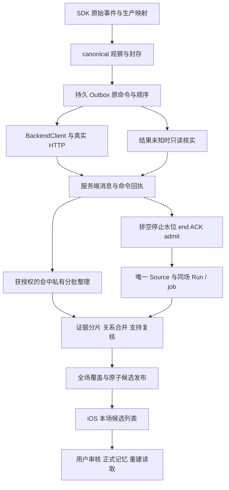

# DreamJourney Live 短、长对话保存闭环：统一修复开发设计

日期：2026-09-23。执行对象：Sol。设计编号：DJ-LIVE-SAVE-20260923。版本：1.0。

本文要求完成局部产品修复、真实本地组合验证和发布准备，不是只查问题或只补测试。当前阶段为本地开发；真实 Provider、部署、真机及历史处理分别管理。本文未授权自动执行这些外部操作。不得因没有连接手机、没有真实 Provider 授权而暂停能够独立完成的本地工作。

## 1. 任务目标及完成边界

目标是让短场与长场共用的真实保存链保持正确：用户说过且 SDK 已交付的合法终稿被完整保存，正常完整场次停止后进入本场待确认记忆，确认后生成可重建读取的正式记忆。不能只改变 saving 文案、延长等待或增加重试。

本次已证实的主要问题分别处理：

1. 本地已有后端修复未进入上次测试的运行版本：delivery-status 的数据库列引用错误、admission 的权限 epoch 读取错误。
2. 结果未知后的核实、停止排空、冷启动恢复与页面归属必须保持安全且可诊断；最新 seq5 的首次异常触发尚未查明。
3. 分批关系复核又拼回原始整 turn，导致合法长场在模型请求前触发内部 4000/30000 字符限制。
4. 默认装配、输入真值、依赖指纹、实际部署与测试结论之间存在缺口，使局部 PASS 被误当成全链通过。

已经正确的实现应保留，不为制造“本轮修改量”重写。以当前真实源码为基线，逐项标记 `已实现且本轮验证`、`本轮修复`、`仍缺证据`。历史旧记录不重写，不把历史 FAIL 改成 PASS。

### 1.1 本次必须完成的本地交付

- W0–W6 的适用实现与本地测试；W7 的本地工具诊断和防伪约束；W8 的可审阅发布准备。
- 当前最终版本执行 `short → logical20 → short → logical65`；每次长场使用独立、新鲜、同版本的短场凭证。
- 真实 Controller / Coordinator / 磁盘 / FeatureGate / BackendClient / HTTP / 默认后端与 Worker / 隔离 PostgreSQL / 受控模型 HTTP 组合。
- 对照独立事实真值表验证本场候选可见、审核、正式记忆与进程/Store 重建后读取。
- 真实模型和物理长时段未执行时明确 NOT_RUN，不妨碍本地阶段完成；不能因此宣称已彻底解决现场问题。

### 1.2 后续验收分开安排

用户主动发起后，才进行真实 Provider 验证、部署及真机测试。当前物理目标为短场通过后至少 20 分钟；物理 65 分钟是后续目标，不是本次本地交付或首次 20 分钟测试的前置条件。

不要提前连接、安装、启动手机，也不重试历史未知命令。过去对某组付费诊断、某次真机测试、清理候选的许可，不是本轮无限模型调用、历史重放或新测试场次的授权。

## 2. 必读材料与冲突处理

先完整读本文和[本次验收矩阵](2026-09-23-DreamJourney-Live短长对话保存闭环-验收矩阵.md)，再读：

1. [全链路历史复盘与根因证据报告](../../../outputs/2026-09-22-live-full-retrospective/2026-09-22-DreamJourney-Live全链路历史复盘与根因证据报告.md)。
2. [iOS 历史](../../../outputs/2026-09-22-live-full-retrospective/ios-history.md)、[验收发布复盘](../../../outputs/2026-09-22-live-full-retrospective/validation-release.md)、[容量复盘](../../../outputs/2026-09-22-live-full-retrospective/provider-capacity.md)。
3. [原分批整理设计](../../../02-设计文档/02-架构调整/记忆系统/2026-09-20-长对话分批整理与统一发布/2026-09-20-Astra-Live长对话分批整理与会后统一发布-开发设计.md)，保留分批、证据身份、全场校验、场内去重、多维属性及统一发布要求。
4. [逐轮模拟设计](../../测试与验收/2026-09-21-DreamJourney-Live逐轮模拟与待确认记忆全链验收补充设计.md)，保留 SIM/GATE/IDEMP 和短场先行要求。
5. [自动短场实测](../../../outputs/2026-09-22-live-device-lab/reports/2026-09-22-DreamJourney-iPhone自动化短场实测与阻塞分析.md)、[自动与人工对照](../../../outputs/2026-09-22-live-device-lab/comparison-sol-short/2026-09-22-Sol人工短场与自动短场对照分析.md)。

最新用户约束优先。本文对当前场次 UI 归属、持久诊断、关系容量、默认装配和版本门禁的明确修改范围，替代旧文件中与这些范围冲突的限制；旧协议的未知写保护、冷启动只读、审核权限、B7 语义及历史数据限制不变。历史交付中的“全部通过”只作为待核验记录，不是省略本轮验收的依据。

工作区：

- iOS：`/Users/gaominge/Documents/Codex/Video/DreamJourney_dev`
- Backend：`/Users/gaominge/Documents/Codex/Video/DreamJourneyBackend`
- 工具：`/Users/gaominge/Documents/liftora/tools/live_device_lab`

2026-09-23 设计核查时，iOS HEAD 为 `11d0d0051b9be3cce57822dd059472d1e2536866`，Backend HEAD 为 `ffd02f37e0e50c43e23420f1a69e69a0ccdb08cc`，两端均有未提交修改。因此 HEAD 不是实际交付指纹；Sol 开工必须重新记录工作树，不覆盖、不清理别人的改动。

## 3. 事实、假设及独立问题编号

| 编号 | 已证实事实 | 本次处理 | 不得声称 |
|---|---|---|---|
| SAVE-01 | 上次运行的 delivery-status 读 `s.thread_id`，实际列为 `current_thread_id`，GET 500；本地已有修复 | W1：保留正确实现，真实 SQL/路由复验，纳入交付及发布核对 | 修好 SQL 就证明原 append 从未发送，或可以重发旧场 |
| SAVE-02 | 自动短场 end/ACK 成功；admit 读不存在的 `context.authority_epoch`，500；本地已有 prepared epoch 修复 | W1：完整 authority 绑定及默认链验证 | 通过补默认 epoch、删除授权校验修好 |
| SAVE-03 | 人工场手机有完整 6 条，服务器提交 4 条；seq5 outcomeUnknown，seq6 未曝光 | W2：验证安全核实、停止、生命周期、持久首错 | seq5 最初必然因 401、15 秒超时或 SQL 失败 |
| SAVE-04 | 当前场无 checkpoint/follow-up，历史恢复协调器可竞争共用 UI 和按钮归属 | W3：修当前场身份选择与显示/按钮绑定，补负例 | 已确定是哪条历史任务覆盖了该次页面 |
| SAVE-05 | 真实关系页函数在 4001 单 turn / 40000 总字符上 HTTP 前失败 | W4：证据投影与容量分页，保留全场语义约束 | 这是最新短场或全部历史长场的唯一原因 |
| SAVE-06 | 早期 8 条生成上限与独立事实全覆盖冲突；已有分批结构但仍需完整验证 | W4：保留分批，覆盖多事实和跨批关系 | 用户最多只能说 8 轮，或把上限改 24 就普遍解决 |
| SAVE-07 | 部分测试绕过真实入口/默认 Worker；short receipt 依赖遗漏；运行版含旧缺陷 | W0/W6/W8：补实际装配和版本链 | 测试数量增加等于生产功能完成 |
| SAVE-08 | 9/23 源码核查：PG begin_or_load 丢弃 policy 参数，仅保存版本名；后续预留使用调用方 policy | W5：冻结完整策略快照，内存/PG 一致；建立配置改变后的红绿用例 | 已证明它导致某次历史现场失败 |
| VERIFY-09 | 9/23 源码核查：长 turn 初切片未显式保存 _sourceStart，后续证据绑定依赖它 | W4：先以第二片/重复文本/空白构造真实范围反例，成立再修 | 尚未执行反例就宣布历史事实错位的唯一根因 |
| LAB-01 | 静音 STREAM 自动场收到 ASR/文字/解码音频但缺实际播放完成；人工场三轮正常 | W7：工具边界、事件诊断、必要局部兼容验证 | 所有真人音频都坏了，或解码结束等于播放结束 |

这些编号不能合并成一个“保存超时”。诊断日志按首次断点分类；同一场后续错误单独列出。

## 4. 统一链路与必须维持的不变量



图中箭头是依赖关系，不授予重试权限。正常场必须全部通过；故障场允许安全停留但必须如实报告未完成。

1. **身份连续**：账号/权限代次、productSession、capture generation、消息、原 command、Source/version/hash、run/job、manifest、候选、正式记忆均可关联。产品场次与 SDK 技术连接 ID 不能混用。
2. **正文与记忆分别完整**：220 条正文不必生成 220 条候选；正文完整由逐条账本证明，候选正确由独立事实真值表证明。
3. **正文先持久再派送**：已曝光原命令内容不可变；合法修订走已有封存/冲突合同，不改写已曝光消息伪装重试。
4. **停止可追踪**：停止意图和水位持久化；窗口内事件均有处置，重复 requestClose 不清空原 manifest；不能跳过未提交正文伪造完整关闭。
5. **未知写不盲目重放**：缺少回执不是没执行的证明；不得重建 command、开替代场、默认幂等可重试。
6. **冷启动只读**：恢复和“核实整理状态”只能按原场次读取；不自动 start/append/end/ACK/admit，不自动审核或重跑历史任务。
7. **候选统一发布**：会中产物是私有草稿；会后 Source 封定且完整性成立才原子发布。事实不能因分批重复，也不能因多维度被复制。
8. **业务与观察分离**：客户端 GET 预算到期不是后台失败；页面状态不替代候选落库和客户端可见证据。
9. **已有功能保护**：短场、partial、非 ASR 隔离、音频自然完成/打断/恢复、B7、权限隔离、审核和正式记忆读取均列入受影响回归。

## 5. W0：基线、差异和可执行范围

开工建立唯一 run 目录：`/Users/gaominge/Documents/liftora/outputs/2026-09-23-live-save-unified-repair/run-01/`；若存在则增加序号。保留旧证据，不覆盖。

输出 baseline：两端 HEAD、dirty diff 摘要、所有实际产品/测试/工具文件内容指纹、锁文件、迁移、白名单配置、构建配置及测试夹具版本。禁止导出完整 .env、令牌或手机原始正文。

先对 SAVE-01/02 做代码与既有红绿证据核验：正确代码已经存在时，不为红测破坏当前工作树；在隔离副本使用可核对旧实现或最小反向补丁重现，记录来源。当前最终实现仍需走真实路由、SQL 和默认装配。测试工具负例、历史生产缺陷复现、当前代码新缺陷必须分开命名。

模块影响表必须在修改前建立，修改后更新。每项写明：触发场景、旧行为、目标行为、涉及文件、共享短场边界、保留用例、新增用例、最终证据。不能用“不涉及”略过实际改动的依赖。

## 6. W1：后端查询与 admission 合同闭合

### 6.1 Delivery-status

入口：`app/services/owner_truth_conversation.py` 的 `read_live_delivery_status` 及其实际路由、Store SQL。

- 对照实际迁移表结构，SELECT 与 JOIN 都使用正确列；若对外字段仍叫 thread_id，使用明确 alias 保持响应合同，不能只改 SELECT 遗漏 JOIN。
- 查询按当前账号、vault、productSession/技术 session 绑定及原 command/message 定位；错误账号、错场、失效 authority 不返回他场结果。
- 返回原有单调版本、连续水位、命令结果及内容绑定；不能把“session 存在”当成该 command committed。
- 真实 PostgreSQL 测试覆盖空场、active、closed、已提交但响应丢失、目标命令缺失、重复读取和不匹配绑定。数据库字段错误必须能在测试中直接暴露。
- 5xx/超时是读取失败，不能转成 committed、notSent 或业务终态成功。

### 6.2 Admission

入口：`app/services/owner_truth_interview_candidate_proposal.py` 的 `admit_review_batch`，连同 `app/domain/owner_truth/interview_candidate_proposal.py`、`source_commands.py`。

- 保留从实际 validated/prepared 数据取得 epoch 的修复；校验类型、owner/vault、当前权限、原批次及 close 水位。
- 不向不存在的 context 字段添加无来源默认值，不把 epoch 默认成 0，不将账号摘要与 lease UUID 直接比较。
- 同一事务建立合法的 Source、同场 Run 绑定、admission 回执和最终 job/outbox；失败回滚不得留下“已 admitted 但无任务”的半状态。
- 分别覆盖新长链启用、旧链兼容、短场走新链；配置从进程启动到 admission 和 Worker 一致，不能 admission 后才开启新链测试。
- 幂等重复返回同一效果；未知响应后的读取保持原 command 关联，不通过重复 admit 制造通过。

本地通过只说明这些修复具备发布资格；W8 才定义未来运行环境怎样确认真正包含修复。

## 7. W2：派送、停止恢复与可持久诊断

### 7.1 恢复决策表

下列为设计分类，优先复用已有 enum，禁止因此新增用户可见状态：

| 实际证据 | 允许行为 | 禁止行为 |
|---|---|---|
| 原命令明确 prepared、尚未曝光，当前授权有效 | 原活动进程写链正常首次派发；冷启动仍只读 | 另造身份、跳过落盘 |
| 确定认证拒绝，具有既有 pre-handler 未执行业务证明，且原合同所需精确查询与绑定成立 | 原活动进程 fresh authority 成功后，在曝光前领取唯一原命令重试名额 | 准备阶段消耗名额、刷新预算、第三次 POST；把冷启读取升级成写恢复 |
| 曝光后结果未知；只读取得精确 committed 回执与绑定 | 原子持久确认，推进连续水位和后续待送 | 凭状态字符串或最大序号猜成功 |
| 曝光后结果未知；查询 500、超时、暂不可读 | 保留原状态和坐标；有界只读跟进，前台可重新发起只读观察 | 清队列、改成未发送、重发写 |
| 曝光后结果未知；查询缺少回执/notObserved/notSent | 继续按未知处理，保存诊断；遵守现有只读边界 | 用“查无记录”认定未曝光并重发 |
| 明确 deny、账号切换、旧 generation 回调 | 停止对应权限下的新请求；拒绝旧回调推进；保留合法恢复资料 | 利用迟到刷新绕过 deny，给新账号展示旧场 |

**重要限制：SAVE-01 修好后，历史 seq5 若仍无精确已提交回执，不能保证自动排空。本文不引入“未知写可以重新 POST”的新协议。** 要实现这种能力必须另有服务器原子未执行证明/幂等语义设计，不能在本任务中偷偷加。当前任务以全新健康场闭环、已提交丢响应可恢复、不可判定结果安全保留分别验收。

### 7.2 实现要求

- 在现有 Coordinator 内补同场 `DeliveryObservationRound` 或等价内部执行上下文，携带原命令摘要、账号 lease、场次/代次、roundID、起始版本、截止时间和单飞句柄。它不是新的用户状态。
- 新增 delivery 读取轮次默认最多 12 次 GET、总计 180 秒，单请求沿用当前有界读取超时；退避为失败后 1/2/4/8/16 秒，之后上限 30 秒，始终受剩余总期限约束。参数集中且计入指纹。这里的定时只安排有限重读，不用于假定业务成功，也不替代完成信号。429 的合法 Retry-After 在剩余期限内尊重。
- 同场最多一个活跃读取；前台/网络恢复/点击核实汇入同一轮，不重置活跃预算。轮次结束后真正的新触发可开启新一轮，只读、不改业务重试额度；旧轮迟到回调按 generation/单调版本拒绝。自动触发去抖并受既有前台节流，不能持续自我重启。
- 原命令、曝光标记、认证拒绝依据、重试领取、回执和连续水位在磁盘上保持一致；落盘失败不能回退到更乐观状态。
- 同进程无故障恢复后继续处理未曝光后续消息；close intent 已保存时，必须排空水位内已封存消息再进入 end/ACK/admit。
- 停止水位捕获与 SDK 入口调度之间使用现有队列屏障；页面销毁不销毁仍被合法持有的保存任务。不能为了延长存活无限持有音频资源或账号租约。
- 重复 close 请求不以默认空 manifest 覆盖第一次解决清单；迟到 callback 只能影响匹配原场/代次且合同允许的记录。
- 磁盘暂时失败采用现有有限恢复；真 partial、冲突、容量拒绝有真实原因，不能把完整但未同步的场误标 partial 来跳过正文。
- 本地针对 seq5 构造多个独立故障模型：提交后丢响应、未提交且结果未知、认证确定拒绝、读取接口 500、页面销毁、账号切换。它们验证行为，不宣称复现历史首发原因。

### 7.3 首错诊断必须持久，不再只有 print

复用现有隐私安全诊断能力，新增最小请求级事件与不可覆盖的首错槽；不记录正文、完整 URL 参数、prompt、token、模型原始输出。

字段：schemaVersion、build/runtime 指纹、场次/command/message 单向摘要、序号、stage、attempt、wallTime 与 monotonicElapsed、原状态/新状态、曝光阶段、HTTP status、错误域/白名单错误码、typed reason、账号/generation 摘要、服务器 request ID（允许时）、读回版本、水位、持久化结果。

至少持久化：准备完成、曝光前冻结、请求派发、结果/错误、首次 unknown、核实请求/响应、回执落盘、close intent、水位屏障、end/ACK/admit、当前 UI owner 选择。`task.resume`、写入本地 socket、服务端已提交不是同一证据，字段命名不得混淆。

常规高频 SDK 事件使用有界环；首个关键失败、停止摘要与阶段边界单独保留，不能被几千条正常回调冲掉。大小/数量/保留周期显式有限；清理只能处理该诊断存储过期项，不清 Outbox/原对话。诊断磁盘失败不得让业务崩溃或伪称“已留证”，需可见的诊断缺失标记。

本地测试关闭并重建进程后读取首错；验证环满仍保留首错、权限隔离、脱敏、关闭快照早于异步落盘时保存两份时序而不改写原失败。

### 7.4 具体代码定位

以符号定位为准，行号随现有工作树变化：

- `DreamJourney/Sources/Modules/Echo/EchoViewController.swift`：`EchoLiveMemoryCaptureCoordinator` 的 `finish`、`advanceNaturalInputPipeline`、`verifyDeliveryStatusIfNeeded`、`receiveDeliveryStatus`、`prepareVerifiedAuthenticationRetry`；`EchoLiveMemoryRecoveryService.resumePendingWorkflows`；`retainLiveMemoryRecoveryCoordinator`、`renderLiveMemoryRecoveryState` 和核实按钮入口。
- `DreamJourney/Sources/Domain/OwnerTruth/OwnerTruthContracts.swift`：`OwnerTruthInterviewLiveTurnOutboxStore.requestClose`、dispatch state、`OwnerTruthInterviewNaturalInputRequestAuthority`。
- `DreamJourney/Sources/Services/DreamJourneyBackendClient.swift`：`fetchOwnerTruthLiveDeliveryStatus`、`logRequestStage`、真实 task creation/resume/result 和 pre-handler 认证证据判断。
- `DreamJourney/Sources/Services/ConversationMemoryManager.swift`：`NativeLiveDiagnosticsRingStore` 及 firstCriticalFailure 的现有持久能力。扩展 typed 事件，不把网络阶段塞成任意文本 reason。

上述文件的所有相关改动进入 short receipt 依赖和保护矩阵。允许提取小型内部类型减少交叉责任；不要借本任务重构整个 Echo Controller 或全局账号/音频系统。

## 8. W3：本场恢复和 UI 绑定

目标是让页面和核实按钮始终指向同一场，而不是重写全部历史仲裁系统。

- 页面维护一个明确、不可被任意回调覆盖的 selected scene/recovery owner，绑定 owner/vault/productSession/captureGeneration/pageGeneration。
- 新建 Live 后该场取得当前页面归属；旧 coordinator 可更新自己的存储状态，但无权抢占新场状态区或按钮目标。
- 恢复扫描发现关闭 Outbox 而没有 checkpoint 时，保留该场为当前未完成恢复对象；不得因为没有 workflow 就回退成“最新历史 acknowledged”。未创建 workflow 的场只调用它合法拥有的 session/command 只读核实接口。
- 每次 UI 提交和按钮动作重新检查绑定与观察版本；离页后迟到响应不更改新页面；账号切换清除可展示所有权而不删除原账号合法持久资料。
- 读取失败或观察期限到达，不降级已有已验证状态、不宣布后台失败；继续显示现有真实状态表达和可用只读操作。不要新增一个掩盖故障的“成功/已保存”产品状态。
- `pendingReview` 只证明相应工作流阶段；候选列表必须取得同场实际候选。0 条与“未读取到”区分；合法无可记忆事实可为 0，测试中明确事实缺失不能通过。
- “文字回响”入口与保存观察可并存，前提是入口只代表可查看正文，不暗示待确认记忆已完成；如现在有歧义只做最小展示调整，不扩大成 UI 重做。

必须以一个新未完成场和多条隔离历史任务构造真实 Controller 测试。按钮命中的 HTTP path、场次摘要和 callback 所有权都要断言，不能只对文案字符串做测试。

## 9. W4：全阶段有界模型请求及跨批语义

### 9.1 保留既有架构，不重建一套长场链

保留已有 Live Run、WorkUnit、稳定 evidence/atom ID、独立支持复核、全场 manifest 和会后原子发布。短长场使用同一规则，不能通过轮数阈值临时绕过严格校验。

重点定位 `owner_truth_candidate_extraction_worker.py` 中 `_relation_batch_page`、初始分片及最终复核，以及 `deepseek.py` 的真实 Live adapter。SAVE-05 的两个现存探针必须成为红测来源：

- [真实函数探针](/Users/gaominge/Documents/liftora/outputs/2026-09-22-live-full-retrospective/probe-relation-input-boundaries.py)
- [原始失败结果](/Users/gaominge/Documents/liftora/outputs/2026-09-22-live-full-retrospective/relation-input-boundaries.json)

必须同时覆盖 `_resolve_cross_batch_relations` 的少量候选单条关系路径、`_resolve_cross_batch_relations_batched` / `_relation_batch_page` 的批路径，以及 `_revalidate_resolved_memories` / `_owned_evidence_turns` 的最终支持路径。只修批路径会漏掉短场；最终支持也不能把同一原 turn 的多个片段再次拼成超限单条。

### 9.2 不可变原文与有界请求投影

原始消息/Source 不截断、不改写。模型请求引用的是可追溯的证据片段，而不是把 `sourceTurnIndices` 指向的整段原文重新塞入每一页。

每个投影片段至少具有：Source 或预整理输入版本、原 message/turn 身份、原区间、原证据 hash、稳定 evidence ID、片内局部索引、负责的 atom IDs、仅作上下文的范围、投影版本。

区间单位、Unicode 规范化和 hash 算法沿用现有协议；Sol 必须核实其精确定义。若需要新投影 schema，显式版本化局部到原范围映射，不静默把 Python 字符索引改为 Swift UTF-16 或字节偏移。中文、emoji、组合字符、换行及跨端 canonical JSON 都需对照。

9/23 核查的 backend 证据 start/end 为 Python `str` Unicode code point 下标，半开 `[start,end)`；textHash 为精确原文子串 UTF-8 字节的 SHA-256。请求投影应断言 `sourceText[start:end] == fragment.text`。不要 strip/拼接后重新定义证据位置；非连续片段需要多个明确映射，不用 join 后偏移反算。

先核实 `_organization_chunks` 第一次切长 turn 的范围维护：当前 pieces 只替换 text，后续 `_bind_support_proof` 读取 `_sourceStart`。必须用第二片、第三片及相同句子重复出现的反例检查全局坐标，不能默认已有映射正确；成立时在切片那一步保留原始范围，再贯穿所有后续投影。

模型生成的释义不能作为原文身份。缺失/错误/跨场 evidence ID 明确拒绝；不允许退回整个 turn 或用字符串 `.find` 猜证据位置。

### 9.3 按实际请求容量规划，而不仅按条数分页

所有阶段都通过一个可复用的容量核算契约：提取、独立遗漏复核、关系筛查、实质关系核验、候选生成、最终支持复核。

以内部 `PreparedLiveModelRequest` 或等价冻结结构保存实际 wire JSON、stage/schema/prompt/model/planner 版本、责任 atoms、局部→全局映射、输入计量、输出预留和 request hash。先构造再计量、再预留、最后发送；真正出站 body 必须与被计量的 body 相同，不能核算后重新渲染另一份 prompt。

规划同时约束：对象数、投影片段长度、总字符/字节、完整序列化 prompt 的估算 tokens、输出预留、模型窗口、本方 deadline、Run 剩余预算。统计包括 schema、提示词、历史纠错反馈、证据映射和上下文；字符数不得冒称 tokens。

优先保持现有 adapter 的防御限制，通过更小的合法请求满足限制。不能只把 4000/30000 改大、删 normalize 校验、增加整个会话输出预算，或删除完整性校验。

推荐规划顺序：

1. 从稳定原子事实及证据范围建立 work items，区分责任证据和辅助上下文。
2. 构造实际请求投影并测量；超限先拆可独立处理的 work items，再缩减可安全分离的上下文。
3. 原 turn 很长时用已有证据区间/可验证细分片段表达，不改变 Source；切片覆盖有可核对并集，必要的关系两端证据同时可读。
4. 每个子单元持久化父子关系、输入 hash、责任范围、扫描游标及共享预算；恢复重用稳定计划，不反复重新拆分领取新额度。
5. 如果最小合法证据组合仍放不下，返回明确容量诊断、保留正文与坐标，不截尾、不瞎合并、不发布部分候选冒充完整。该故障保护不等于健康长场验收通过。

对 4001 字符单 turn 以及 8×32 / 40000 字符页，修后必须经真实 adapter 到达受控 HTTP transport，并正确完成对应事实/关系处理；提前拒绝或测试绕过 adapter 不算绿。

### 9.4 关系覆盖与合并

关系页缩小后，要保留原扫描域的完整覆盖：每个 incoming atom 应检查全部应检查的 existing 页；同批 incoming 之间也要检查。页外上下文不承担本页完整性义务，但不能永久遗漏其责任页。

- 重复：同一事实只有一个最终候选，合并各处证据。
- 补充：更新同一事实的完整表达及维度，不丢早期细节；使受影响的旧支持证明失效并重新复核。
- 明确纠正：保留指向和新证据，旧断言不继续作为当前事实发布。
- 明确撤回：保留审计处置，撤回断言不发布。
- 独立事件：同人、相似措辞也不能为了降条数强行合并。
- 无明确纠正的冲突、模糊指代：按既有不确定性规则处理，不能一律最后一句覆盖。
- 纯问题、助手推测不成为用户事实；同一发言中的真实事实与问题分别处理，保留 B7。
- 经历、知识、情绪、dimensions/facets 等属性保持；多维映射不等于多建重复候选。

关系响应达到对象上限/输出截断，必须识别尚未覆盖范围，按有界计划继续或真实失败；禁止取 top-K 后将其余标为 distinct。并发批次基于受 fencing 的索引版本处理，防止双方互相看不到。

### 9.5 全场发布不变量

发布前证明最终 Source 水位与已处理正文吻合；每个应记忆 atom 最终被表达、合并、明确纠正替代或撤回；排除项有合法语义依据。所有关系依赖和支持证明与最新内容 hash 匹配。

候选及 manifest 一次事务提交；任一步失败整批回滚。重复 job/Worker 领取、崩溃恢复不会新增第二套候选。审核后逐条核对同一 Source/version/manifest 到正式 Memory/Version，不用数据库总条数代替来源一致性。

## 10. W5：预算、超时和第三方合同

### 10.1 本次不擅自扩容

旧分批设计的 512 次/输入 400 万/输出 200 万预算，与当前实现中更高预算存在差异；它们是本方策略，不是供应商限额。Sol 先记录实际默认值、环境覆盖、每个 Run 的持久快照和来源，再用真实 planner 对短场、20/65 分钟及密集事实样本核算。

本任务不得为通过样本继续提高现有上限，也不盲目把已有 Run 回退到旧数字。本轮允许在既定总预算内优化分页、预留和调度。若健康必需样本确需提高总请求/token/成本上限，只交付可审阅的计划次数、最坏页形状、正常/故障开销、耗时、成本测量及调整建议，未经用户另行授权不得应用扩额。无法在现有边界完成的健康必需样本标本地缺口，不能换少量重复事实充数，不能标 LOCAL_CHAIN_PASS。

新 pipeline 的已持久预算继续随原 Run 生效；刷新权限、换 lease、拆页、重启或绑定 Source 不重置。正常规划、容量拆分与失败重试分别记账。业务未知写与模型调用未知结果是两种合同，不得混淆。

当前 PG 实现仅保存 `budget_policy_version` 不足以满足这个合同。新增 Run 级完整策略数值快照和 hash，首次创建在事务内冻结；后续 planning/claim/reserve/recovery 读取快照，不再信任本进程当前默认 policy。内存实现必须一致。新快照至少覆盖单元/请求/输入输出/恢复/并发上限、规划与合同版本、期限策略。

已有 Run 缺快照时，只能通过有证据的版本化历史 policy registry 解析；不能凭同名版本或最新默认数值猜历史额度。无法唯一解析时保留原 Run 并报告兼容未决，不自动补发、另建 Run 或处理生产历史。迁移只新增兼容字段/表与版本，不原地修改已经应用的 0122；空库和旧 schema 升级库分别本地验证。

机械输入错误应在曝光前校验；预留后确实未曝光的失败按持久证据结清，不能一律记 outcomeUnknown。已曝光但没有结果的模型请求则保留成本预算，禁止退款后无限再调。此分类改动仅用于模型 attempt，不改变 Live 业务未知 POST 的保护。

### 10.2 必须验证完整期限，而非只看 timeout=60

HTTPX 的 connect/read/write/pool 是分阶段超时，read 约束下一数据块的等待，并不是整次请求的绝对期限。[HTTPX 官方说明](https://www.python-httpx.org/advanced/timeouts/)（2026-09-23 核对）。

DeepSeek 可能在等待期间发送保活空行/SSE 注释；不能把保活当业务进展，也不能据此延长本方任务期限。[DeepSeek 官方限流与保活说明](https://api-docs.deepseek.com/quick_start/rate_limit/)（2026-09-23 核对）。

保留旧设计的独立三层期限目标：单请求整体期限、会后无业务进展期限、会后绝对期限。原指导起点为 90 秒、600 秒、3600 秒；本轮先核实现有是否实现，再按这些已设计起点补齐缺失的有界行为，不将其宣称用户等待时间 SLA。

- 整体 deadline 到达要取消/关闭传输并阻止迟到结果提交；若底层同步客户端难以取消，必须证明 fence、预算和并发槽不会被“已返回但请求仍无限挂起”的任务绕过。
- timeout 的 ProviderAttempt 已曝光额度保留，不退款后无限再调；预算内恢复必须用原 Run/Unit 合同。
- 429/5xx/网络超时与非法 schema/证据错误分别分类，尊重有限退避与 retry-context；不能把所有错误归 transient。
- 无进展只由新的已持久、已校验工作进度更新；心跳、相同 GET、空响应、重复领取和错误重试不算进展。
- 跨进程重建不延长绝对期限；时钟回拨/跳跃使用已定义且可验证的时间策略。注入时钟用于测试，不用固定 sleep。
- 过期 lease、账号撤权、输入版本变化、已失败 Run 的迟到模型结果均不能提交或再次自动调用。

### 10.3 外部约束台账

新增版本化、无密钥的 Provider 合同记录：实际域名/API、请求 model alias、响应 model、可用时的 revision/fingerprint、SDK 版本、输入/输出预算、token 估算方法、finish_reason 原值/缺失、usage、耗时、HTTP/typed reason、配置版本。

没有返回 revision 时写 unavailable，不推测底层型号；没有 finish_reason 不伪造 stop。明确本地内部限制、公开规格、账号实际配额和现场测量是四列不同证据。

火山当前接口必须按项目实际 SpeechEngine / realtime dialogue 合同核对，不能套用其他 RTC/ASR/方舟接口。其对话上下文窗口不等于应用持久化容量。未来真实 Provider 阶段核对账号配额、活跃连接/空闲限制、输入输出 token、限流与超时；本地可用受控响应覆盖边界，但不宣称供应商真实行为已通过。

## 11. W6：本地真实装配与短场强制门禁

完整链如下，允许替换的是外部边界，不是业务判断：

```text
原始 SDK 事件脚本
→ 生产事件解析与 Manager
→ Controller / Coordinator / 临时真实磁盘
→ 真实 FeatureGate / BackendClient / 双向 HTTP
→ 正式后端路由 / PostgreSQL Store
→ 默认 Worker 入口与默认 SourceExtractor / LiveExtractor
→ 真实 DeepSeek adapter / 受控 HTTP 模型端点
→ 实际校验、关系合并、事务候选发布
→ 真实 iOS 候选读取与展示模型
→ 隔离审核接口 / 正式记忆 / 进程和 Store 重建读回
```

要求：

- API 和 Worker 从可复制生产启动入口运行，仅使用隔离配置；不能把已经完成的 Source/candidates 塞进数据库代替真实入站。
- 当前可用 `DEEPSEEK_BASE_URL` 指向 loopback 受控模型 HTTP 服务；使用正式 `app.main:app`、Worker activation 和 `owner_truth_candidate_extraction_worker --loop` 入口。Sol 先核实 CLI 参数和依赖，保存实际启动命令。具体 runner 合同见验收矩阵，不能把待实现脚本描述为已运行。
- 不注入成品 extractor，不手动调用 preorganizer 绕过调度；替换模型 HTTP base URL/transport 时必须仍经过真实 adapter、序列化、响应解析及默认 worker wrapper。
- 受控模型逐请求检查实际证据与责任范围，只返回该请求可见事实，禁止靠全场真值直接喂最终答案。期望真值由独立场景作者固定，不从被测输出反推。
- 隔离环境强制 loopback/测试 DB allowlist、无生产凭据。开启所测策略应发生在 API/Worker 启动之前；保存实际生效配置。
- 只读恢复测试创建新进程/Controller/Store，不保留旧 Proposal/Coordinator 引用冒充冷启。
- 正常链和未知故障链分开：健康场必须生成正确候选；不可判定未知场必须无额外写，不能因此算保存成功。

### 11.1 最终执行顺序

冻结最终源码/构建/配置后执行：`short-A → logical20 → short-B → logical65`。两份 short 独立场次、各自审核与重建读回、各自一次使用；short-A 不能再次放行 logical65。修复后改了任何相关依赖，旧 receipt 作废。

逻辑 20 分钟至少 110 用户 + 110 助手消息；逻辑 65 分钟至少 150 用户 + 150 助手消息。同时记录实际墙钟耗时，不能把快速时钟推进叫物理时长。

另设容量场：至少 300 个独立事实，包含多个事实集中在一个长 turn、4001 字符 turn、40000 字符关系证据、全场超过 30000 字符、跨页末尾纠正。不能仅重复四个事实就宣称高密度容量通过。专项快速函数诊断不强制先跑完整短场；完整长链验收必须先短场。

### 11.2 逐层账本和独立真值

每条合法正文核对角色、原始事件身份、canonical ID/hash、冻结 command、真实请求、HTTP 回执、服务端 message/sequence 和 Source 范围。候选核对 fact IDs、证据引用、维度与预期合并关系，再经真实客户端确认可见。

报告按场次列候选数和正式记忆数；若总计包含短场，单独拆分，不能用 `长场 17 + 短场 1 = 18` 假称长场 18。合法全问题场可 0 候选，但明确事实场缺候选为 FAIL。

### 11.3 short receipt 依赖与真实性

改用实际可维护的依赖集合，不继续只手写 25 个容易遗漏的文件。至少包括两端全部实际产品源文件/新文件、admission service/domain、迁移、构建/依赖锁、运行配置白名单、工具、测试夹具、模型合同和服务构建产物。

可采用整棵相关源目录内容摘要，排除密钥、缓存和输出；但必须证明新文件也参与。后端运行进程、API/Worker artifact 与 migration head 应各有实际身份，不能只读配置里声称的 SHA。iOS Debug 包必须覆盖 dylib、frameworks、资源及实际构建，不只 hash 启动壳。

receipt 绑定本次 short 场次/Source、候选可见与审核/重建结果、完整版本摘要、实际配置、工具/夹具版本、目标 longAttemptID、签发时间和单次消费状态。长场入口重新核对真实依赖与运行配置，在产生业务请求前拒绝缺失/过期/变更/重用凭证。

仅逻辑或受控模型通过的 receipt 不可放行物理真机长场；真机必须有对应的真实短场凭证。

## 12. W7：自动真机工具的独立处理边界

复用 `tools/live_device_lab`，不要再造一套通过旁路写入来替代 Live 的工具。本轮先完成其本地诊断、防伪和版本门禁，准备后续执行条件。

- 明确普通麦克风模式与静音 STREAM 模式，分别记录 SDK 版本、配置、实际回调与 app 完成判定。
- 解码到非静音 PCM 不等于播放结束；TTSEnded 不等于 native player drained。不得注入播放完成回调、强制 speaking=false 或直接喂 ASR/final 让门禁通过。
- 实际完成事件缺失若仅能在真机复现，保留 `LAB_COMPATIBILITY_DEVICE_PENDING`，不阻止其他本地工作交付。局部兼容修复必须有调用合同依据；不在本任务顺带替换 SDK、重写音频、改变普通麦克风状态机。
- 任何确需影响已有音频模块的局部修复，都增加自然播放、长回答、主动打断、恢复聆听、账号切换、普通 mic 与 STREAM 的对应验收；无证据不宣称恢复正常。
- 工具只能审核本次授权测试场生成且 Source 绑定准确的候选；不得批量确认历史候选或改写旧正式记忆。
- Mac 合成音频文件、手机数字音频注入、原生回复路径保持。静音数字链通过仍需以后单独验证麦克风和扬声器效果。

## 13. W8：发布准备及后续运行版本核对

本轮生成 release-manifest 和可执行 runbook，但不部署。不要只告诉用户“拿新包再试”，因为后端版本也必须匹配。

清单包括：iOS 完整构建指纹、Backend API/各 Worker 镜像与关键文件指纹、schema/migration head、依赖锁、实际配置白名单、pipeline/prompt/schema/budgetPolicy 版本、短场验收 receipt、回滚兼容性。

获授权后的次序：

1. 核对目标环境与备份/迁移准备，不修改历史业务记录。
2. 按兼容顺序部署必要迁移、API 和所有相关 Worker；记录实际运行身份和配置，不以本地 SHA 代替。
3. 只读核对 SAVE-01/02 对应修复实际存在、表结构匹配、组织/长链/Worker 开关一致。镜像或配置不匹配不得开始真机造新场。
4. 全新真实短场：完整候选、审核、正式记忆、冷启读回通过，才放行同版本物理 20 分钟。
5. 任一短场失败，停止长场；保留同场首错，不自动多建第二场、重放未知写或清历史。
6. 后续物理 65 分钟之前再次独立短场。65 分钟不能用旧 20 分钟 receipt 放行。

回滚必须保持新增 schema、已创建 Run/证据版本可读。禁止部署不认识新状态/新证据 schema 的旧 Worker 强行接管已有任务。若需要新增迁移，采用兼容增加、明确 forward/backward 支持矩阵；本地完成升级/兼容测试，不在生产试错。不开启自动历史重处理。

本轮默认发布方式为**停旧后统一启新**：先暂停新 Live Run/admission 的准入（前端已有正文不得丢失），有界排空或持久保留在途工作，停止全部旧候选 Worker，核实旧进程为零，再迁移、启动兼容的新 API/Worker，核对实际版本后恢复准入。不要假设未修改的旧 Worker 会主动理解新预算快照或新证据 schema。必须在隔离部署演练中证明新任务不在旧 Worker 活着时放出，停启/回退均不重置原预算。

如果现有部署设施必须采用滚动发布，先提供真正可执行的版本/能力领取隔离与持久 fencing，证明旧进程无法领取新版本任务，再采用滚动步骤。仅加一条“禁止混版”的文档约束不够。未具备安全升级/暂停能力时标发布准备缺口，继续完成本地独立项，不对生产试错。回滚只能回到兼容这些 schema/预算快照的版本；不能自动降库或让不兼容旧进程继续领取。

## 14. 已通过功能的保护范围

| 模块 | 本次可能影响 | 必须保持的验证 |
|---|---|---|
| SDK→canonical | 日志、生命周期邻接 | ASR final/QueryConfirmed、非 ASR、Chat/TTS 来源、重复/迟到、partial、单冲突后继续采集 |
| Outbox/关闭 | 读取恢复、磁盘/水位 | 不改已曝光命令；停止尾段、重复 close、无第三次 POST、磁盘失败、冷启动零写 |
| FeatureGate/账号 | admission/读取和刷新 | 各种身份域不混比；same-account 恢复；先策略恢复再切账号的迟到隔离；明确 deny 有界停止 |
| Echo/UI | 当前场选择与观察 | 历史状态不抢当前页面；按钮命中当前场；页面重入/超时/第7次迟到；候选真实可见 |
| 音频 | 原则不改；工具需核实 | 原声回答、长回答、自然结束、打断、恢复聆听和音频租约；实际改动必须扩回归 |
| Provider/长链 | 投影、分页、期限 | B7、合法释义、错误引用拒绝、混合问答、重复/补充/纠正/撤回、多维属性、全场覆盖 |
| Worker/PG | 默认装配、预算、发布 | 并发、lease fencing、事务回滚、崩溃恢复、原 job/Run、持久重试预算、旧非 Live 提取 |
| 审核/正式记忆 | 组合入口与验证 | 真实确认/更正绑定、幂等、Source/manifest 一致、正式 Memory/Version 重建及只读检索 |
| 键盘文字/档案输入 | 共用 admission、候选与正式服务 | 各自独立短闭环；保持原输入来源和 schema，不把它们改走 Live SDK；正式记忆用于后续 Live 上下文的结构合同保持 |

现有 CAP/KEEP、BE/IR、LM/LI、SIM/GATE/IDEMP、OwnerTruth、音频/账号用例应映射到本矩阵而非全部复制。受影响模块必须运行；旧基线失败需有同环境修前可复现证据，不能只凭历史口述豁免。跳过项逐条说明独立替代入口和证据，核心链不能跳过。

## 15. 开发顺序、交付状态与禁止捷径

顺序：W0 → W1 的短链真实组合 → W2/W3 → W4/W5 → W6 最终整体顺序；W7 本地工具和 W8 发布准备可并行。不在每个小阶段结束时询问是否继续；已授权的本地工作持续完成。

不能做：增加固定延时假装恢复；提前显示成功；删除恢复坐标；放宽 B7/证据/完整性检查；默认返回 supported；只拿总数验收；手插候选；重放未知 POST；清理历史；擅自升级模型/SDK或无上限扩大预算；未经授权部署、调用真实 Provider、操作手机或 commit/push。

状态分别报告：

- `LOCAL_IMPLEMENTATION_PASS`：必需实现及局部真实红绿通过。
- `LOCAL_CHAIN_PASS`：最终版本默认装配、独立短场先行、logical20/65、隔离 PostgreSQL 和受影响回归全部满足。
- `DIAG_SEQ5_INITIAL_TRIGGER_UNRESOLVED`：历史首次原因仍无证据时保留；不妨碍已证实缺陷的本地修复，但不能说历史原因全查明。
- `REAL_PROVIDER_NOT_RUN / DEPLOY_NOT_RUN / DEVICE_SHORT_NOT_RUN / DEVICE_20M_NOT_RUN / DEVICE_65M_NOT_RUN / ACOUSTIC_NOT_RUN / HISTORICAL_REPROCESS_NOT_RUN`：逐项事实。

可以在满足前两项时汇总 `LOCAL_PASS`，但禁止仅凭它写“真机已修复”“生产已生效”或“全部根因闭合”。本地核心测试失败就是 `LOCAL_INCOMPLETE`，不能以手机未连接为由遮掩。基础设施缺失应尝试本地隔离可行方案；真正不可解决时说明精确阻塞并完成其余独立工作，不把缺测改成 PASS。

## 16. Sol 必须交付的文件

在本次 run 目录保存：

1. `README.md`：入口、范围、精确状态、阻塞与下一阶段。
2. `implementation-report.md`：逐问题实际修改，已有修复复验，文件影响矩阵，未决项。
3. `acceptance-matrix.md`：本设计各测试 ID 对应命令、结果文件、断言和状态。
4. `baseline-and-final-fingerprints.json`、`release-manifest.json`：实际源码、运行产物、配置、迁移、夹具身份；无密钥。
5. `red-green/`：旧实现/最小反向补丁来源、修前失败与同断言修后通过；不能将新增工具防伪负例冒充产品旧缺陷。
6. `short-a/ logical20/ short-b/ logical65/`：逐轮账本、同场证据、独立事实期望与实际、候选读取、审核/正式记忆/重建结果、xcresult、真实 HTTP/PG 结果、门禁凭证。
7. `capacity-and-deadline-report.md`：每阶段实际请求形状、估算和实际 usage 区分、总请求/额度、故障恢复消耗、期限与进展证据。
8. `reproduction-runbook.md`：未来最新 seq5 首发异常的最小短场取证步骤；先记录版本，保存首次请求错误，不重放旧场；未实际执行明确标识。
9. `release-and-device-runbook.md`：待授权发布/运行核对、真实 Provider、独立短场、20 分钟、未来 65 分钟、声学检查与回滚步骤。

交付给用户时用业务结果说明：正常短场保存哪些事实，长场哪些跨批重复/补充/纠正被正确处理，哪些真实环境尚未验证。测试总数只能附在场景结果之后。

## 17. 本设计自身的证据边界

本文基于 9/22 全链复盘及 9/23 当前源码/工具只读核对编制；本次只生成开发与验收指导，没有执行产品修复、构建测试、真实 Provider、数据库业务写、部署或真机操作。旧现场首发原因未明处保留未明。文件中的测试编号是要求，不代表已执行结果。
